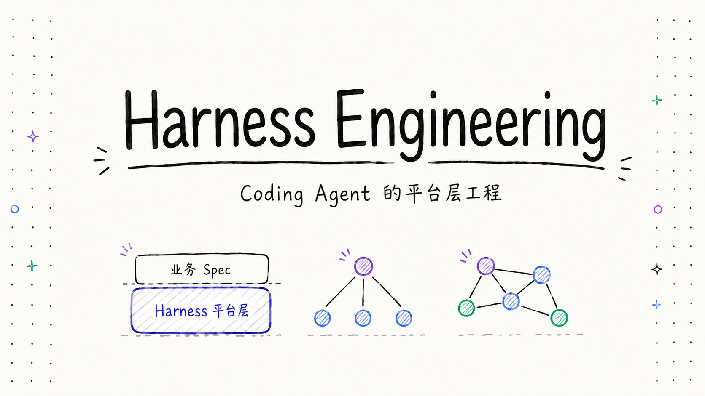

[English](README.md) ∙ [한국어](README.ko.md) ∙ [日本語](README.ja.md) ∙ **中文**

# Harness Engineering

**Coding Agent 平台层工程实践 —— Claude Code 与 Codex。**

---

## 什么是 Harness Engineering？

用 Claude Code 或 Codex 这类 coding agent 做事，你写的代码只是一半。另一半是 *harness*——模型外面那层运行时：上下文管理、记忆、工具调用、subagent、skill、hook，以及把这一切串起来的运行闭环。

> *"the full environment of scaffolding, constraints, and feedback loops that surrounds the agent."* —— OpenAI, [Harness engineering](https://openai.com/index/harness-engineering/)

**Harness Engineering** 是一门建在这层之上、而不是去和它对着干的工程纪律。整个系列围绕一条边界展开：

> **Harness 是 coding agent 的平台层；你的业务工程是建在它之上的一组 spec —— 你不该去改 harness 本身。**

这条边界一旦摆正，很多 agent 的坑就消失了：上下文窗口不再爆、subagent 不再跨阶段偷信息，每一次平台升级都是白嫖，而不是三小时的兼容性排查。

这是一个有一手出处、可上手的系列，对比大多数工程师真正在用的两套 harness —— **Claude Code（Anthropic）** 和 **Codex（OpenAI）** —— 是怎么解决同一批问题的：skill、配置目录、hook、权限、effort。

## 写给谁

- 在 Claude Code、Codex、Cursor 或任何 agentic coding 工具上搭真实工作流的工程师。
- 那些动过「干脆改一下 agent」念头、想知道什么时候**别改**的人。
- 把 **agentic engineering**、**context engineering**、**spec-driven development（SDD）** 当成可落地的工程而非热词的人。

## 目录

| # | 章节 | 讲什么 |
|---|------|--------|
| 01 | [**Harness 到底指什么**](./zh/01-what-is-harness.md) | 平台层与业务工程的边界；为什么不该改 harness |
| 02 | [**复杂任务的 Spec 怎么写**](./zh/02-how-to-write-specs.md) | 多 Agent 编排、编排者入口、rules / docs / skills 怎么组织 |
| 03 | [**Harness 怎么扩展**](./zh/03-extending-the-harness.md) | skill、配置目录、hook —— CC 与 Codex 的两套扩展机制 |
| 04 | [**Harness 怎么拿捏 agent：权限与 effort**](./zh/04-permissions-and-effort.md) | 控制面 —— 权限模式与 reasoning effort，CC 与 Codex 对比 |
| 05 | *Harness 怎么扛住长任务：compact、memory、goal* | 写作中 |

## 记住一句话

> **你的工作 = 写好这套 spec、组合 harness 暴露的原语；不要去改 harness 本身。克制是工程纪律的核心。**

## 延伸阅读

系列建立在一手出处之上，最有用的几篇：

- OpenAI —— [Harness engineering: leveraging Codex in an agent-first world](https://openai.com/index/harness-engineering/)
- Anthropic —— [Building agents with the Claude Agent SDK](https://claude.com/blog/building-agents-with-the-claude-agent-sdk)
- Anthropic —— [Effective harnesses for long-running agents](https://www.anthropic.com/engineering/effective-harnesses-for-long-running-agents)
- Simon Willison —— [How coding agents work](https://simonwillison.net/guides/agentic-engineering-patterns/how-coding-agents-work/)
- LangChain —— [The Anatomy of an Agent Harness](https://www.langchain.com/blog/the-anatomy-of-an-agent-harness)

## 多语言

本指南提供 **English**、**한국어**、**日本語**、**中文** 四个版本。中文为原文，其余为翻译。发现翻译问题欢迎提 PR —— 术语锁定见 [GLOSSARY.md](./GLOSSARY.md)。

## 许可

采用 [CC BY 4.0](./LICENSE) 协议 —— 署名即可自由分享与改编。
