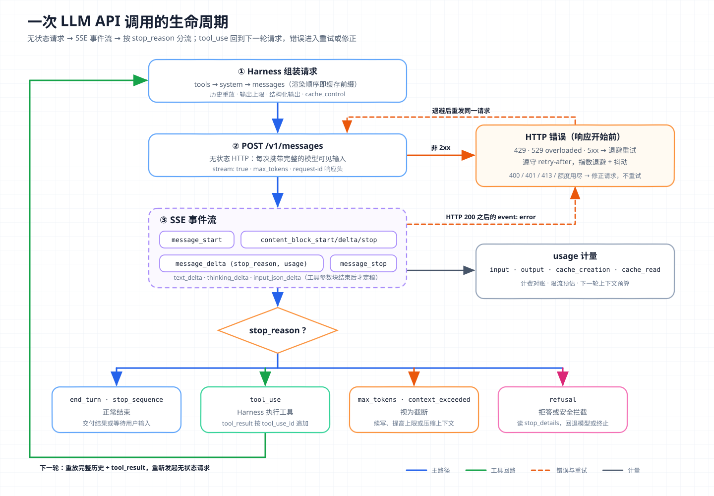

# 核心概念 01 - LLM API：无状态请求、事件流与计费边界

> 技术快照：pi `c8c3cd49`、Hermes Agent `30e947e0`、OpenAI Codex `6ff670bd`；接口字段与价格系数以文末官方文档为准

> *本合集是一套面向 Agent 架构与工程实践的系统学习笔记，帮助读者建立从原理、Runtime、工具与权限到评测和多 Agent 编排的完整知识框架。*
>
> *本篇拆解 LLM API 的请求结构、生成控制、流式事件、停止原因、缓存计费、限流重试与批处理接口，对比 Anthropic、OpenAI 与 Google 的接口形态，并说明 Harness 应在哪一层处理哪类问题。*

## 接口边界：一次无状态的 HTTP 推理调用

LLM API 是模型服务对外的推理接口。调用方用一次 HTTP 请求提交模型可见的全部输入，服务端完成一次推理，返回生成内容、停止原因和用量：

```text
(content, stop_reason, usage) = Inference(model, instructions, tools, messages, generation_config)
```

“无状态”指模型推理本身不保留调用方的会话。第二轮要让模型“记得”第一轮，调用方必须把第一轮的输入、输出和工具结果重新放进请求。多轮对话、工具循环和压缩都由 API 之外的 Harness（负责装配上下文、执行工具、持久化状态的运行框架）完成，见 [Agent Loop](03-agent-loop.md) 与 [Context Engineering](13-context-engineering.md)。

三家都提供服务端保存会话的选项，本质是把“保存并重放历史”搬到服务端：

| 会话形态 | Anthropic | OpenAI | Google |
| --- | --- | --- | --- |
| 客户端重放历史 | Messages API 唯一方式 | Chat Completions；Responses 设 `store: false` | `generateContent`；Interactions 设 `store=false` |
| 服务端按 ID 续接 | Messages API 不提供 | Responses 的 `previous_response_id` 或 Conversation | Interactions 的 `previous_interaction_id` |

LLM API 只负责一次推理的输入输出合同；工具执行、权限、重试、完成判定和记忆都属于 Harness。

## 请求结构：角色、内容块与多模态输入

主流接口都把输入组织成带角色的消息序列。system / developer 承载运营方的长期指令（Anthropic 顶层 `system`，OpenAI Responses 顶层 `instructions`，Gemini `systemInstruction`）；user 承载用户输入，Anthropic 还把客户端工具结果放在 user 消息里；assistant 承载模型此前的文本、推理块和工具调用，Gemini 称这一角色为 `model`。

`content` 可以是字符串，也可以是内容块（content block）数组。内容块是带 `type` 的结构化片段，如 `text`、`image`、`document`、`tool_use`、`tool_result`、`thinking`。多模态输入就是在同一条消息里混排不同类型的块，图片和 PDF 可以 base64 内联、用 URL 或预先上传的文件 ID 引用。OpenAI Responses 把同一概念称为 Item，Gemini 称为 Part。

```json
{
  "model": "claude-opus-5",
  "max_tokens": 8192,
  "system": "你是代码审查助手……",
  "tools": [{ "name": "read_file", "description": "读取仓库内文件",
              "input_schema": { "type": "object", "properties": { "path": { "type": "string" } }, "required": ["path"] } }],
  "messages": [
    { "role": "user", "content": [
      { "type": "image", "source": { "type": "base64", "media_type": "image/png", "data": "..." } },
      { "type": "text", "text": "截图里的报错来自哪个文件？" } ] },
    { "role": "assistant", "content": [
      { "type": "tool_use", "id": "toolu_01", "name": "read_file", "input": { "path": "src/app.ts" } } ] },
    { "role": "user", "content": [
      { "type": "tool_result", "tool_use_id": "toolu_01", "content": "export function main() { ... }" } ] }
  ]
}
```

这个结构有三个工程含义。

- `tool_use.id` 与 `tool_result.tool_use_id` 必须一一配对。裁剪历史时要按调用对整体删除，否则请求被拒绝，或模型无法判断工具是否执行过。
- 工具定义、system 与 messages 在服务端按固定顺序拼成一条 Token 序列。Anthropic 的渲染顺序是 `tools → system → messages`，它决定了 Prompt Caching 的前缀边界。
- 图片、PDF 和工具定义都计入输入 Token。

工具在 API 层只有三样东西：请求里的 `tools` 数组（名称、描述、JSON Schema 参数），控制是否调用的 `tool_choice`，以及响应里的调用块（Anthropic `tool_use`、OpenAI `function_call` Item、Gemini `functionCall` Part）。模型只生成调用意图，执行发生在调用方或厂商托管环境。工具设计、并行调用和结果回填见 [Tool Use](04-tool-use.md)。

## 三家接口形态：相同的推理合同，不同的状态归属



主路径是 Harness 组装请求、发起 HTTP 调用、消费 SSE 事件流，再按 `stop_reason` 分流。`tool_use` 分支沿左侧外环回到请求组装，这是 Agent Loop 在 API 层留下的形状。右侧是两类异常：HTTP 错误在响应开始前返回，流内 `error` 事件在生成途中出现，都进入退避重试或修正请求。

| 维度 | Anthropic Messages | OpenAI Responses | OpenAI Chat Completions | Google generateContent / Interactions |
| --- | --- | --- | --- | --- |
| 端点 | `POST /v1/messages` | `POST /v1/responses` | `POST /v1/chat/completions` | `models/*:generateContent`；`interactions.create` |
| 输入单位 | message + content block | Item | message | Content + Part；Interaction step |
| 服务端状态 | 无 | 默认存储，可续接 | 无续接语义 | Interactions 默认存储，可续接 |
| 输出结构 | `content` 块数组 | `output` Item 数组 | `choices[].message` | `candidates[].content.parts` |
| 停止字段 | `stop_reason` | `status` + `incomplete_details` | `finish_reason` | `finishReason` |
| 结构化输出 | `output_config.format` | `text.format` | `response_format` | `responseMimeType` + `responseJsonSchema` |

三家的推理合同相同，差异集中在状态归属。Anthropic Messages 与 Chat Completions 让调用方掌握完整历史；Responses 与 Interactions 把 Item 或 step 存在服务端，调用方只发增量，请求更短、更容易命中缓存，但保留期、删除能力和跨厂商迁移要单独评估。OpenAI 把 Responses 作为新项目推荐接口，Chat Completions 继续支持，Assistants API 已停用；Google 把 Interactions 作为新项目推荐接口，`generateContent` 继续完整支持。依赖服务端会话的系统应在本地保存一份供应商无关的历史副本，服务端 ID 只作为加速手段。

## 生成控制：采样参数、输出上限与结构化输出

### temperature 和 top_p 改的是下一个 Token 的分布

模型每一步输出词表上的 logits（未归一化分数）$z_i$，temperature $T$ 在 softmax 前缩放它们：

$$
p_i = \frac{\exp(z_i / T)}{\sum_j \exp(z_j / T)}
$$

$T < 1$ 让分布更尖锐，$T > 1$ 让分布更平，$T \to 0$ 接近贪心解码。top_p（核采样）按概率从高到低累加，只保留累计概率达到 $p$ 的最小候选集再归一化采样；top_k 固定保留前 $k$ 个候选。

这组参数在推理模型上正在退场：

| 厂商 | 当前约束 |
| --- | --- |
| Anthropic | Claude Opus 4.7 及之后的多款模型不再接受非默认值的 `temperature`、`top_p`、`top_k`，传入非默认值返回 400，思考深度改由 `output_config.effort` 控制 |
| OpenAI | 推理模型在 `reasoning.effort` 不为 `none` 时，需要移除 `temperature`、`top_p` 与 `top_logprobs` |
| Google | `generationConfig` 仍提供 `temperature`、`topP`、`topK`、`seed`，思考配置单独放在 `thinkingConfig` |

推断：推理模型回答前有较长的内部推理，厂商更倾向用推理强度控制质量与成本。适配层应按模型能力过滤参数。

### max_tokens 是模型看不到的硬截断

`max_tokens`（Responses 为 `max_output_tokens`，Gemini 为 `maxOutputTokens`）限制本次最多生成多少 Token。模型不知道这个上限，写满时服务端直接截断。推理 Token 通常也计入输出预算，上限太低可能在推理阶段耗尽，没有可见回答。输入加输出上限还不能超过模型窗口，Anthropic 在输出写满窗口时返回 `model_context_window_exceeded`。Agent 场景应按“最大工具参数 + 推理 + 最终回答”预留上限。

### 结构化输出靠约束解码

结构化输出（Structured Outputs）让响应严格符合 JSON Schema。三家的实现都属于约束解码（constrained decoding）：服务端把 schema 编译成语法约束，每步采样前屏蔽会让输出偏离语法的 Token，结果在语法上必然可解析。最终回答的写法见上表“结构化输出”一行；工具参数则在工具定义上开启严格模式（Anthropic 与 OpenAI 的 `strict: true`，Gemini 的 `parametersJsonSchema`）。

约束解码只保证语法合法。截断会留下不完整 JSON，拒答不产出 schema 内容，金额非负、ID 存在这类业务约束也超出 JSON Schema 能力，这些都要在 Harness 里二次校验。

## 流式输出：SSE 事件序列与停止原因

### SSE 把一次响应拆成可增量消费的事件

SSE（Server-Sent Events）是基于单个 HTTP 响应的文本流协议，每个事件由 `event:` 行和 `data:` 行组成，以空行分隔。三家的事件粒度不同：

| 接口 | 事件结构 |
| --- | --- |
| Anthropic Messages | `message_start` → 每个块的 `content_block_start` / `content_block_delta` / `content_block_stop` → `message_delta`（带 `stop_reason` 与最终 usage）→ `message_stop`；可能穿插 `ping` 与 `error` |
| OpenAI Responses | 语义事件：`response.created`、`response.output_item.added`、`response.output_text.delta`、`response.function_call_arguments.delta`、`response.completed` / `response.failed` 等 |
| OpenAI Chat Completions | 连续的 `chat.completion.chunk`，以 `data: [DONE]` 结束；用量要开启 `stream_options.include_usage` |
| Gemini | `streamGenerateContent?alt=sse` 逐个返回部分响应；Interactions 为 `interaction.created` → `step.start` / `step.delta` / `step.stop` → `interaction.completed` |

Anthropic 的 delta 按块类型区分：`text_delta`、`thinking_delta`、`signature_delta`，工具参数是 `input_json_delta`。工具参数以 JSON 片段到达，块结束前不保证合法。pi 的 Anthropic 适配器这样组装：

```ts
for await (const event of iterateAnthropicEvents(response, options?.signal)) {
  if (event.type === "message_start") {
    // 流一开始就记录输入与缓存用量，即使中途断开也能对账
    output.usage.input = event.message.usage.input_tokens || 0;
    output.usage.cacheRead = event.message.usage.cache_read_input_tokens || 0;
  } else if (event.type === "content_block_delta" && event.delta.type === "input_json_delta") {
    block.partialJson += event.delta.partial_json;
    block.arguments = parseStreamingJson(block.partialJson); // 容错解析，只用于预览
  } else if (event.type === "content_block_stop" && block.type === "toolCall") {
    block.arguments = parseStreamingJson(block.partialJson); // 块结束后才定稿
    delete block.partialJson;
  } else if (event.type === "message_delta") {
    output.stopReason = mapStopReason(event.delta.stop_reason, event.delta.stop_details).stopReason;
    output.usage.output = event.usage.output_tokens;
  }
}
```

输入用量在 `message_start` 落账，流被中断时仍可对账；工具参数只在块结束后才可执行，执行前还应按 schema 校验。流式让首个 Token 更早可见，长输出也不会触发 HTTP 读超时，所以 Anthropic SDK 对很大的 `max_tokens` 要求流式。

### 停止原因决定 Harness 的下一步

| 语义 | Anthropic | OpenAI Responses | Chat Completions | Gemini | Harness 动作 |
| --- | --- | --- | --- | --- | --- |
| 正常结束 | `end_turn`、`stop_sequence` | `completed` | `stop` | `STOP` | 交付或等待用户 |
| 调用工具 | `tool_use` | 输出含 `function_call` | `tool_calls` | 含 `functionCall` | 执行工具并回填 |
| 截断 | `max_tokens`、`model_context_window_exceeded` | `incomplete`（`max_output_tokens`） | `length` | `MAX_TOKENS` | 续写、提高上限或压缩 |
| 拦截或拒答 | `refusal` + `stop_details` | refusal 或 `content_filter` | `content_filter` | `SAFETY` 等 | 回退模型或终止 |

另有两类专用值：Anthropic 的 `pause_turn` 表示服务端工具循环达到迭代上限，原样回传助手内容即可继续；Gemini 的 `MALFORMED_FUNCTION_CALL` 表示工具调用格式错误。pi 的 `mapStopReason` 把 `end_turn` 映射为 stop、`max_tokens` 为 length、`tool_use` 为 toolUse、`refusal` 为 error，遇到未知值直接抛错。厂商会持续增加停止原因，Gemini 的 `FinishReason` 已有二十多种。把未知值默认当成正常结束，Agent 可能把一次截断当成任务完成。

## Prompt Caching 与 usage：用量字段就是账单公式

### 三家的缓存 API 形态

Prompt Caching 复用相同输入前缀在服务端算好的中间状态，降低延迟和输入费用。原理是推理引擎的前缀 KV Cache，见 [KV Cache](02-kv-cache.md)。API 层关心三件事：怎么声明、多久过期、怎么计费。

| 维度 | Anthropic | OpenAI | Google Gemini |
| --- | --- | --- | --- |
| 开启 | 在内容块上加 `cache_control`，或在请求顶层开启自动缓存 | 默认自动；`prompt_cache_key` 影响路由，GPT-5.6 起支持显式断点 | 2.5 及更新模型默认隐式缓存；`generateContent` 另有显式 `cachedContents` |
| 限制 | 每请求最多 4 个断点；最小前缀随模型在 512–4096 Token | GPT-5.6 起最小 1024 个可见输入 Token | 最小 2048 或 4096 Token |
| 生存期 | 默认 5 分钟，可选 1 小时，命中刷新计时 | `in_memory` 或 `24h` 保留策略，新模型改用 TTL 选项 | 显式缓存 TTL 默认 1 小时 |
| 价格 | 写入 1.25×（5 分钟）或 2×（1 小时），读取约 0.1× | 读取 0.1×，GPT-5.6 起写入 1.25× | 命中按折扣价；显式缓存另按 TTL 收存储费 |
| 用量字段 | `cache_creation_input_tokens`、`cache_read_input_tokens` | `input_tokens_details.cached_tokens` | `cachedContentTokenCount` |

Anthropic 的显式断点把“缓存到哪里”交给调用方。Hermes Agent 的 `system_and_3` 策略用满 4 个断点：一个放在 system prompt，三个放在最后三条非 system 消息，并且在深拷贝上打标记，不改动原始历史。pi 则标在工具数组的最后一个工具和最后一条 user 消息上。两者思路相同：稳定前缀有一个固定读点，增长的尾部有一个随轮次前移的写点。

### 一次调用的成本公式

以 Anthropic 为例，设基础输入单价 $P$、输出单价 $Q$：

$$
\text{cost} = P \cdot \text{input} + 1.25P \cdot \text{write}_{5m} + 2P \cdot \text{write}_{1h} + 0.1P \cdot \text{read} + Q \cdot \text{output}
$$

Anthropic 的 `input_tokens` 只统计最后一个断点之后的未缓存部分，三项输入相加才是总输入；OpenAI 与 Gemini 的输入总数包含缓存命中，缓存部分是子集。跨厂商统计时这是最容易算错的口径。推理 Token 计入输出，分别在 Anthropic `output_tokens_details.thinking_tokens`、OpenAI `output_tokens_details.reasoning_tokens`、Gemini `thoughtsTokenCount` 中单列。

用一个 Agent 循环估算量级：固定前缀（工具 + system）2 万 Token，每轮新增 3 千 Token，共 30 轮，忽略输出。

- 不用缓存：第 $k$ 轮输入 $20 + 3k$ 千 Token，合计 $\sum_{k=0}^{29}(20+3k) = 1905$ 千 Token，折合 $1905P$（按千 Token 计）。
- 5 分钟缓存且每轮都在 TTL 内：首轮写入 20 千（$25P$）；之后每轮读取上一轮全部输入、写入新增 3 千。读取合计 1798 千 × 0.1 ≈ $180P$，写入 87 千 × 1.25 ≈ $109P$，总计约 $314P$。

输入成本降到约六分之一，前提是前缀逐字节不变、相邻两轮间隔短于 TTL。连续多轮 `cache_read` 为 0，说明前缀被悄悄改变了。Anthropic 多数模型的 ITPM 限流不计缓存读取，缓存也提高了有效吞吐。

## 限流、错误与重试：生成请求天然不幂等

### 限流维度与错误分类

限流按组织或项目计量，维度通常有 RPM（每分钟请求数）、输入与输出的 TPM（每分钟 Token 数）和按天额度。Anthropic 用令牌桶算法持续补充容量；OpenAI 提醒失败请求同样计入每分钟限额，连续重发不能绕开限流。

| 状态码 / 类型 | 含义 | 是否重试 |
| --- | --- | --- |
| 400 `invalid_request_error`、413 | 请求格式、参数或大小不合法 | 否，修正请求 |
| 401 / 403 | 认证或权限错误 | 否 |
| 429 `rate_limit_error`（Gemini `RESOURCE_EXHAUSTED`） | 触发速率限制 | 是，优先遵守 `retry-after` |
| 429 且无 `retry-after`（Anthropic 花费上限） | 额度用尽 | 否，重试会一直失败 |
| 500 / 529 `overloaded_error` / 503 | 内部错误或服务整体过载 | 是，指数退避，必要时切换模型或区域 |

流式响应还有中途错误：HTTP 已返回 200，事件流里出现 `event: error`（如 `overloaded_error`）。已收到的部分输出不完整，不能交给下一轮。

Codex 把错误分成可重试与不可重试两类。上下文超限、额度耗尽、非法请求不可重试；流中断、超时、连接失败、服务端错误可重试。退避从 200 ms 起、每次翻倍，并加 ±10% 抖动，避免客户端同时重试：

```rust
pub fn backoff(attempt: u64) -> Duration {
    let exp = BACKOFF_FACTOR.powi(attempt.saturating_sub(1) as i32); // BACKOFF_FACTOR = 2.0
    let base = (INITIAL_DELAY_MS as f64 * exp) as u64;               // INITIAL_DELAY_MS = 200
    let jitter = rand::rng().random_range(0.9..1.1);
    Duration::from_millis((base as f64 * jitter) as u64)
}
```

### 幂等要在 Harness 层保证

三家的公开文档都没有为生成接口提供幂等键参数，可以认为生成请求没有“只执行一次”的语义（推断）。同一请求重试两次就是两次推理、两次计费，结果也可能不同。需要幂等的是模型触发的副作用：

- 已执行的工具记录结果；模型重试后再次请求同一操作时，Harness 按调用 ID 或业务键去重。有副作用的工具（下单、写库、部署）自带幂等键。
- 流在工具参数生成途中断开时，丢弃不完整的调用块。
- 记录厂商返回的请求 ID（Anthropic 的 `request-id` 响应头）用于对账排障。
- 设置总重试预算和整体截止时间。Anthropic SDK 默认也会重试 408、409、429 与 5xx，与业务层重试叠加时实际次数是两者的乘积，应明确由一层负责。

## Batch API：用延迟换价格与吞吐

| 维度 | Anthropic Message Batches | OpenAI Batch | Gemini Batch |
| --- | --- | --- | --- |
| 价格 | 标准价 50% | 同步接口的 50% | 标准价 50% |
| 完成窗口 | 多数 1 小时内，24 小时未完成则过期 | 24 小时 | 目标 24 小时 |
| 规模上限 | 10 万个请求或 256 MB | 5 万个请求，文件 200 MB | 内联 20 MB；JSONL 文件 2 GB |
| 结果对应 | 按 `custom_id`，顺序不保证 | 按 `custom_id`，顺序不保证 | 按请求键 |

批处理适合离线评测、数据标注、批量摘要和回填，不适合交互式 Agent Loop：每轮工具调用都要等上一轮结果，放进 24 小时窗口会让任务几乎停滞。批处理请求同样可以用 Prompt Caching，把共享长前缀放在最前面，两种折扣可以叠加。

## 生产约束与失败模式

| 失败模式 | 表现 | 处理方式 |
| --- | --- | --- |
| 调用与结果失配 | 裁剪历史后出现孤立的 `tool_result` | 按调用对裁剪，发送前做结构校验 |
| 缓存悄悄失效 | 成本突增，`cache_read` 长期为 0 | 排查前缀中的时间戳、随机 ID、工具顺序 |
| 重试风暴 | 过载时所有客户端同时重试 | 退避加抖动，遵守 `retry-after`，设全局并发上限 |
| 用量口径混用 | 跨厂商报表重复计算缓存 Token | 归一为未缓存输入、缓存读、缓存写、输出、推理五项 |

## 架构推演

某团队为内部客服系统构建多模型网关：前端 Agent 需要流式回复，并调用订单查询与退款两个工具；夜间要对当天全部对话做质量评估。模型提供方至少包括 Anthropic 和 OpenAI，部分租户要求零数据保留。

请设计这层网关，并说明：

- 内部消息模型如何表示角色、内容块、工具调用与结果，如何转换为 Messages、Responses 和 Chat Completions 请求；
- 采样参数、推理强度、输出上限和结构化输出如何按模型能力下发；
- SSE 事件如何归一，工具参数何时视为可执行，中途 `error` 事件如何处理；
- 停止原因如何映射到交付、执行工具、续写、回退模型、终止五种动作；
- 缓存断点放在哪里、如何监控命中率，零数据保留租户能否使用服务端会话；
- 429、529、5xx 与额度耗尽如何重试或熔断，退款工具如何在模型重试后只执行一次；
- 夜间评估如何走 Batch API，并与缓存折扣叠加。

可行方案把厂商协议限定在适配层内部，上层只看到归一后的消息、事件、停止原因和用量；副作用幂等、重试预算和会话持久化放在适配层之上。

## 复习结论

- LLM API 的推理调用无状态。多轮会话靠重放历史；`previous_response_id` 与 `previous_interaction_id` 只是把保存与重放移到服务端。
- 工具定义、system 与 messages 按固定顺序拼成一条 Token 序列，这个顺序决定缓存前缀。
- temperature 与 top_p 在推理模型上多被移除或限制，推理强度成为主要旋钮；`max_tokens` 是模型看不到的硬截断。
- 结构化输出靠约束解码保证语法，截断、拒答和业务约束仍要调用方校验。
- 流式工具参数要等块结束后定稿；停止原因必须逐一处理，未知值按错误处理。
- 缓存读取约 0.1 倍价格，写入有溢价；长前缀、多轮次、间隔短于 TTL 的 Agent 循环收益最大。
- 生成请求不幂等。重试只针对模型调用，副作用幂等由 Harness 和工具保证。

## 参考

| 主题 | 来源 |
| --- | --- |
| Anthropic Messages | [Messages API](https://platform.claude.com/docs/en/api/messages) · [Streaming Messages](https://platform.claude.com/docs/en/build-with-claude/streaming) · [Handling Stop Reasons](https://platform.claude.com/docs/en/build-with-claude/handling-stop-reasons) · [Errors](https://platform.claude.com/docs/en/api/errors) · [Rate Limits](https://platform.claude.com/docs/en/api/rate-limits) |
| Anthropic 生成控制与缓存 | [Structured Outputs](https://platform.claude.com/docs/en/build-with-claude/structured-outputs) · [Migration Guide](https://platform.claude.com/docs/en/about-claude/models/migration-guide) · [Migrating to Claude Opus 5.5](https://platform.claude.com/docs/en/models/opus-5-5/migration-guide) · [Prompt Caching](https://platform.claude.com/docs/en/build-with-claude/prompt-caching) · [Batch Processing](https://platform.claude.com/docs/en/build-with-claude/batch-processing) |
| OpenAI | [Migrate to Responses](https://developers.openai.com/api/docs/guides/migrate-to-responses) · [Streaming Responses](https://developers.openai.com/api/docs/guides/streaming-responses) · [Reasoning Models](https://developers.openai.com/api/docs/guides/reasoning) · [Structured Outputs](https://developers.openai.com/api/docs/guides/structured-outputs) · [Prompt Caching](https://developers.openai.com/api/docs/guides/prompt-caching) · [Rate Limits](https://developers.openai.com/api/docs/guides/rate-limits) · [Error Codes](https://developers.openai.com/api/docs/guides/error-codes) · [Deprecations](https://developers.openai.com/api/docs/deprecations) · [Batch API](https://developers.openai.com/api/docs/guides/batch) |
| Google Gemini | [Generate Content API](https://ai.google.dev/api/generate-content) · [Interactions API](https://ai.google.dev/gemini-api/docs/interactions) · [Interactions Streaming](https://ai.google.dev/gemini-api/docs/interactions/streaming) · [Context Caching](https://ai.google.dev/gemini-api/docs/generate-content/caching) · [Batch API](https://ai.google.dev/gemini-api/docs/batch-api) |
| 采样方法 | [The Curious Case of Neural Text Degeneration](https://arxiv.org/abs/1904.09751) |
| 源码 | pi [`anthropic-messages.ts`](https://github.com/earendil-works/pi/blob/c8c3cd499f4d35c0f9cfebfec5f4e3822411a49f/packages/ai/src/api/anthropic-messages.ts) · Hermes Agent [`prompt_caching.py`](https://github.com/NousResearch/hermes-agent/blob/30e947e0a05ef535e4b25a183d8bbe34fd68d1d5/agent/prompt_caching.py) · Codex [`util.rs`](https://github.com/openai/codex/blob/6ff670bd030f7f94ce956d8a176c226deb427666/codex-rs/core/src/util.rs) · [`error.rs`](https://github.com/openai/codex/blob/6ff670bd030f7f94ce956d8a176c226deb427666/codex-rs/protocol/src/error.rs) |
