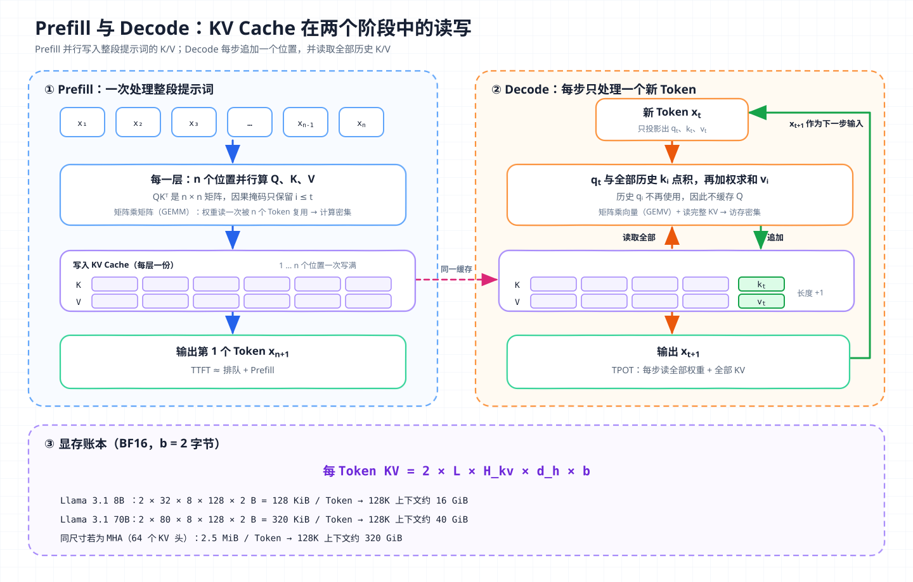
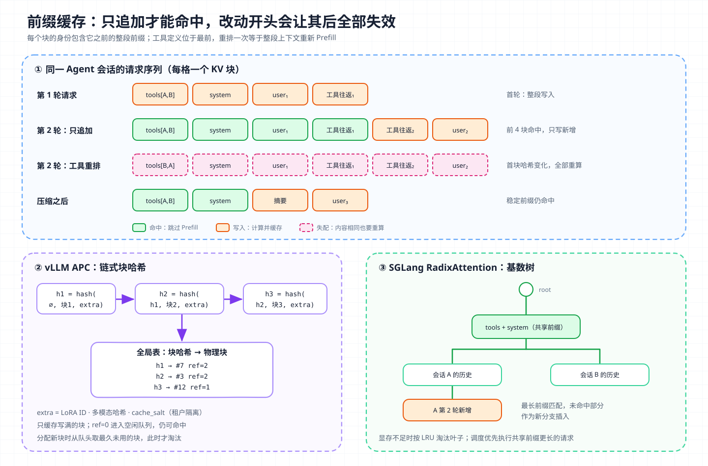

# 核心概念 02 - KV Cache：自回归解码的显存账本

> 技术快照：OpenAI Codex `6ff670bd`、pi `c8c3cd49`；vLLM、SGLang 与各家 API 行为以文末官方文档和论文为准

> *本合集是一套面向 Agent 架构与工程实践的系统学习笔记，帮助读者建立从原理、Runtime、工具与权限到评测和多 Agent 编排的完整知识框架。*
>
> *本篇从注意力计算推导 KV Cache 为什么存在、占多少显存、如何被 GQA、MLA、PagedAttention 和前缀缓存压缩与共享，并说明它与 API 层 Prompt Caching 的对应关系，以及对 Agent 上下文设计的约束。*

## 定义与边界：缓存每层注意力的历史 Key 与 Value

LLM 按自回归方式生成文本，第 $t$ 个 Token 的分布只依赖此前的全部 Token，即 $p(x_t \mid x_{<t})$。Transformer 的每一层都要做一次自注意力：

$$
\text{Attention}(Q, K, V) = \text{softmax}\left(\frac{QK^\top}{\sqrt{d_k}} + M\right)V
$$

其中 $M$ 是因果掩码，保证位置 $t$ 只能看到 $i \le t$ 的位置。对第 $l$ 层、第 $t$ 个位置，隐藏状态 $h_t$ 经过三次线性投影得到 $q_t = h_t W_Q$、$k_t = h_t W_K$、$v_t = h_t W_V$，输出为：

$$
o_t = \sum_{i \le t} \text{softmax}_i\left(\frac{q_t \cdot k_i}{\sqrt{d_k}}\right) v_i
$$

KV Cache（键值缓存）就是把每层已经算出的 $k_i, v_i$ 保存下来，生成下一个 Token 时直接读取，不再重算。

### 为什么缓存 K/V 而不缓存 Q

按公式，生成位置 $t$ 只用到当前位置的 $q_t$ 和所有历史位置的 $k_i, v_i$。

- 因果掩码让 $k_i, v_i$ 只取决于 $x_{\le i}$。后续追加 Token 不会改变它们，算一次就能一直复用。
- 历史位置的 $q_i$（$i < t$）只在计算 $o_i$ 时用过一次，之后没有任何计算再读取它。缓存 Q 没有收益。

没有缓存时，生成第 $t$ 个 Token 要对全部 $t$ 个位置重做投影和注意力，生成 $n$ 个 Token 的投影计算量是 $O(n^2)$ 次；有缓存后每步只投影新 Token，投影降为 $O(n)$ 次，注意力本身仍是每步 $O(t)$。缓存要占显存，大小随序列线性增长，每一步还要从显存完整读一遍。

### 与相邻概念的边界

| 概念 | 位置 | 生命周期 | 与 KV Cache 的关系 |
| --- | --- | --- | --- |
| KV Cache | 推理引擎的 GPU 显存 | 单个请求期间；前缀可跨请求共享 | 本篇主题 |
| Prompt Caching | 模型 API 的计费功能 | 按 TTL 保留，如 5 分钟或 1 小时 | 推断：建立在服务端前缀 KV 复用之上 |
| 会话历史 | Harness 或服务端存储 | 由应用决定 | 每次请求都要重新变成 Token，命中缓存才能跳过重算 |
| 模型权重 | 显存 | 模型加载期间 | 与 KV Cache 争用同一块显存 |

## Prefill 与 Decode：两个阶段，两种瓶颈



左侧 Prefill 把整段提示词一次性送入各层，并行算出所有位置的 K/V 写入缓存，同时得到第一个输出 Token；右侧 Decode 每步只处理一个新 Token，把它的 K/V 追加进缓存，再用它的 Q 与全部历史 K/V 做注意力。底部是后文使用的显存公式。

| 阶段 | 输入 | 主要运算 | 瓶颈 | 对应延迟指标 |
| --- | --- | --- | --- | --- |
| Prefill（预填充） | 全部提示词 Token，并行处理 | 矩阵乘矩阵（GEMM） | 计算密集 | TTFT（Time To First Token，首 Token 延迟） |
| Decode（解码） | 每条序列每步 1 个 Token | 矩阵乘向量（GEMV）+ 读全部 KV | 访存密集 | TPOT（Time Per Output Token，每个输出 Token 的间隔） |

一次请求的端到端延迟近似为 $\text{TTFT} + \text{TPOT} \times (N_{out} - 1)$。TTFT 还包含排队时间。

### 用算术强度判断瓶颈

算术强度是每读 1 字节数据做多少次浮点运算。以 NVIDIA H100 SXM 的公开规格估算，BF16 稠密算力约 989 TFLOPS，HBM 带宽约 3.35 TB/s，两者之比约 295 FLOP/字节。算术强度低于这个值，GPU 在等数据；高于它，GPU 在等算力。

- Decode、批大小为 1：每生成 1 个 Token，约做 $2N$ 次浮点运算（$N$ 为参数量），同时读 $2N$ 字节 BF16 权重，强度约 1 FLOP/字节，远低于 295。
- Prefill 一次处理 $n$ 个 Token：权重读一次，被 $n$ 个 Token 复用，强度随 $n$ 增长。几千 Token 的提示词足以把 GPU 推到计算上限。

一个 8B 模型的 BF16 权重约 16 GB。单卡 Decode 每步至少读完一遍权重，下限约 $16 / 3350 \approx 4.8$ ms，即单序列最多约 200 Token/s。批处理可以让多条序列分摊权重读取，但每条序列的 KV Cache 各读各的，无法分摊。上下文越长，KV 读取在每步访存中的占比越高，TPOT 随之上升。

推理引擎因此把两个阶段分开调度。Prefill 适合大块计算，Decode 适合大批量合并，而长提示词的 Prefill 会阻塞同一批次里其他序列的 Decode。vLLM 与 SGLang 都提供把长 Prefill 切块执行、或把两阶段放到不同实例上的能力。

## 显存账本：KV Cache 的大小公式

每个 Token 在每层要存一份 K 和一份 V，每份的形状是 KV 头数 × 头维度：

$$
\text{KV bytes per token} = 2 \times L \times H_{kv} \times d_h \times b
$$

$L$ 是层数，$H_{kv}$ 是 KV 头数，$d_h$ 是每个头的维度，$b$ 是每个元素的字节数（BF16 为 2）。整条序列再乘以长度，整个批次再乘以并发序列数。

用 Llama 3 论文公开的架构参数估算（BF16）：

| 模型 | $L$ | 查询头 / KV 头 | $d_h$ | 每 Token KV | 128K Token 一条序列 |
| --- | --- | --- | --- | --- | --- |
| Llama 3.1 8B | 32 | 32 / 8 | 128 | 128 KiB | 16 GiB，与 16 GB 权重相当 |
| Llama 3.1 70B | 80 | 64 / 8 | 128 | 320 KiB | 40 GiB |
| 假设 70B 使用 MHA | 80 | 64 / 64 | 128 | 2.5 MiB | 320 GiB |

放到一台 8 × H100 80GB 的机器上估算，总显存约 640 GB，70B 权重约 141 GB，再为激活和运行时预留约 10%，留给 KV Cache 的约 430 GB。按 GQA 的 40 GiB 一条，最多容纳约 10 条 128K 序列；若是 MHA，一条都放不满。长上下文服务的并发上限因此主要取决于 KV Cache，架构层面最直接的压缩手段是减少 $H_{kv}$。

## 压缩 KV 头：MHA、MQA、GQA 与 MLA

| 方案 | 每层每 Token 缓存的元素数 | 做法 | 代价 |
| --- | --- | --- | --- |
| MHA（Multi-Head Attention，多头注意力） | $2 H d_h$ | 每个查询头有独立的 K/V 头 | 缓存最大 |
| MQA（Multi-Query Attention，多查询注意力） | $2 d_h$ | 所有查询头共享一组 K/V | 缓存缩小 $H$ 倍，质量可能下降、训练不稳定 |
| GQA（Grouped-Query Attention，分组查询注意力） | $2 G d_h$ | 查询头分成 $G$ 组，每组共享一组 K/V | 介于两者之间，可从 MHA 检查点改造 |
| MLA（Multi-head Latent Attention，多头潜在注意力） | $d_c + d_h^R$ | 把 K/V 联合压缩成低维潜在向量，只缓存潜在向量和一段解耦的位置键 | 推理时需把上投影矩阵吸收进其他矩阵 |

MQA 由 Shazeer 提出，目标是降低增量解码时的显存读取量。GQA 论文把 MQA 和 MHA 统一为分组的特例，并说明只用原预训练约 5% 的算力，就能把 MHA 检查点改造为 GQA，质量接近 MHA、速度接近 MQA。Llama 3 的各个尺寸都采用 8 个 KV 头的 GQA。

MLA 来自 DeepSeek-V2。它把每个 Token 的 K/V 压成维度 $d_c = 512$ 的潜在向量 $c_t^{KV} = W^{DKV} h_t$，计算注意力时再由上投影矩阵还原。RoPE（旋转位置编码）与低秩压缩不兼容，论文额外保留一个 $d_h^R = 64$ 维、各头共享的位置键。推理时 $W^{UK}$ 可以吸收进 $W^Q$，$W^{UV}$ 可以吸收进输出投影，因此不需要真的展开完整 K/V。每层每 Token 只缓存 576 个元素，论文称其等价于只有 2.25 组的 GQA，但效果强于 MHA。按 DeepSeek-V2 的 60 层计算，BF16 下每 Token 约 67.5 KiB，论文报告 KV Cache 相比 DeepSeek 67B 减少 93.3%，最大生成吞吐提升到 5.76 倍。

这些方案改变的是模型结构，必须在训练或继续训练阶段决定。推理引擎和应用层只能在给定结构下分配、共享和压缩这块显存。

## 分配 KV：PagedAttention 把显存当作分页内存

早期推理系统按“最大可能长度”为每条序列预留一段连续显存。输出长度事先未知，这种预留会浪费三类空间，分别是为未来 Token 预留却未使用的部分、分配粒度带来的内部碎片，以及不同大小请求之间的外部碎片。PagedAttention 论文测得，已有系统中真正存放 Token 状态的显存只占 KV 空间的 20.4%–38.2%。

vLLM 借鉴操作系统的虚拟内存：

- 把 KV Cache 切成固定大小的块（block），每块存固定数量 Token 的 K/V，物理上不必连续。
- 每条序列维护一张块表（block table），把逻辑块映射到物理块。注意力内核按块表间接寻址。
- 只在需要时分配新块，浪费只发生在每条序列的最后一个块里，论文报告低于 4%。
- 物理块带引用计数，多条序列可以共享同一批块，写入时复制（copy-on-write），适用于并行采样和束搜索。

在相同延迟下，vLLM 的吞吐比 FasterTransformer 和 Orca 高 2–4 倍。显存不够时，调度器会抢占部分请求，把它们的块释放掉，之后重算或换回，这会表现为个别请求的 TTFT 突增。

块化之后，KV Cache 也成了可以按块寻址、计数和淘汰的对象，前缀缓存就建立在这个基础上。

## 共享 KV：前缀缓存的两种实现



上半部分是同一个 Agent 会话的连续请求，只追加的第 2 轮复用第 1 轮全部块，调整工具顺序的请求从第一个块开始失配。下半部分对应引擎侧的数据结构，vLLM 用链式块哈希在全局表中查找，SGLang 用基数树按最长公共前缀匹配。

多个请求如果以相同 Token 序列开头，这段前缀在每一层的 K/V 完全相同，可以直接复用，跳过这部分 Prefill。复用不改变输出，只减少计算。

### vLLM Automatic Prefix Caching：链式块哈希

vLLM 为每个写满的块计算哈希，输入包括父块的哈希、本块的 Token 序列和额外信息（LoRA ID、多模态输入的哈希、`cache_salt`）。父块哈希让每个块的身份编码了它之前的整段前缀，因此只要某个位置不同，其后所有块的哈希都不同。新请求到来时，引擎逐块计算哈希并在全局表中查找，连续命中的块直接复用。

- 只缓存写满的块。前缀末尾不满一块的 Token 需要重算。
- 块带引用计数。计数归零的块进入空闲队列但保留内容，仍可被命中；分配新块时从队头取出最久未用的块，这时才真正淘汰。
- `cache_salt` 注入第一个块的哈希，只有相同盐值的请求才能共享缓存，用于多租户隔离，防止通过延迟差异推断他人提示词的侧信道攻击。

### SGLang RadixAttention：基数树

SGLang 把所有缓存的 Token 序列组织成一棵基数树（radix tree），边上是 Token 序列，节点关联对应的 KV 块。新请求沿树做最长前缀匹配，命中部分直接复用，未命中部分作为新分支插入。显存不足时按 LRU 淘汰叶子节点。调度器还做缓存感知排序，优先执行与现有缓存共享前缀更长的请求，提高命中率。论文在少样本、多轮对话、Agent 等负载上报告最高 6.4 倍的吞吐提升。

| 维度 | vLLM APC | SGLang RadixAttention |
| --- | --- | --- |
| 索引结构 | 块哈希 → 物理块的扁平表 | Token 序列上的基数树 |
| 匹配粒度 | 整块 | Token 级前缀，存储按页 |
| 淘汰 | 空闲队列 LRU | 叶子节点 LRU |
| 适合的负载 | 通用服务，多模态与 LoRA 场景有完善的哈希规则 | 前缀树形分叉多的负载，如多轮、并行采样、Agent |

两者都要求前缀逐 Token 相同。中间插入、替换或重排任何一个 Token，都会让其后全部内容失去复用资格。

## 压缩与淘汰：量化和序列内裁剪

架构之外，还有两类在推理时压缩 KV 的方法：

| 方法 | 做法 | 收益 | 风险 |
| --- | --- | --- | --- |
| FP8 KV Cache | 以 8 位浮点存储 K/V（vLLM `--kv-cache-dtype fp8`，SGLang 同类参数） | 显存与读取量减半 | 精度轻微下降，需要校准缩放因子 |
| 低比特量化（如 KIVI） | Key 按通道、Value 按 Token 做 2 位非对称量化 | 显存进一步下降 | 需专用内核，长任务质量需评测 |
| 注意力汇聚点 + 滑动窗口（StreamingLLM） | 只保留开头少数 Token 和最近窗口 | 显存恒定，可流式处理超长输入 | 窗口外信息永久丢失 |
| 重要 Token 保留（H2O） | 按累计注意力分数保留少数“重要” Token | 显存按比例下降 | 丢弃的 Token 以后可能又变重要 |

这里有两种“淘汰”要区分。前缀缓存的 LRU 淘汰是无损的，被淘汰的前缀下次重算即可，输出不变。序列内的 KV 裁剪是有损的，被丢弃的位置从模型视野中消失，相当于一种不可见的上下文截断。Agent 任务依赖精确回忆文件内容、工具结果和约束，使用有损裁剪前应在真实长任务上评测，只看困惑度不够。

## 从引擎到 API：Prompt Caching 的对应关系

厂商没有公开托管服务的推理实现。下表把 API 层的可观察行为与开源引擎的机制对应起来，属于推断：

| API 层行为 | 引擎层对应 |
| --- | --- |
| 前缀必须逐字节一致，缓存按 `tools → system → messages` 的渲染顺序匹配 | 链式块哈希或基数树的前缀匹配 |
| 最小可缓存长度（如 1024 Token）、Anthropic 的断点与 20 个块的回溯窗口 | 块粒度，以及限制查找开销的工程取舍 |
| 5 分钟 TTL、命中刷新计时、1 小时 TTL 加价 | LRU 淘汰；更长保留需要占用显存或下沉到更便宜的存储 |
| 写入 1.25 倍价格 | 完整 Prefill，再加上保存 KV 的成本 |
| 读取约 0.1 倍价格，且多数模型不计入 ITPM 限流 | 跳过 Prefill，只剩读取已存 KV |
| OpenAI 的 `prompt_cache_key` 和前缀哈希路由 | 把同前缀请求送到持有该缓存的实例，即前缀感知路由 |
| 缓存不跨组织共享 | 与 `cache_salt` 类似的租户隔离 |
| 换模型、改推理配置后缓存失效 | KV 由特定权重和计算路径产生，不能跨模型复用 |

对照这张表，API 文档里的缓存规则都落在三个条件上，即前缀是否逐 Token 相同、请求是否落到持有缓存的机器，以及缓存是否已被淘汰。API 用法和计费见 [LLM API](01-llm-api.md)。

## 对 Agent 设计的约束

### 稳定前缀，只追加上下文

Agent 每一轮都会重发全部上下文，Prefill 成本和缓存命中率直接由上下文的变化方式决定。前缀因此要保持不变，新内容只追加在末尾。

Codex 的 WebSocket 会话把这条要求写成了显式判断。只有当本次请求除 `input` 外的全部字段（模型、指令、工具、推理配置、`prompt_cache_key` 等）与上一次完全相同，并且新 `input` 严格以旧 `input` 加上一轮服务端输出为前缀时，才只发送增量：

```rust
fn get_incremental_items(&self, request: &ResponsesApiRequest, last_response: Option<&LastResponse>, /* … */)
    -> Option<Vec<ResponseItem>> {
    let previous_request = self.websocket_session.last_request.as_ref()?;
    if !responses_request_properties_match(previous_request, request) {
        return None; // 模型、指令、工具等任一字段变化，放弃增量
    }
    let after_previous_input = request.input.strip_prefix(previous_request.input.as_slice())?;
    let response_items = last_response.map_or_else(Vec::new, |r| r.items_added.clone());
    let incremental_items = after_previous_input.strip_prefix(response_items.as_slice())?;
    // …
}
```

同一线程的请求还固定使用线程 ID 作为 `prompt_cache_key`，让这些请求路由到同一批缓存。Harness 侧常见的破坏前缀的做法有这些：

- 在 system prompt 里写入当前时间或随机请求 ID；
- 把检索结果插到历史中间；
- 每轮重新排序或重新生成工具描述；
- JSON 序列化时字段顺序不固定。

### 工具定义位于最前面

工具定义在渲染顺序的最前端，任何增删、重排或描述修改都会让其后的 system 与全部历史失去缓存。按任务动态增减工具集，每切换一次就要重新 Prefill 整段上下文。更稳妥的做法是保持工具集固定且排序确定，需要大量工具时用工具搜索或延迟加载，把变化放到上下文尾部，见 [Tool Use](04-tool-use.md)。pi 把缓存标记打在工具数组的最后一个元素和最后一条 user 消息上，前者给工具与 system 这段稳定前缀一个固定读点，后者随对话增长前移。

运行中切换模型、修改推理强度或思考配置，同样会让已有缓存失效。需要在会话中途追加运营指令时，追加一条消息只需为新增部分做 Prefill，改写开头的 system prompt 则要重算其后的整段上下文。

### 压缩的代价

压缩（compaction）会重写历史，下一轮必然有一段新前缀要重新 Prefill。按 [LLM API](01-llm-api.md) 中的 Anthropic 价格系数估算。设上下文 15 万 Token，其中工具与 system 2 万，把其余历史压缩成 1 万 Token 的摘要。

- 不压缩，下一轮读取 15 万缓存：$150 \times 0.1 = 15P$（按千 Token 计）。
- 压缩后下一轮：读取 2 万稳定前缀 $2P$，写入 1 万摘要 $12.5P$，合计 $14.5P$，之后每轮都更便宜。
- 生成摘要本身：读取 15 万缓存 $15P$，再输出 1 万 Token。输出单价通常是输入的数倍，这一次调用往往是整个压缩里最贵的部分。

只要压缩只替换消息历史、不动工具和 system，重算前缀的成本就很小，压缩的主要成本落在摘要生成和信息损失上。若压缩顺带改写了开头的指令，稳定前缀也要整体重写。Anthropic 的缓存查找还有 20 个块的回溯窗口，单轮追加过多块会让上一轮的缓存点落在窗口之外，Harness 可以在长尾部增加一个断点。

### 子 Agent 与并行请求

子 Agent 有独立的上下文，也就有独立的缓存。多个子 Agent 如果共享同一段工具与 system 前缀，并发请求可以命中同一份缓存；每个子 Agent 各自拼装略有差异的开头，就要各付一次写入成本。

## 生产约束与失败模式

| 现象 | 根因 | 处理方式 |
| --- | --- | --- |
| 长上下文请求 TPOT 明显变慢 | 每步 Decode 都要读完整 KV | 限制有效上下文，使用 GQA/MLA 模型或 FP8 KV |
| TTFT 偶发突增 | 显存不足触发抢占重算，或长 Prefill 阻塞批次 | 预留 KV 余量，分块 Prefill 或两阶段分离 |
| 多副本部署命中率低 | 同前缀请求被随机分发到不同实例 | 前缀感知路由或会话粘性 |
| 缓存命中率随版本发布骤降 | 工具描述、system 模板或序列化顺序变化 | 把前缀变更当作需要评估成本的发布项 |
| 多租户之间的时间侧信道 | 共享前缀缓存让命中与否可被测量 | 按租户加盐隔离 |
| 长任务后期质量下降 | 有损 KV 裁剪或低比特量化丢失信息 | 用真实 Agent 轨迹评测后再开启 |

## 架构推演

某团队在 8 × H100 80GB 的机器上自建 Coding Agent 推理服务，模型为 70B 级别、GQA 结构（80 层、8 个 KV 头、头维度 128）。目标是同时服务 150 个会话，平均上下文 6 万 Token、峰值 20 万 Token；所有会话共享约 2.5 万 Token 的工具与 system 前缀，每轮新增 2 千到 8 千 Token 的工具结果。

请设计这套系统，并说明：

- 按公式估算单会话和全部会话的 KV 需求，与可用显存对比，判断需要几台机器，或需要 FP8 KV、长上下文限流中的哪些手段；
- 选择 vLLM APC 还是 SGLang RadixAttention，共享前缀在块表或基数树中如何表示，淘汰策略如何避免把公共前缀挤出；
- 多副本之间如何做前缀感知路由，会话如何保持粘性，副本扩缩容时缓存如何预热；
- 长提示词 Prefill 与大量 Decode 如何调度，才能同时控制 TTFT 与 TPOT；
- Harness 如何保证工具定义、system 与历史只追加，压缩时如何保持稳定前缀不变；
- 多租户场景下如何隔离缓存，量化和有损裁剪是否开启、用什么评测决定。

方案还需要说明并发上限如何从 KV 公式推出，路由、调度和上下文策略又如何由这个上限倒推出来。

## 复习结论

- KV Cache 保存每层历史位置的 K/V。因果掩码保证它们不随后续 Token 改变；历史 Q 不再被使用，所以不缓存。
- Prefill 并行处理提示词，计算密集，决定 TTFT；Decode 每步生成一个 Token，要读全部权重与 KV，访存密集，决定 TPOT。
- 每 Token 的 KV 大小为 $2 \times L \times H_{kv} \times d_h \times b$。70B 级 GQA 模型每 Token 约 320 KiB，128K 上下文约 40 GiB，长上下文并发主要受 KV 限制。
- MQA、GQA 减少 KV 头数，MLA 把 K/V 压成低维潜在向量，它们都要在训练阶段决定。
- PagedAttention 用块和块表消除碎片，并让 KV 可以按块共享与淘汰。
- vLLM APC 用链式块哈希，SGLang 用基数树；两者都要求前缀逐 Token 相同，淘汰前缀缓存是无损的。
- 序列内 KV 裁剪和低比特量化是有损的，Agent 场景需用真实轨迹评测。
- API 层 Prompt Caching 的前缀匹配、TTL、写入溢价和读取折扣，可以还原为前缀 KV 复用、LRU 淘汰和跳过 Prefill 的成本结构（推断）。
- Agent 上下文应保持稳定前缀、只追加；工具定义顺序变化会让全部缓存失效；压缩的主要成本在摘要生成与信息损失。

## 参考

| 主题 | 来源 |
| --- | --- |
| 注意力与 KV 头结构 | [Attention Is All You Need](https://arxiv.org/abs/1706.03762) · [Fast Transformer Decoding: One Write-Head is All You Need（MQA）](https://arxiv.org/abs/1911.02150) · [GQA](https://arxiv.org/abs/2305.13245) · [DeepSeek-V2（MLA）](https://arxiv.org/abs/2405.04434) |
| 模型架构参数 | [The Llama 3 Herd of Models](https://arxiv.org/abs/2407.21783) |
| 硬件规格 | [NVIDIA H100 Tensor Core GPU](https://www.nvidia.com/en-us/data-center/h100/) |
| KV 分配与前缀共享 | [Efficient Memory Management for Large Language Model Serving with PagedAttention](https://arxiv.org/abs/2309.06180) · [vLLM Automatic Prefix Caching](https://docs.vllm.ai/en/latest/design/prefix_caching.html) · [SGLang: Efficient Execution of Structured Language Model Programs](https://arxiv.org/abs/2312.07104) · [SGLang 文档](https://docs.sglang.ai/) |
| KV 量化与裁剪 | [vLLM Quantized KV Cache](https://docs.vllm.ai/en/latest/features/quantization/quantized_kvcache.html) · [KIVI](https://arxiv.org/abs/2402.02750) · [StreamingLLM](https://arxiv.org/abs/2309.17453) · [H2O](https://arxiv.org/abs/2306.14048) |
| API 层 Prompt Caching | [Claude Prompt Caching](https://platform.claude.com/docs/en/build-with-claude/prompt-caching) · [Claude Rate Limits](https://platform.claude.com/docs/en/api/rate-limits) · [OpenAI Prompt Caching](https://developers.openai.com/api/docs/guides/prompt-caching) · [Gemini Context Caching](https://ai.google.dev/gemini-api/docs/generate-content/caching) |
| 源码 | Codex [`client.rs`](https://github.com/openai/codex/blob/6ff670bd030f7f94ce956d8a176c226deb427666/codex-rs/core/src/client.rs) · pi [`anthropic-messages.ts`](https://github.com/earendil-works/pi/blob/c8c3cd499f4d35c0f9cfebfec5f4e3822411a49f/packages/ai/src/api/anthropic-messages.ts) |
