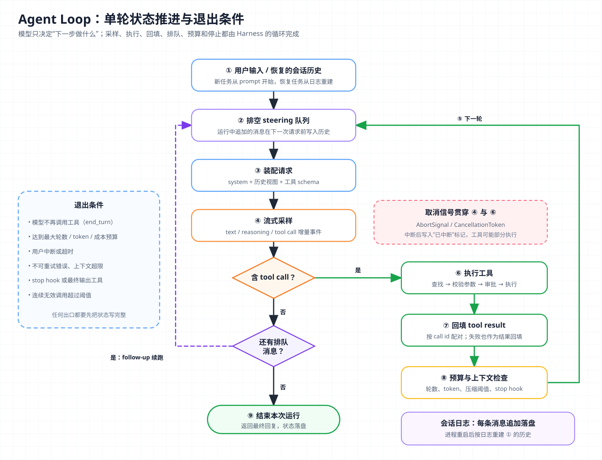

# 核心概念 03 - Agent Loop：从一次采样到可恢复的执行循环

> 技术快照：OpenAI Codex `6ff670bd`、Pi `c8c3cd49`、Hermes Agent `30e947e0`，API 行为以文末参考链接为准

> *本合集是一套面向 Agent 架构与工程实践的系统学习笔记，帮助读者建立从原理、Runtime、工具与权限到评测和多 Agent 编排的完整知识框架。*
>
> *本篇讲 Agent Loop 的定义、ReAct 来源、最小状态与停止条件，并用 Codex、Pi、Hermes Agent 的源码说明单轮推进、错误回填、运行中 steering、流式取消和长任务恢复是怎样实现的。*

## Agent 与 Workflow：下一步由谁决定

Anthropic《Building effective agents》定义：Workflow 是“LLM 和工具通过预定义代码路径编排”的系统，Agent 是“LLM 动态决定自己的流程和工具使用”的系统。OpenAI《A practical guide to building agents》称 Agent 是“代表用户独立完成任务的系统”，并把不用 LLM 控制工作流执行的聊天机器人、单轮调用和分类器排除在外。两份定义都按控制流归属划分，即下一步由代码决定还是由模型决定，和是否使用工具无关。

| 维度 | Workflow | Agent |
| --- | --- | --- |
| 下一步由谁决定 | 代码里的固定分支 | 模型根据当前观察决定 |
| 步数 | 设计时已知或有上界 | 运行时才知道，需要显式停止条件 |
| 可测试性 | 每条路径可单测 | 只能靠轨迹评测和约束兜底 |
| 适用问题 | 步骤可枚举、要求一致性 | 开放问题、步骤无法预先写死 |

Anthropic 把“增强型 LLM”（带检索、工具和记忆的模型调用）当作两类系统共用的积木，并建议只有在固定路径覆盖不了问题时才引入 Agent。控制流交给模型后，系统更灵活，可预测性随之下降。

Agent Loop 是承载这种控制流的运行时结构，反复执行“请求模型 → 执行模型选定的动作 → 把结果交还模型”，本身不提供模型能力。任务分解和多 Agent 协作分别属于 [Planning](06-planning.md) 和 [Multi-Agent](11-multi-agent.md) 的范围。

## ReAct：思考、行动、观察交替出现

今天的 Agent Loop 在概念上来自 ReAct（Reasoning + Acting，推理与行动交替）。Yao 等人在 ICLR 2023 的论文里指出，此前“推理”（如 Chain-of-Thought）和“行动”（如生成动作序列）是分开研究的；ReAct 让模型在同一条轨迹里交替产出推理痕迹和任务动作：

```text
Thought 1: 需要先确认这个函数在哪个模块定义
Action 1:  search[parse_config]
Observation 1: src/config/loader.py 第 42 行
```

推理让模型维护计划、处理异常并选择下一步；观察把外部事实带回上下文，减少只靠参数知识推断造成的幻觉。论文在 ALFWorld 和 WebShop 上仅用一到两个示例，成功率分别比模仿学习和强化学习基线高 34 和 10 个百分点。当时靠提示词约定格式、用字符串解析 `Action:` 行；现在这三个角色都进了结构化协议：

| ReAct 元素 | 现代 API 中的载体 |
| --- | --- |
| Thought | text 块、thinking / reasoning 块 |
| Action | `tool_use` 块（Anthropic）/ `function_call` 项（OpenAI） |
| Observation | Harness 回填的 `tool_result` 块 / `function_call_output` 项 |

协议细节见 [Tool Use](04-tool-use.md)，推理块见 [Reasoning](05-reasoning.md)。ReAct 的分工也保留了下来，模型推理并选择动作，Harness 执行动作并记录观察结果。

## 循环的最小实现与状态



有工具调用走右侧回路，没有则检查排队消息，两条回路都回到“排空 steering 队列”。退出条件、取消信号和会话日志贯穿全程。

### 最小骨架

以 Anthropic Messages API 为例，一个能工作的 Agent Loop 只需要十几行：

```python
messages = [{"role": "user", "content": task}]
for turn in range(MAX_TURNS):
    resp = client.messages.create(model=MODEL, max_tokens=4096,
                                  system=SYSTEM, tools=TOOLS, messages=messages)
    messages.append({"role": "assistant", "content": resp.content})
    if resp.stop_reason != "tool_use":
        break                                   # end_turn / max_tokens / refusal ...
    results = []
    for block in resp.content:
        if block.type == "tool_use":
            out, is_err = run_tool(block.name, block.input)
            results.append({"type": "tool_result", "tool_use_id": block.id,
                            "content": out, "is_error": is_err})
    messages.append({"role": "user", "content": results})
```

这段骨架已经包含循环的全部要素。消息历史是唯一的状态载体，每轮是一次完整请求，`stop_reason` 决定是否继续，工具结果按 `tool_use_id` 配对回填。模型“记得”前几轮，是因为每轮都重发了历史（见 [LLM API](01-llm-api.md)）。

生产实现补齐流式、并发、队列、预算、取消和持久化后，状态扩展为：

| 状态 | 内容 | 生命周期 |
| --- | --- | --- |
| 消息历史 | user / assistant / tool call / tool result，按时间追加 | 整个会话，需持久化 |
| 轮次计数 | 已发起的模型请求数，或工具迭代数 | 一次运行 |
| 用量累计 | token、成本、耗时 | 一次运行或会话 |
| 待注入队列 | steering 消息、follow-up 消息 | 运行期间 |
| 取消句柄 | AbortSignal / CancellationToken | 一次运行 |

“turn”的口径各家不同。本文把一次模型请求加随后的工具执行称为一轮；Codex 把用户一次提交引发的整段执行称为 turn，其中每次采样称为 sampling request。

### 停止条件

步数在运行时才确定，停止条件必须显式设计。OpenAI 的指南列出的常见出口有特定工具调用、特定结构化输出、错误和最大轮数；其 Agents SDK 在调用最终输出工具或模型返回不含工具调用的回复时结束 `Runner.run()`。

| 停止条件 | 触发方 | 典型实现 |
| --- | --- | --- |
| 模型不再调用工具 | 模型 | Anthropic `stop_reason: "end_turn"`；OpenAI 响应中无 `function_call` 项 |
| 最大轮数 | Harness | Hermes 默认 `max_iterations = 90`，子 Agent 默认 50 |
| Token / 成本 / 时间预算 | Harness | 用量累计超过阈值后停止或压缩 |
| 人工中断 | 用户 | 取消信号传入采样和工具执行 |
| 不可恢复错误 | API / Harness | 上下文超限、鉴权失败、重试耗尽 |
| 外部钩子 | Harness 扩展 | Codex 的 stop hook 可以阻止结束并追加提示 |

没有工具调用时任务也可能没有完成。`max_tokens` 表示输出被截断；Anthropic 的 `pause_turn` 表示服务端工具循环达到迭代上限（默认 10 次），要把响应原样发回才能继续。停止判断必须看 `stop_reason` 的具体值。

预算耗尽时直接退出会丢掉已有进展。Hermes 到达上限后追加一条 user 消息，要求模型“不再调用工具，总结已找到和已完成的内容”，用最后一次请求收尾。

## 单轮状态推进：三个实现的循环骨架

三个实现都遵循“请求 → 解析 → 执行 → 回填 → 再请求”，差别在循环嵌套、工具开始执行的时机和用户输入的插入点。

### Pi：双层循环分离 steering 与 follow-up

Pi 的 `runLoop()` 用两层 `while` 区分两种续跑理由：内层处理工具调用和 steering，外层在本该停止时检查 follow-up：

```ts
async function runLoop(initialContext, newMessages, initialConfig, signal, emit, streamFunction) {
  let pendingMessages = (await config.getSteeringMessages?.()) || [];
  while (true) {                                                 // 外层：follow-up 续跑
    let hasMoreToolCalls = true;
    while (hasMoreToolCalls || pendingMessages.length > 0) {    // 内层：工具与 steering
      for (const m of pendingMessages) currentContext.messages.push(m);
      pendingMessages = [];
      const message = await streamAssistantResponse(currentContext, config, signal, emit, streamFunction);
      if (message.stopReason === "error" || message.stopReason === "aborted") return;

      const toolCalls = message.content.filter((c) => c.type === "toolCall");
      hasMoreToolCalls = false;
      if (toolCalls.length > 0) {
        const batch = message.stopReason === "length"
          ? await failToolCallsFromTruncatedMessage(toolCalls, emit)   // 截断：不执行，全部回填错误
          : await executeToolCalls(currentContext, message, config, signal, emit);
        hasMoreToolCalls = !batch.terminate;
        for (const r of batch.messages) currentContext.messages.push(r);
      }
      // prepareNextTurn 可替换上下文、模型和推理强度；shouldStopAfterTurn 可提前结束
      pendingMessages = (await config.getSteeringMessages?.()) || [];
    }
    const followUps = (await config.getFollowUpMessages?.()) || [];
    if (followUps.length === 0) break;
    pendingMessages = followUps;
  }
}
```

循环内部用 `AgentMessage`，只在请求边界经 `transformContext()` 裁剪、`convertToLlm()` 转成厂商格式，因此与厂商协议解耦。工具可返回 `terminate: true`，同批次全部要求终止才生效。

### Codex：流式到达即执行，采样后统一判断续跑

Codex 的 `run_turn()` 是外层循环，每次迭代先排空待处理输入，再发起一次采样：

```rust
loop {
    let pending_input = if can_drain_pending_input {
        sess.input_queue.get_pending_input(&sess.active_turn).await
    } else { Vec::new() };
    if run_hooks_and_record_inputs(&sess, &turn_context, &pending_input).await { break; }

    let input = sess.clone_history().await.for_prompt(&turn_context.model_info.input_modalities);
    match run_sampling_request(/* ... */ input, cancellation_token.child_token()).await {
        Ok((output, _)) => {
            let has_pending_input = sess.input_queue.has_pending_input(&sess.active_turn).await;
            let needs_follow_up = output.needs_follow_up || has_pending_input;
            if needs_follow_up && token_limit_reached {
                run_auto_compact(/* ... */ CompactionPhase::MidTurn).await?;   // 轮内压缩后继续
                continue;
            }
            if !needs_follow_up {
                let stop = run_turn_stop_hooks(/* ... */).await;
                if stop.should_block { /* 记录 hook 给出的续跑提示 */ continue; }
                break;
            }
        }
        Err(err @ CodexErr::TurnAborted) => return Err(err),
        // 其余错误：清洗无效图片后重试，或上报错误并结束
    }
}
```

流里每完成一个输出项，`handle_output_item_done()` 就判断它是否为工具调用；是则立即把执行 future 推入 `FuturesOrdered` 并置 `needs_follow_up = true`。工具在模型还在输出后续内容时就开始执行，流结束后按原顺序收齐结果。`response.completed` 若带 `end_turn == Some(false)`，没有工具调用也会续跑。

续跑由“模型需要继续”和“有待处理输入”共同决定，token 超阈值时在 turn 中途压缩后继续，stop hook 还能否决结束。

### Hermes Agent：以迭代预算为循环条件

Hermes 的 `run_conversation()` 使用 Chat Completions 风格消息，循环条件直接写成预算：

```python
while (api_call_count < agent.max_iterations
       and agent.iteration_budget.remaining > 0) or agent._budget_grace_call:
    if agent._interrupt_requested:
        _turn_exit_reason = "interrupted_by_user"; break
    api_call_count += 1
    if not agent.iteration_budget.consume():
        _turn_exit_reason = "budget_exhausted"; break
    # steer 注入 → 带重试的 API 调用 → 检查 finish_reason → 校验工具 → 执行 → 追加 tool 消息
```

`IterationBudget` 是线程安全计数器，父 Agent 上限 90、每个子 Agent 各 50，合计可超过 90；`execute_code` 批量调用工具的迭代会被退还。

| 维度 | Pi | Codex | Hermes Agent |
| --- | --- | --- | --- |
| 循环结构 | 内外双层 `while` | 单层 `loop` + 采样内事件循环 | 单层 `while`，条件含预算 |
| 工具开始执行时机 | 完整消息结束后 | 每个输出项完成时 | 完整响应返回后 |
| 并行策略 | 默认并行，工具可声明 sequential | 读写锁：可并行工具共享读锁 | 按工具名和路径判断能否并行 |

## 错误回填与自我纠正

模型能修正的错误回填给模型，修正不了的由 Harness 处理。前者变成一条 `is_error` 工具结果，后者在循环外重试、降级或终止。

| 错误类型 | 处理方 | 做法 |
| --- | --- | --- |
| 工具名不存在 | 模型 | 回填“工具不存在”和可用工具列表 |
| 参数校验失败 | 模型 | 回填具体字段和原因，附上收到的参数 |
| 工具执行异常 | 模型 | 回填异常信息和建议的下一步 |
| 权限拒绝 | 模型 + 用户 | 回填拒绝原因，模型可换方案或请求授权 |
| 网络抖动、限流、5xx | Harness | 指数退避重试，不进入对话历史 |
| 上下文超限 | Harness | 压缩后重试，或终止并报告 |

Anthropic 文档说明，工具请求无效或缺参数时 Claude 会修正重试 2 到 3 次，并建议错误信息写明错在哪、下一步怎么做（如 “Rate limit exceeded. Retry after 60 seconds.”），不要只写 “failed”。

Pi 在执行前用 `validateToolArguments()` 校验参数，错误信息列出每个字段的路径、原因和收到的原始参数。输出因 token 上限截断时，它不执行任何工具，统一回填“参数可能被截断，请以完整参数重新调用”。原因在于流式参数用的是尽力修复的 JSON 解析，截断后的参数可能恰好通过校验却缺了内容。

Hermes 对编造的工具名先做模糊修复，修不了就回填“工具不存在，可用工具有……”，同批次合法调用回填“已跳过，请重试”，保证每个 `tool_call_id` 都有结果；无效工具名连续 3 次后以 partial 状态结束。工具名为空时只回简短提示，不附目录，以免给模仿文件内工具调用文本的模型更多可抄的名字。

Codex 把可修正错误建模为 `FunctionCallError::RespondToModel`，写成 `FunctionCallOutput` 并续跑；`Fatal` 直接终止 turn。采样层网络错误在 `run_sampling_request()` 内按 `stream_max_retries()` 重试，上下文超限和额度耗尽不重试。

每次错误回填都占上下文、耗一轮预算，因此同类错误要设上限，并单独统计“错误回填后的成功率”。

## Steering、消息队列与中断

运行中的用户输入分两类：steering 是纠偏（“先跑测试”），在当前工具批次结束后、下一次请求前注入；follow-up 是追加任务（“做完再写 changelog”），在 Agent 本该停止时注入。请求一旦发出，模型看到的上下文就固定了，运行中的输入只能排队，在下一个安全点写入历史。

### 安全点与角色约束

Pi 的 `Agent` 维护两个 `PendingMessageQueue`，`steer()` 与 `followUp()` 只入队，排空模式可选每次一条或全部取出。

Codex 的 `steer_input()` 要求存在活跃 turn，可校验调用方给出的期望 turn id 以免输入落进错误的任务，并拒绝向压缩和 review 类 turn 注入。turn 开始和自动压缩之后会推迟一次排空，让初始输入和待续接的调用先被采样。

Hermes 面对的是 Chat Completions 的角色交替约束，工具结果后紧跟 user 消息在部分服务上会被拒绝。它把 steer 文本以标记附加到最后一条 tool 消息末尾；还没有 tool 消息时就继续排队。这样满足了协议约束，但 steer 要等到出现 tool 消息才能送达模型。

### 中断的语义

- **怎么停**：Pi 每次运行一个 `AbortController`，信号传给模型流和每个工具的 `execute()`；Codex 用层级化 `CancellationToken`，采样和每个工具调用各拿一个 child token；Hermes 在每轮开头和重试等待中轮询 `_interrupt_requested`。
- **停在哪**：Codex 的 `abort_all_tasks()` 给任务 100 毫秒优雅退出，超时后强制 abort；已进入终态的工具等它完成，否则返回带耗时的“已中止”结果，保证调用与结果成对。
- **停了之后模型知道什么**：Codex 向历史写入标记：“用户有意中断了上一轮；后台进程可能仍在运行；被中止的工具可能已部分执行”，并在发出 `TurnAborted` 前刷盘。下一轮模型据此先检查现场。

### 流式输出与取消

Pi 在流开始时把 partial 消息放进上下文，每个 delta 替换它，结束时用完整消息覆盖；取消时这条消息以 `aborted` 结尾，循环随即退出。Codex 则利用流式提前启动工具。两者受同一个限制约束。工具参数以 JSON 片段增量到达，参数块结束前或输出被截断时，都不能执行工具。

## 长任务的持久化与恢复

进程崩溃、机器重启或隔天续跑，都要求状态在进程外可重建。三个实现都用“追加日志 + 重放构建”：

| 实现 | 存储 | 结构 | 恢复方式 |
| --- | --- | --- | --- |
| Pi | 每会话一个 JSONL | 记录带 `id` / `parentId` 构成可分支的树 | `buildSessionContext()` 从根走到当前叶子，处理压缩摘要 |
| Codex | rollout JSONL | `RolloutItem`：`ResponseItem`、`TurnContext`、`Compacted`、`EventMsg` 等 | 按日志重建历史与 turn 上下文 |
| Hermes Agent | JSON 日志 + SQLite | 普通消息列表 | `_persist_session()` 在所有退出路径上同时写两处 |

Pi 的分支不改历史，只移动叶子指针再追加。

恢复的难点是日志尾部可能是“半截”状态：

- 孤立的工具调用：工具执行中崩溃，调用没有结果，直接重放违反协议。恢复时补一条“执行状态未知”的错误结果。
- 协议非法的尾部：Hermes 的 `_drop_trailing_empty_response_scaffolding()` 删除失败重试留下的占位消息，回退到最后一个完整的 assistant/tool 对；否则下一条 user 进来形成 `tool, user, user`，多数服务会静默返回空内容，触发空响应重试死循环。
- 副作用是否已发生：日志只记录模型看到的内容，不反映外部世界的状态。`git push` 或数据库迁移是否完成，只能查询外部系统，幂等设计见 [Tool Use](04-tool-use.md)。
- 压缩后的恢复：按压缩点重建活动视图，不重放全部原文，见 [Context Engineering](13-context-engineering.md)。

推断：有外部副作用的工具至少要在执行前后各写一条记录（意图与结果），恢复时才知道哪些调用需要核实。

## 设计取舍

| 决策 | 选项 A | 选项 B | 取舍 |
| --- | --- | --- | --- |
| 循环位置 | 客户端 Harness | 服务端托管（服务端工具、托管 Agent） | 客户端可控可审计；服务端省实现，但受 `pause_turn` 等上限约束 |
| 工具开始时机 | 完整响应后 | 输出项完成即执行 | 后者延迟低，但后续输出失败时要清理已启动的工具 |
| 历史所有权 | 客户端重放 | 服务端 `previous_response_id` 等引用 | 后者请求简单，但恢复与迁移依赖服务端保留策略 |

## 生产约束与失败模式

- **工具乒乓**：模型在几个动作间来回切换，每轮合理、整体不前进。按“工具名 + 参数”哈希检测重复，超阈值后提示或终止。
- **假完成**：模型声称“已修复”却没跑测试。Codex 的 stop hook 允许外部检查阻止结束，验证机制见 [Harness Engineering](14-harness-engineering.md)。
- **中断后的状态误判**：中止的命令可能已写了一半文件。历史里要有明确的中断标记，下一轮先检查现场。
- **steering 竞态**：steer 到达时运行刚好结束而被丢弃。Codex 用期望 turn id 校验；也可以把残留 steering 转为下一次运行的输入。
- **重试导致重复副作用**：超时后重发，对方可能已执行。工具层用幂等键，循环层不自动重试有副作用的工具。
- **协议不变量被破坏**：裁剪、压缩、恢复都可能拆散 call/result 配对，发送前要做结构规范化。

## 架构推演

某团队要把 Coding Agent 接入 CI：PR 上出现测试失败时，Agent 自动定位并提交修复，单次任务最长 2 小时。运行期间 PR 作者可以在评论里追加说明；CI 机器是可抢占实例，随时可能被回收；提交修复需要作者在评论中批准。

请设计这个 Agent Loop，并说明：

- 模型请求、工具执行、会话日志、审批状态分别由哪个组件持有；
- 停止条件如何组合：轮数、token 与成本、墙钟时间、测试通过、作者拒绝；
- PR 评论如何变成 steering 或 follow-up，如何避免落进已结束的运行；
- 工具错误、测试失败、限流、上下文超限分别由谁处理，回填什么信息；
- 实例被回收后如何处理日志尾部的未完成调用、如何识别已 push 的分支；
- 作者点“停止”时，测试进程、写了一半的文件和历史记录如何处理；
- 如何用轨迹数据区分“修正”与“打转”。

方案需要说明三层分工。模型决定下一步，循环负责推进与停止，Git、CI、审批等外部状态作为事实来源。循环状态要能从日志重建，副作用要能从外部系统确认，这些状态都不能只保存在进程内存里。

## 复习结论

- Agent 与 Workflow 的分界是控制流归属：步骤由代码固定的是 Workflow，由模型按观察决定的是 Agent。
- ReAct 提出思考、行动、观察交替的轨迹结构；现代 API 把三者分别落在推理块、工具调用块和工具结果块上。
- 最小循环是“请求 → 检查 stop_reason → 执行工具 → 按 id 回填 → 再请求”。
- 停止条件要显式组合模型信号、轮数与预算、人工中断、错误和钩子；`max_tokens`、`pause_turn` 不等于完成。
- 可修正的错误作为 `is_error` 结果回填并设上限；网络、限流、额度错误由 Harness 在循环外处理。
- 运行中的输入只能排队，steering 在工具批次间注入，follow-up 在本该停止时注入。
- 中断要保证调用与结果仍然成对，并告诉模型“工具可能已部分执行”。
- 长任务靠追加日志和重建恢复；恢复时要修复孤立调用和非法尾部，外部副作用以外部系统查询为准。

## 参考

| 主题 | 来源 |
| --- | --- |
| Agent 与 Workflow | [Building Effective Agents](https://www.anthropic.com/engineering/building-effective-agents) · [A Practical Guide to Building Agents](https://cdn.openai.com/business-guides-and-resources/a-practical-guide-to-building-agents.pdf) |
| ReAct | [ReAct: Synergizing Reasoning and Acting in Language Models](https://arxiv.org/abs/2210.03629) |
| 协议与停止原因 | [Claude Tool Use Overview](https://platform.claude.com/docs/en/agents-and-tools/tool-use/overview) · [Handle Tool Calls](https://platform.claude.com/docs/en/agents-and-tools/tool-use/handle-tool-calls) · [Handling Stop Reasons](https://platform.claude.com/docs/en/build-with-claude/handling-stop-reasons) · [OpenAI Function Calling](https://developers.openai.com/api/docs/guides/function-calling) |
| Pi 循环与队列 | [`agent-loop.ts`](https://github.com/earendil-works/pi/blob/c8c3cd49/packages/agent/src/agent-loop.ts) · [`agent.ts`](https://github.com/earendil-works/pi/blob/c8c3cd49/packages/agent/src/agent.ts) · [`validation.ts`](https://github.com/earendil-works/pi/blob/c8c3cd49/packages/ai/src/utils/validation.ts) · [`session-manager.ts`](https://github.com/earendil-works/pi/blob/c8c3cd49/packages/coding-agent/src/core/session-manager.ts) |
| Codex 单轮推进与中断 | [`turn.rs`](https://github.com/openai/codex/blob/6ff670bd/codex-rs/core/src/session/turn.rs) · [`stream_events_utils.rs`](https://github.com/openai/codex/blob/6ff670bd/codex-rs/core/src/stream_events_utils.rs) · [`session/mod.rs`](https://github.com/openai/codex/blob/6ff670bd/codex-rs/core/src/session/mod.rs) · [`tasks/mod.rs`](https://github.com/openai/codex/blob/6ff670bd/codex-rs/core/src/tasks/mod.rs) · [`turn_aborted.rs`](https://github.com/openai/codex/blob/6ff670bd/codex-rs/core/src/context/turn_aborted.rs) · [`protocol.rs`](https://github.com/openai/codex/blob/6ff670bd/codex-rs/protocol/src/protocol.rs) |
| Hermes Agent 主循环与持久化 | [`conversation_loop.py`](https://github.com/NousResearch/hermes-agent/blob/30e947e0/agent/conversation_loop.py) · [`iteration_budget.py`](https://github.com/NousResearch/hermes-agent/blob/30e947e0/agent/iteration_budget.py) · [`chat_completion_helpers.py`](https://github.com/NousResearch/hermes-agent/blob/30e947e0/agent/chat_completion_helpers.py) · [`run_agent.py`](https://github.com/NousResearch/hermes-agent/blob/30e947e0/run_agent.py) |
