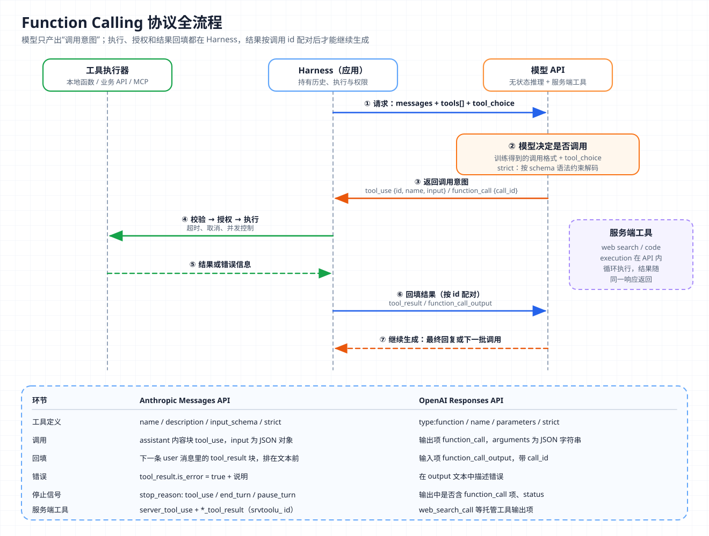
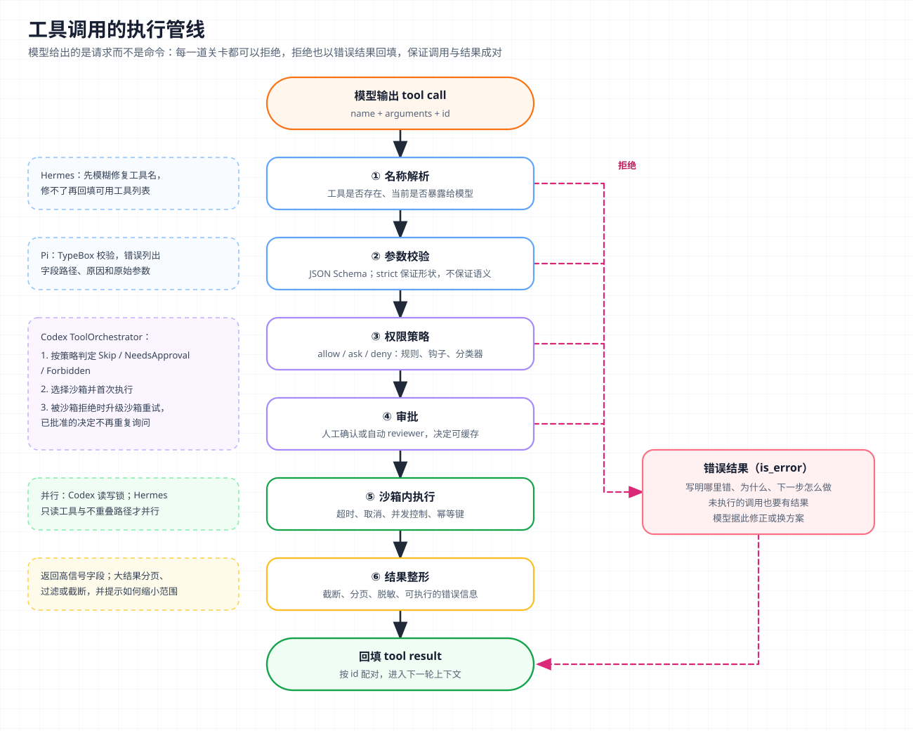

# 核心概念 04 - Tool Use：从函数定义到受控的外部动作

> 技术快照：OpenAI Codex `6ff670bd`、Pi `c8c3cd49`、Hermes Agent `30e947e0`，API 字段与模型能力以文末参考链接为准

> *本合集是一套面向 Agent 架构与工程实践的系统学习笔记，帮助读者建立从原理、Runtime、工具与权限到评测和多 Agent 编排的完整知识框架。*
>
> *本篇讲 function calling 协议的完整往返、模型选择工具的机制、strict 模式与并行调用，并从工具设计、可靠性、权限沙箱和大规模工具目录四个方面说明如何把模型的“调用意图”变成可控的外部动作。*

## Tool Use 的边界：模型只产出调用意图

Tool Use（也称 function calling）指模型在回复中输出包含工具名和参数的结构化调用请求，由应用或服务端执行后把结果交还模型继续生成。模型不运行代码，也不知道工具是否真的执行了，它只看到下一轮请求里的结果。

按这条边界分工，模型选择工具并填写参数，Harness 决定能否执行、在哪里执行，以及结果如何交回。[Agent Loop](03-agent-loop.md) 讲的是这个往返如何反复推进，本篇讲单次往返本身。

按执行位置，工具分三类：

| 类型 | 谁定义 schema | 谁执行 | 例子 |
| --- | --- | --- | --- |
| 自定义客户端工具 | 开发者 | 应用 | 查询订单、读文件、调用内部 API |
| 厂商 schema 客户端工具 | 模型厂商（schema 由厂商固定） | 应用 | Anthropic 的 `bash`、`text_editor`；OpenAI 的 `apply_patch` |
| 服务端工具 | 模型厂商 | 模型服务 | web search、web fetch、code execution、tool search |

MCP（Model Context Protocol）是把外部工具以统一协议接入 Harness 的方式，接入后在模型眼里仍是普通工具定义，细节见 [MCP](08-mcp.md)。

## 协议全流程：定义、调用、执行、回填、继续



七步构成一次完整往返，④⑤ 完全发生在 Harness 一侧，服务端工具例外。底部表格对比两家 API 的字段。

### Anthropic Messages API

工具定义放在请求的 `tools` 数组里（名称须匹配 `^[a-zA-Z0-9_-]{1,128}$`）。模型决定调用时，响应 `stop_reason` 为 `tool_use`，assistant 内容里出现 `tool_use` 块；应用执行后，在下一条 user 消息里回填 `tool_result`：

```json
{ "name": "get_weather", "description": "Get the current weather for a given location.",
  "input_schema": { "type": "object", "required": ["location"],
                    "properties": { "location": { "type": "string" } } } }
{ "type": "tool_use", "id": "toolu_01A09q...", "name": "get_weather",
  "input": { "location": "San Francisco, CA" } }
{ "type": "tool_result", "tool_use_id": "toolu_01A09q...", "content": "15°C, partly cloudy" }
```

Anthropic 没有专门的 `tool` 角色，工具调用和结果都是 user / assistant 消息中的内容块。协议有三条硬性约束，违反会得到 400 错误：

- `tool_result` 必须紧跟在对应的 `tool_use` 所在消息之后，中间不能插入其他消息；
- 同一条 user 消息里，`tool_result` 块必须排在任何文本之前；
- 每个 `tool_use` 都要有对应结果，没有执行的调用也要回填一条 `is_error: true` 的结果。

### OpenAI Responses API 与 Chat Completions

Responses API 的工具定义带 `type: "function"`，参数 schema 字段叫 `parameters`。模型输出的是独立的 `function_call` 输出项，`arguments` 是 JSON 字符串，不是对象；应用回填 `function_call_output` 输入项，用 `call_id` 配对：

```json
{ "type": "function_call", "call_id": "call_weather", "name": "get_weather",
  "arguments": "{\"location\":\"Paris, France\"}" }
{ "type": "function_call_output", "call_id": "call_weather",
  "output": "{\"city\":\"Paris\",\"temperature_c\":18}" }
```

对推理模型，响应中与工具调用一起返回的 reasoning 项必须随工具结果一起传回。Chat Completions 格式则是 assistant 消息带 `tool_calls` 数组、结果用 `role: "tool"` 加 `tool_call_id` 回填，Hermes Agent 的主循环就使用这种格式。

两家的差异见图底部的表格。两家都用 id 配对调用意图与结果，结果回填后由模型继续生成，Harness 的历史裁剪、压缩和恢复都必须维护这个配对关系。

## 模型如何“决定”调用工具

工具调用是训练出来的输出格式，模型内部并没有函数调度器。Anthropic 文档公开了注入方式。传入 `tools` 后，API 构造一段特殊 system prompt，包含格式说明、JSON Schema 形式的工具定义、用户 system prompt 和工具配置；模型按训练过的格式输出调用，API 再解析成 `tool_use` 块。这段注入本身要花 token（Claude Opus 5.5 为 286，Opus 4.7 在 `auto` 下为 675），另加全部工具定义。

所以“决定调用”是一次条件生成，模型根据请求、上下文和工具描述，预测下一段输出是文字还是调用。这带来两个后果：

- 工具描述是影响调用质量的最大因素。Anthropic 把“极其详细的描述”列为首要实践，建议每个工具至少三到四句话，说明做什么、何时该用何时不该用、每个参数的含义和限制。
- 缺参数时模型可能自行编造。文档举例：只问“天气怎么样”，Claude Sonnet 可能填上 “New York, NY”，Claude Opus 更倾向于追问。

### tool_choice：约束是否调用

| 语义 | Anthropic | OpenAI |
| --- | --- | --- |
| 模型自行决定（默认） | `auto` | `auto` |
| 必须调用某个工具 | `any` | `required` |
| 必须调用指定工具 | `{"type":"tool","name":...}` | 指定 function |
| 禁止调用 | `none` | `none` |
| 限定可用子集 | — | `allowed_tools` |

Anthropic 在 `any` / `tool` 模式下会预填 assistant 消息强制输出调用，模型因此不会在 `tool_use` 前写说明文字。强制模式也有限制。手动开启 extended thinking 时不支持 `any` 和 `tool`；Claude Opus 5.5 等模型完全不支持强制调用，官方建议改用 `auto` 加 strict。修改 `tool_choice` 还会使已缓存的消息块失效，缓存机制见 [KV Cache](02-kv-cache.md)。

## JSON Schema 与 strict 模式

非 strict 模式下 schema 只是提示，模型可能把整数写成 `"2"` 或漏掉必填字段。strict 模式使用语法约束采样（grammar-constrained sampling），服务端把 schema 编译成语法，解码时只允许符合语法的 token。Anthropic 保证 strict 工具的 `input` 符合 schema、工具名有效。

并非所有 JSON Schema 特性都能编译成语法，因此有额外要求：

| 要求 | Anthropic | OpenAI |
| --- | --- | --- |
| 开启方式 | 工具定义加 `strict: true` | 函数定义加 `strict: true` |
| 对象约束 | `additionalProperties: false` | `additionalProperties: false`，所有字段列入 `required`，可选字段用 `["string","null"]` |
| 默认行为 | 需显式开启 | Responses API 会尽量把 schema 规范化为 strict，无法兼容时回退为非 strict |
| 编译缓存 | 编译后的 schema 最多缓存 24 小时 | — |

strict 只保证参数形状，不保证业务语义。路径是否越界、金额是否超限、用户是否有权限，仍要在执行前校验。外部接入的 schema 也常不满足 strict 要求。Codex 把 MCP 工具转换成 Responses API 工具时，统一写入 `strict: false`；Pi 则在执行前用 TypeBox 校验，并先用 `Value.Convert` 做类型转换，把 `"2"` 这类输入转成 schema 要求的类型。

## 并行工具调用

两家 API 默认都允许模型在一次回复里发出多个工具调用。Anthropic 用 `tool_choice` 内的 `disable_parallel_tool_use: true` 关闭（`auto` 下最多一个，`any` / `tool` 下恰好一个），OpenAI 用 `parallel_tool_calls: false` 关闭。

API 只负责让模型一次说出多个意图，不规定执行顺序。Anthropic 文档写明，这些调用可以并发执行、顺序执行或混合执行，但所有结果要放在下一条 user 消息里一起回填。如果顺序执行时前一个失败、后一个没跑，也要给后一个回填错误结果，例如 `"Not executed: the preceding write_file call failed."`。

是否真的并发执行，由 Harness 根据安全性决定。三个实现的做法如下：

| 实现 | 并发策略 |
| --- | --- |
| Pi | 默认并行；工具可声明 `executionMode: "sequential"`，同批次出现这类工具时整批顺序执行 |
| Codex | 共享一把读写锁：声明支持并行的工具拿读锁，可同时运行；其余拿写锁，独占执行 |
| Hermes Agent | 白名单：只读工具、目标路径互不重叠的文件工具、声明可并行的 MCP 工具才并发，最多 8 个线程 |

Codex 的实现只有几行：

```rust
let _guard = if supports_parallel {
    Either::Left(lock.read().await)     // 可并行工具共享读锁
} else {
    Either::Right(lock.write().await)   // 其余工具独占
};
router.dispatch_tool_call_with_terminal_outcome(/* ... */).await
```

Hermes 的判定更细。任一调用参数无法解析就整批退回顺序执行；`read_file`、`write_file`、`patch` 按目标路径判断，路径重叠则顺序执行；`clarify` 这类要和用户交互的工具永远不并行。回填顺序上，Pi 用 `Promise.all` 按原顺序收集，Codex 用 `FuturesOrdered`，结果顺序与调用顺序一致，便于模型对应。

## 服务端工具与客户端工具

服务端工具由模型服务执行，Harness 看得到调用和结果，但不参与执行：

| 维度 | 客户端工具 | 服务端工具 |
| --- | --- | --- |
| 执行位置 | 应用进程或其沙箱 | 模型服务的基础设施 |
| 结果回填 | 应用发送 `tool_result` | 结果块随同一响应返回，无需回填 |
| 循环 | 应用驱动 | 服务端内部循环，达到迭代上限返回 `pause_turn` |
| 计费 | 只计 token | token 加按次计费（如每次搜索） |
| 数据与合规 | 应用可控 | 依赖服务端的数据保留策略 |

Anthropic 的服务端工具调用以 `server_tool_use` 块出现，id 前缀为 `srvtoolu_`，结果块（如 `web_search_tool_result`）紧随其后。两个边界情况会影响 Agent Loop 的实现：

- **`pause_turn`**：服务端循环在长任务中暂停，应用要把 assistant 内容原样发回，并保留同样的 `tools`，才能继续。
- **客户端与服务端工具混在同一批调用中**：API 不执行服务端工具，直接以 `stop_reason: "tool_use"` 返回。应用执行客户端工具后，下一条 user 消息里只能放 `tool_result` 块，服务端工具会在下一次请求开头执行；追加文本会被视为轮次结束，导致 400 错误。

OpenAI Responses API 的托管工具包括 `web_search`、`file_search`、`code_interpreter`、`computer_use`、`image_generation`、`shell`、`tool_search` 和远程 `mcp`，以各自的输出项出现在响应中。Anthropic 的 programmatic tool calling 让模型在 code execution 容器里写代码批量调用工具（工具用 `allowed_callers` 声明允许的调用方），把多次往返压缩成一段代码执行。

## 工具设计：Agent-Computer Interface

SWE-agent 论文提出 ACI（Agent-Computer Interface，面向 Agent 的计算机接口）：人用 IDE，Agent 也需要专门设计的接口。它用定制的文件查看、编辑和搜索命令在 SWE-bench 上取得 12.5% 的 pass@1。Anthropic《Building effective agents》给了一个具体例子：模型在切换目录后频繁写错相对路径，把工具改成只接受绝对路径后，错误消失了。这种做法叫 poka-yoke（防错设计）。

Anthropic《Writing effective tools for agents》的原则可以归纳为下表：

| 原则 | 做法 | 依据 |
| --- | --- | --- |
| 按任务设计，不包装 API | 提供 `search_contacts` 而非 `list_contacts` | 列表类工具浪费上下文 |
| 合并相关操作 | 一个带 `action` 参数的工具代替 `create_pr`、`merge_pr` 等 | 减少选择歧义 |
| 命名空间 | 以服务为前缀，如 `github_list_prs` | 工具增多时仍可区分，便于搜索 |
| 返回高信号内容 | 用可读名称代替不透明 UUID，只返回下一步需要的字段 | 同一 Slack 结果 detailed 206 token，concise 72 token |
| 控制返回规模 | 分页、过滤、截断并给出默认上限 | Claude Code 默认把工具返回限制在 25,000 token |
| 可执行的错误信息 | 说明错在哪、如何修正，必要时给出正确输入示例 | 模型据此自我纠正 |
| 用评测驱动迭代 | 用真实任务评估，让模型分析失败并改写描述 | 优化后的工具优于人工初版 |

OpenAI function calling 文档补充了两条：不要让模型填写应用已知的参数（如当前用户 ID），总是一起调用的函数应合并为一个。这些原则针对的调用方是模型，它按 token 付费，上下文有限，还容易被模糊的描述误导。

## 可靠性与安全：从调用意图到受控执行



模型给出的调用只是请求。图中每道关卡都可以拒绝它，拒绝同样以错误结果回填，保证调用与结果成对；左侧是各关卡的开源实现示例。

### 按副作用分级

策略取决于副作用能否重复：

| 类别 | 例子 | 自动重试 | 并行 | 审批 |
| --- | --- | --- | --- | --- |
| 只读 | 搜索、读文件、查询 | 可以 | 可以 | 通常不需要 |
| 幂等写 | 按 ID 覆盖配置、设置标签 | 可以（带幂等键） | 视资源冲突 | 视范围 |
| 非幂等写 | 发消息、创建订单、追加记录 | 不自动重试 | 不并行 | 通常需要 |
| 不可逆 | 删除数据、转账、生产部署 | 不重试 | 不并行 | 必须人工确认 |

OpenAI 的指南建议按只读/可写、可逆性、权限范围和财务影响给工具评定风险等级，高风险动作（取消订单、大额退款、付款）在建立信任前都要人工介入。

具体机制：

- 超时与取消：取消信号要传到子进程；Codex 对未进入终态的工具返回带耗时的“已中止”结果。
- 幂等：推断上可由 tool call id 派生幂等键，重试或恢复时据此去重。
- 不可信结果：网页、邮件、第三方响应要留在 `tool_result` 块里，不拼进 system prompt 或普通 user 文本，以降低间接提示注入风险。

### 权限、审批与沙箱

权限必须在模型之外强制执行，提示词里的“不要删除文件”只是建议。常见做法分四层：

| 层 | 控制什么 | 例子 |
| --- | --- | --- |
| 暴露面 | 模型能看到哪些工具 | 按任务或角色裁剪工具集 |
| 策略 | 每次调用 allow / ask / deny | 规则匹配命令或路径，钩子拦截 |
| 审批 | 需要确认时由谁决定 | 人工确认、自动 reviewer 模型 |
| 沙箱 | 执行时能访问什么 | 文件系统只读或限定工作区、网络隔离 |

Codex 的 `ToolOrchestrator` 把这些步骤集中在一个函数里，源码注释写明顺序是“审批 → 选择沙箱 → 执行 → 被拒绝时用升级的沙箱策略重试（审批结果已缓存，不重复询问）”：

```rust
let requirement = tool.exec_approval_requirement(req).unwrap_or_else(|| {
    default_exec_approval_requirement(approval_policy, &file_system_sandbox_policy)
});
match &requirement {
    ExecApprovalRequirement::Skip { .. } => { /* 策略允许；严格自动审查模式下仍送审 */ }
    ExecApprovalRequirement::Forbidden { reason } => return Err(ToolError::Rejected(reason.clone())),
    ExecApprovalRequirement::NeedsApproval { .. } => { /* request_approval → 未批准则拒绝 */ }
}
let initial_sandbox = if sandbox_requested {
    self.sandbox.select_initial(/* 文件系统与网络策略 ... */)
} else { SandboxType::None };
let (first_result, _) = Self::run_attempt(tool, req, tool_ctx, &initial_attempt, managed_network_active).await;
match first_result {
    Ok(out) => { /* 返回结果 */ }
    Err(ToolError::Codex(CodexErr::Sandbox(SandboxErr::Denied { .. }))) => {
        /* 按策略决定是否升级沙箱后重试 */
    }
    // ...
}
```

Pi 把同一职责开放为扩展点：`beforeToolCall` 钩子在参数校验之后、执行之前运行，返回 `{ block: true, reason }` 就会生成错误结果回填，工具不执行。`afterToolCall` 可以改写结果内容、错误标记或终止标志。权限系统的完整设计属于 [Harness Engineering](14-harness-engineering.md)。

## 工具太多：选择退化、工具搜索与延迟加载

每个工具定义都占上下文，也增加选择难度。Anthropic 文档给出的量级：同时接入 GitHub、Slack、Sentry、Grafana、Splunk 五个服务，工具定义约 55k token；可用工具超过 30 到 50 个后，选择准确率开始下降。OpenAI 建议一轮开始时可用函数少于 20 个，并说明这只是软建议。

常见解法是按需加载。请求里仍然声明全部工具，但大部分标记为延迟加载，模型先看到一个搜索工具，搜到后才把完整定义放进上下文。

| 维度 | Anthropic tool search | OpenAI tool search |
| --- | --- | --- |
| 声明方式 | 工具加 `defer_loading: true`，另加 `tool_search_tool_regex_*` 或 `tool_search_tool_bm25_*` | 命名空间内的函数加 `defer_loading: true`，配合托管 `tool_search` |
| 搜索方式 | 正则（Python `re.search`）或自然语言 BM25，搜索名称、描述和参数 | 托管检索 |
| 结果形态 | `tool_reference` 块，由 API 展开为完整定义 | 加载后的工具定义 |
| 规模 | 每请求最多 10,000 个延迟工具，每次默认返回 5 个 | 文档未给出数量上限，建议每个命名空间少于 10 个函数 |

Anthropic 称这通常能减少 85% 以上的工具定义开销，建议最常用的 3 到 5 个工具保持非延迟；也可以自建检索，在普通 `tool_result` 中返回 `tool_reference` 块。

Codex 在客户端实现了同样的机制。`ToolSearchInfo::from_spec()` 把函数或命名空间里的工具标记为延迟加载，并去掉输出 schema，搜索文本由名称、描述和参数拼成：

```rust
ToolSpec::Function(mut tool) => {
    tool.defer_loading = Some(true);
    tool.output_schema = None;
    LoadableToolSpec::Function(tool)
}
```

按任务裁剪工具集、把一组工具交给 [Subagent](10-subagent.md)、封装成按需加载的 [Skills](07-skills.md)，也能减少同时面对的选项。工具总量不到 10 个或每次都要用全部工具时，直接声明更简单。

## 设计取舍

| 决策 | 选项 A | 选项 B | 取舍 |
| --- | --- | --- | --- |
| 参数约束 | 非 strict + 运行时校验 | strict 约束解码 | strict 消除格式错误，但限制 schema 表达力，外部 schema 难以满足 |
| 执行位置 | 客户端工具 | 服务端工具 | 服务端省实现和往返，但数据、合规、定制性受限 |
| 并发 | 全部顺序 | 按副作用分类并发 | 并发降低延迟，但要能准确识别冲突 |
| 工具目录 | 全部预加载 | 搜索 + 延迟加载 | 延迟加载省上下文、提升选择准确率，但多一次搜索往返，也可能漏检 |

## 生产约束与失败模式

- **配对被破坏**：裁剪或压缩历史时拆散了调用与结果，请求直接 400。每次发送前做结构规范化。
- **模型编造工具或参数**：名字相近的工具、缺失的必填参数都会诱发编造。用 strict、命名空间和详细描述预防，用可执行的错误信息纠正。
- **并发写冲突**：两个调用同时修改同一文件或资源。按路径或资源键判断冲突，不确定时顺序执行。
- **重复副作用**：超时后的重试或崩溃恢复导致同一操作执行两次。非幂等工具必须带幂等键，恢复时先查询外部状态。
- **结果撑爆上下文**：一次查询返回数万行日志。设置默认上限、分页和摘要，并在截断时告诉模型如何缩小范围。
- **工具结果里的提示注入**：网页或邮件里的“忽略之前的指令”被当成指令执行。权限在模型外强制，敏感工具需要审批。

## 架构推演

某电商平台要为客服团队构建售后 Agent：可以查询订单与物流、修改收货地址、发起退款（单笔上限 500 元，超过需主管批准）、给用户发送消息。后端能力来自 12 个内部服务，现有 API 共约 180 个端点；公司还希望 Agent 能在需要时搜索公开的物流政策网页。

请设计这套工具层，并说明：

- 180 个端点如何收敛为工具集，哪些合并、用命名空间区分或延迟加载；
- 哪些工具启用 strict，金额、订单归属、地址格式等约束在哪里校验；
- 查询、改地址、退款、发消息的副作用级别及对应的重试、并发、审批策略；
- 退款超限时审批如何发出和等待，被拒绝后模型收到什么；
- 网页搜索用服务端工具还是自建工具，合规与注入风险如何控制；
- 退款超时或进程崩溃后如何避免重复退款、确认调用是否生效；
- 如何用真实工单轨迹评测并迭代工具描述与返回格式。

方案需要分别说明模型可以请求什么、系统允许执行什么。模型可见的工具影响选择准确率，应当少而清晰。执行侧的约束关系到资金与数据安全，需要完整并强制执行。两者之间靠校验、策略、审批和幂等衔接。

## 复习结论

- 模型只输出调用意图，执行、授权和回填在 Harness 或模型服务一侧；两家协议的共性是按 id 配对、回填后继续生成。
- 调用决策是训练出的条件生成，描述质量决定选择质量，`tool_choice` 只约束是否调用。
- strict 用语法约束解码保证参数形状，不保证业务语义。
- API 允许并行调用，Harness 决定是否真并发；结果一次回填，未执行的调用也回填错误。
- 服务端工具省去执行与往返，但要遵守 `pause_turn` 和混合调用的续接规则。
- 工具设计遵循 ACI：按任务设计、命名空间、高信号返回、控制规模、可执行的错误信息。
- 按副作用分级决定重试、并发、幂等和审批；权限在模型之外强制执行。
- 工具过多时用工具搜索与延迟加载按需暴露定义，常用工具保持常驻。

## 参考

| 主题 | 来源 |
| --- | --- |
| Anthropic 工具协议 | [Tool Use Overview](https://platform.claude.com/docs/en/agents-and-tools/tool-use/overview) · [Define Tools](https://platform.claude.com/docs/en/agents-and-tools/tool-use/define-tools) · [Handle Tool Calls](https://platform.claude.com/docs/en/agents-and-tools/tool-use/handle-tool-calls) · [Parallel Tool Use](https://platform.claude.com/docs/en/agents-and-tools/tool-use/parallel-tool-use) · [Strict Tool Use](https://platform.claude.com/docs/en/agents-and-tools/tool-use/strict-tool-use) |
| Anthropic 服务端工具与工具搜索 | [Server Tools](https://platform.claude.com/docs/en/agents-and-tools/tool-use/server-tools) · [Tool Search Tool](https://platform.claude.com/docs/en/agents-and-tools/tool-use/tool-search-tool) · [Handling Stop Reasons](https://platform.claude.com/docs/en/build-with-claude/handling-stop-reasons) |
| OpenAI 工具协议 | [Function Calling](https://developers.openai.com/api/docs/guides/function-calling) · [Tools](https://developers.openai.com/api/docs/guides/tools) · [Apply Patch](https://developers.openai.com/api/docs/guides/tools-apply-patch) · [Tool Search](https://developers.openai.com/api/docs/guides/tools-tool-search) · [A Practical Guide to Building Agents](https://cdn.openai.com/business-guides-and-resources/a-practical-guide-to-building-agents.pdf) |
| 工具设计与 ACI | [Writing Effective Tools for Agents](https://www.anthropic.com/engineering/writing-tools-for-agents) · [Building Effective Agents](https://www.anthropic.com/engineering/building-effective-agents) · [SWE-agent: Agent-Computer Interfaces](https://arxiv.org/abs/2405.15793) |
| Codex 工具执行 | [`orchestrator.rs`](https://github.com/openai/codex/blob/6ff670bd/codex-rs/core/src/tools/orchestrator.rs) · [`parallel.rs`](https://github.com/openai/codex/blob/6ff670bd/codex-rs/core/src/tools/parallel.rs) · [`responses_api.rs`](https://github.com/openai/codex/blob/6ff670bd/codex-rs/tools/src/responses_api.rs) · [`tool_search.rs`](https://github.com/openai/codex/blob/6ff670bd/codex-rs/tools/src/tool_search.rs) |
| Pi 工具执行 | [`agent-loop.ts`](https://github.com/earendil-works/pi/blob/c8c3cd49/packages/agent/src/agent-loop.ts) · [`types.ts`](https://github.com/earendil-works/pi/blob/c8c3cd49/packages/agent/src/types.ts) · [`validation.ts`](https://github.com/earendil-works/pi/blob/c8c3cd49/packages/ai/src/utils/validation.ts) |
| Hermes Agent 工具执行 | [`tool_dispatch_helpers.py`](https://github.com/NousResearch/hermes-agent/blob/30e947e0/agent/tool_dispatch_helpers.py) · [`tool_executor.py`](https://github.com/NousResearch/hermes-agent/blob/30e947e0/agent/tool_executor.py) · [`conversation_loop.py`](https://github.com/NousResearch/hermes-agent/blob/30e947e0/agent/conversation_loop.py) |
