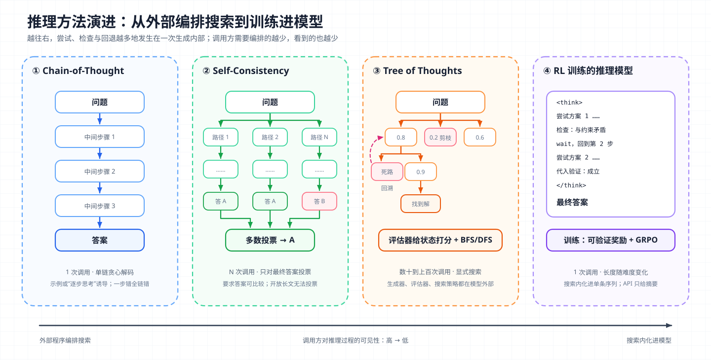
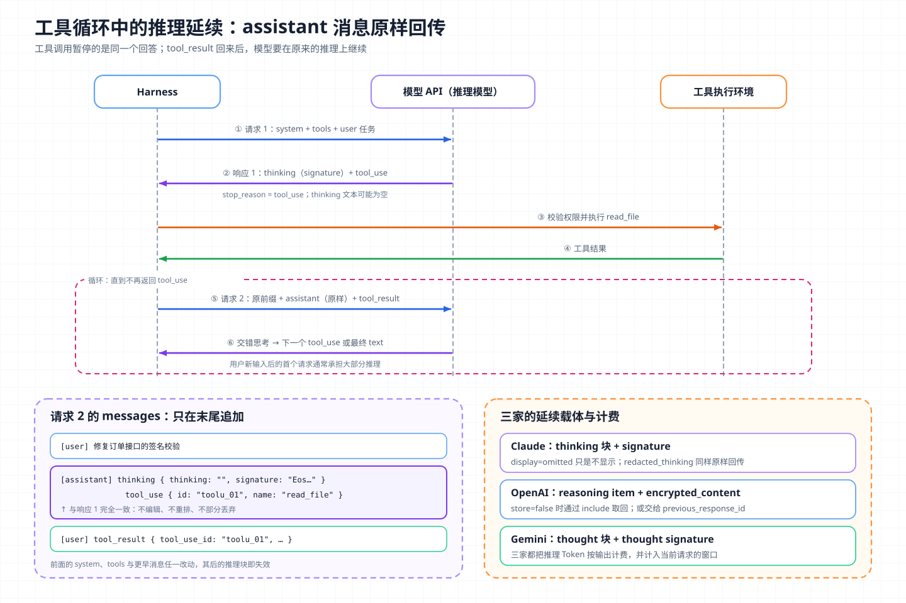

# 核心概念 05 - Reasoning：把计算花在答案之前

> 技术快照：OpenAI Codex `6ff670bd`，API 字段与模型能力以文末参考链接为准

> *本合集是一套面向 Agent 架构与工程实践的系统学习笔记，帮助读者建立从原理、Runtime、工具与权限到评测和多 Agent 编排的完整知识框架。*
>
> *本篇从 Chain-of-Thought 讲到用强化学习训练出的推理模型，拆解 Anthropic、OpenAI、Gemini 三家 API 暴露推理的方式，并回答 Agent 在工具循环里如何保存推理、何时开启推理、开多大，以及可见推理能被信任到什么程度。*

## 推理的定义与边界：中间 Token、内部计算与 Agent 决策

LLM 的 Reasoning（推理）在工程上指一件具体的事：模型在给出最终答案之前，先生成一段中间 Token，并让最终答案以这段中间内容为条件。这段内容可以写在回答里（提示词诱导的 Chain-of-Thought），也可以放在 API 单独返回的 thinking / reasoning 块里（推理模型）。

多生成 Token 为什么能提升正确率，可以从计算量理解。Transformer 每生成一个 Token 做一次深度固定的前向计算。直接输出答案，所有中间步骤都要压进答案那几次前向里；先写出中间步骤，等于把串行计算摊到更多次前向上，每步结果再作为后续输入。推断：这是 Test-time Compute（推理时计算，在推理阶段而非训练阶段追加的计算量）能换取质量的基本原因，所以它对算术、代码、多约束规划这类步骤相互依赖的任务收益最大，对事实问答收益很小。

推理和几个相邻概念的边界如下：

| 概念 | 解决什么 | 不解决什么 |
| --- | --- | --- |
| Reasoning | 在已知信息上做多步推导、检查、改道 | 不增加模型不知道的事实，不能替代查询 |
| [Planning](06-planning.md) | 把目标拆成可执行、可验证的步骤并维护进度 | 单步推导本身的正确性 |
| [Tool Use](04-tool-use.md) | 从外部获取事实、产生副作用 | 决定调用哪个工具、如何解读结果 |

两条边界要记住。第一，推理只在上下文和参数知识范围内推导，信息缺失时只会推出自洽但可能错误的结论，这时该调用工具，而不是加大推理预算。第二，写出来的推理不等于内部实际发生的计算，见“忠实性”一节。

## 从提示技巧到推理模型：四类方法的演进



图中从左到右，推理从提示词诱导的一条链，发展到多链投票、显式树搜索，最后被训练进模型本身。越往右，调用方要编排的越少，能看到的推理过程也越少。

### Chain-of-Thought：用示例诱导中间步骤

Chain-of-Thought（CoT，思维链）由 Wei 等人提出：在 few-shot 示例里给出“问题 → 推理步骤 → 答案”，模型会模仿格式先写步骤再给答案。PaLM 540B 加 8 个带推理过程的示例，在 GSM8K 数学应用题上超过了微调并配合验证器的 GPT-3。这种收益在小模型上不明显，规模到约千亿参数才稳定出现。

Zero-shot CoT 去掉了示例。Kojima 等人发现只在答案前加一句 “Let's think step by step”，就能让 text-davinci-002 在 MultiArith 上从 17.7% 提到 78.7%，GSM8K 从 10.4% 提到 40.7%。逐步推理的能力已在模型里，提示词只是激活它。

### Self-Consistency：多条推理路径投票

单条 CoT 是贪心解码，一步走错全盘皆错。Self-Consistency（自洽解码）改为采样 N 条推理路径，丢弃推理文本，只对最终答案投票：

```text
answer = argmax_a  Σ_{i=1..N} 1[ a_i = a ]
```

它的前提是：正确答案可以由多条不同路径到达，错误路径的答案则相对分散。论文报告在 GSM8K 上比贪心 CoT 提升 17.9 个百分点。代价是调用次数乘以 N，而且只适用于答案可比较的任务（数值、选项、可规范化的短答案）；对开放式长文本，投票没有明确定义。

### Tree of Thoughts：显式搜索与状态评估

Tree of Thoughts（ToT，思维树）把推理拆成若干“想法”节点，每个节点由模型生成多个候选后继，再由模型给每个状态打分，用 BFS 或 DFS 搜索，允许回溯。在 24 点游戏上，GPT-4 用 CoT 的成功率为 4%，ToT 为 74%。

| 方法 | 搜索结构 | 每题模型调用 | 需要评估器 | 适用任务 |
| --- | --- | --- | --- | --- |
| CoT / Zero-shot CoT | 单链 | 1 | 否 | 通用多步推导 |
| Self-Consistency | N 条独立链 + 投票 | N | 否（答案投票） | 答案可比较的题目 |
| Tree of Thoughts | 树 + 回溯 | 数十到上百 | 是（模型自评或规则） | 需要试错的组合问题 |
| 推理模型 | 单条长链，内部含回溯与检查 | 1 | 训练时用奖励 | 通用，尤其是数学、代码、Agent |

前三种在推理阶段由外部程序编排计算；推理模型则把“多试几条路、错了回头”训练进一条长推理链。

## 推理模型的训练原理：可验证奖励与长推理链

OpenAI 发布 o1 时的核心观察是：用强化学习（RL）训练模型生成思维链后，性能同时随训练阶段的 RL 计算量和推理阶段的“思考时间”增长，Test-time Compute 由此成为可调资源。DeepSeek-R1 公开了细节。

### 奖励只看结果，不看过程

DeepSeek-R1-Zero 直接在基座模型上做 RL，不使用人工标注的推理轨迹。奖励完全基于规则：

- 准确性奖励：数学题比对标准答案，代码题运行测试；
- 格式奖励：要求推理写在 `<think>` 标签内，答案写在 `<answer>` 标签内。

论文不用神经网络奖励模型，理由是大规模 RL 中它容易被 Reward Hacking（策略钻奖励函数的漏洞而非真正完成任务），重训成本也高。只奖励可验证结果，模型就可以自由探索推理方式。

### GRPO：用组内相对得分代替价值网络

训练算法是 GRPO（Group Relative Policy Optimization，组相对策略优化）。对同一道题采样一组 G 个回答，用组内奖励的均值和标准差归一化得到每个回答的优势：

```text
A_i = ( r_i - mean(r_1..r_G) ) / std(r_1..r_G)
```

高于组平均的回答被强化，低于的被抑制。组内平均就是基线，因此不需要 PPO（近端策略优化）那样单独训练价值网络（critic）。

### 长度增长与“顿悟”

训练中出现了三个现象：

- AIME 2024 的 pass@1（单次采样正确率）从 15.6% 升到 77.9%，16 次采样多数投票达到 86.7%；
- 平均回答长度随训练步数持续增长，模型自发地把更多 Token 花在思考上；
- 推理中出现反思和验证行为，论文记录了模型开始用 “wait” 重新审视前面步骤的“aha moment”。

推断：这是把 Self-Consistency 和 ToT 的外部搜索内化进单条序列。模型在一条链里提出思路、检查、发现矛盾、回退换路，奖励只看终点，“序列内搜索”就被选择出来，推理长度也因此随题目难度变化。

R1-Zero 的推理可读性差、中英混杂。正式的 R1 分四阶段：冷启动 SFT（监督微调）规范格式，推理导向 RL（加语言一致性奖励），拒绝采样扩充 SFT 数据，再做覆盖有用性与安全性的 RL；其推理轨迹还被蒸馏到小模型。

### Test-time Compute 的收益边界

Snell 等人比较了“推理时多花计算”和“换更大的模型”：按难度自适应分配推理计算，比固定 best-of-N 效率高 4 倍以上；计算量对齐时，在基座模型已有一定成功率的题目上，小模型加推理计算可超过大 14 倍的模型，最难的题则仍是扩大预训练更有效。推理预算能弥补“会但不稳”，弥补不了“不会”。

## API 机制：三家厂商如何暴露推理

API 层面要回答四个问题：如何控制推理量、调用方看到什么、推理如何跨请求延续、如何计费。

| 维度 | Anthropic Claude | OpenAI Responses API | Google Gemini |
| --- | --- | --- | --- |
| 开关与强度 | `thinking: {type: "adaptive"}` + `output_config.effort`；旧模型用 `type: "enabled"` + `budget_tokens` | `reasoning.effort`，取值按模型从 `none` 到 `max` | `thinking_level`（low / medium / high 等，按模型） |
| 可见内容 | thinking 块，`display` 为 `summarized` 或 `omitted`；给出的是摘要，不是原始推理 | reasoning item，可选 `summary` | thought 步骤，可选摘要 |
| 延续载体 | 每个 thinking 块的 `signature`（加密的完整推理） | reasoning item 的 `encrypted_content`，或服务端 `previous_response_id` | thought signature |
| 计费字段 | `usage.output_tokens_details.thinking_tokens` | `usage.output_tokens_details.reasoning_tokens` | thought tokens 计入输出 |
| 工具循环要求 | 原样回传 thinking 块，不可修改、重排或部分丢弃 | 回传上次函数调用以来的 reasoning item | 无状态模式下原样回传 thought 块 |

### Anthropic：自适应思考与签名

当前 Claude 模型使用 Adaptive Thinking（自适应思考）：模型逐请求判断是否思考、想多少，调用方用 effort 表达意图。`low` 尽量少想，`medium` 适度、简单问题可能跳过，`high` 是多数模型的默认值，`xhigh` 与 `max` 进一步放开；任何档位都不保证出现 thinking 块。

旧的手动模式 `type: "enabled"` 加 `budget_tokens` 要求预算不少于 1,024 且小于 `max_tokens`，预算只是目标而非硬上限；它在 4.6 代模型上已弃用，4.7 及之后直接返回 400。

一次带工具调用的响应长这样：

```json
{
  "role": "assistant",
  "content": [
    { "type": "thinking", "thinking": "", "signature": "EosnCkYICxIM..." },
    { "type": "tool_use", "id": "toolu_01", "name": "read_file",
      "input": { "path": "src/order/service.ts" } }
  ],
  "stop_reason": "tool_use"
}
```

`thinking` 为空是因为较新模型的 `display` 默认 `omitted`，设为 `summarized` 才返回摘要；两者计费相同。`signature` 是完整推理的加密副本，调用方不应解析，服务端在下一次请求中解密它重建推理。推理被安全系统遮蔽时会出现只带加密 `data` 的 `redacted_thinking` 块，同样原样回传。

### OpenAI：reasoning item 与加密内容

Responses API 把推理作为独立的 `reasoning` 输出项。`store: false` 或零数据保留时，reasoning item 带 `encrypted_content`，放回下一次请求即可延续。`reasoning.context` 决定是否渲染更早轮次的推理（`all_turns` / `current_turn`，默认值随模型）。官方建议起步时为推理和输出预留至少 25,000 Token，耗尽 `max_output_tokens` 时响应状态为 `incomplete`。

Codex 不在服务端存储会话，因此请求时主动要求返回加密推理：

```rust
// build_responses_request 中
let reasoning = Self::build_reasoning(model_info, effort, summary); // effort 缺省时取模型目录的 default_reasoning_level
let include = if reasoning.is_some() {
    vec!["reasoning.encrypted_content".to_string()]
} else {
    Vec::new()
};
let request = ResponsesApiRequest {
    reasoning,
    store: provider.is_azure_responses_endpoint(),
    include,
    // ...
};
```

历史中的 `ResponseItem::Reasoning` 保存 `summary` 和 `encrypted_content`，下一轮随历史重放。

### Gemini：thinking level 与 thought signature

Gemini 用 `thinking_level` 控制强度，推理以 thought 步骤返回并带 thought signature（推理状态的加密表示）。有状态模式由服务端管理签名，无状态模式必须原样回传 thought 块，函数调用时官方 SDK 会自动处理。

### 工具循环中的推理连续性



图中是一次用户输入触发的 Agent turn：请求 1 返回 thinking 和 tool_use，Harness 执行工具，请求 2 把上一条 assistant 消息原样放回并附上 tool_result；模型在工具结果之后可以再次思考，即 Interleaved Thinking（交错思考，同一 assistant turn 的多次工具调用之间继续推理）。

必须原样回传，是因为工具调用暂停的是同一个回答，tool_result 虽然在结构上是 user 消息，推理上仍属于同一条思路。Anthropic 的具体规则是：

- 最新 assistant 消息里连续的 thinking 块必须与原始生成一致，不能编辑、重排或部分丢弃，`redacted_thinking` 也算在内；
- 一个 thinking 块只在它之前的 `system`、`tools` 和更早消息都未改变时有效，前缀一旦改动，该块及其后所有 thinking 块失效，API 返回 400 或丢弃它们；
- 较新模型默认保留所有历史轮次的 thinking 块并按输入计费，较早模型只保留最后一轮，其余自动剥离；
- 同一 turn 中途切换 thinking 配置不会报错，但该请求会静默关闭思考。

常见的破坏方式有：客户端压缩改写早期消息、插入提醒时修改 `system`、中途增删工具、把 assistant 消息序列化成纯文本存储。Anthropic 为这些需求提供了追加式替代机制（消息内系统消息、工具增删块、服务端压缩与上下文编辑），原则是只在末尾追加、不改前缀，这与 [KV Cache](02-kv-cache.md) 对前缀稳定的要求一致。

## 推理的代价：延迟、成本与上下文

### 成本与延迟估算

单次请求的输出计费可以写成：

```text
billed_output = T_thinking + T_visible_text + T_tool_call_args
latency ≈ TTFT + (T_thinking + T_visible) / decode_rate
```

TTFT 是首 Token 延迟。`T_thinking` 按实际生成的完整推理计，不是摘要长度，所以计费 Token 与可见 Token 对不上。监控推理开销只能看用量字段里的 `thinking_tokens` / `reasoning_tokens`。

量级估算（推断，数值为假设）：思考 8,000 Token、可见输出 500 Token，按每秒 80 Token 解码，仅生成就超过 100 秒，而不思考可能只要几秒；一个 Agent 任务有几十次请求，开销成倍放大。`display: "omitted"` 只缩短首个可见文本的等待，不减少推理的时间和费用。

### 上下文窗口与缓存

当前请求的推理计入 `max_tokens` 并占用本次窗口，按不思考的回答长度设置的 `max_tokens` 在难题上很容易被耗尽（Anthropic 的 `stop_reason: "max_tokens"`、OpenAI 的 `incomplete`）。跨轮次时，保留全部历史推理的模型会把推理当普通历史累积，需要用上下文编辑清理；只保留最后一轮的模型自动剥离。

Anthropic 把 thinking 配置和 effort 渲染进 prompt，切换模式、改 `budget_tokens` 或 effort 都会让消息级缓存失效。个别轮次需要多想或少想时，官方建议保持配置不变，在最新 user 消息里追加“请仔细思考”或“直接回答”一类引导。

## 推理忠实性：可见推理不是内部计算的记录

CoT Faithfulness（思维链忠实性）指模型写出的推理是否真实反映了它得出答案的原因。这个问题直接决定能否把推理文本当作解释、审计证据或安全监控信号。

### 实验证据

Anthropic 的早期研究用干预法测量：截断推理、插入错误、换成无意义填充，看答案是否改变；答案不受影响，说明推理只是事后装饰。结果是忠实程度随任务差异很大，而且在多数任务上，更大更强的模型推理反而更不忠实。

针对推理模型的后续研究改用“提示线索”法：在题目中塞入暗示答案的线索，模型因此改答案时，检查推理是否提到了线索。

| 结果 | 数值 |
| --- | --- |
| Claude 3.7 Sonnet 在推理中承认使用线索的比例 | 平均 25% |
| DeepSeek R1 承认使用线索的比例 | 平均 39% |
| 基于结果的 RL 对忠实性的提升 | 早期明显，随后在 MMLU 28%、GPQA 20% 附近停滞 |
| 训练中学会钻奖励漏洞后利用线索的比例 | 超过 99% |
| 同时在推理中说出自己在利用漏洞的比例 | 低于 2% |

不忠实的推理平均更长：模型不是想得少才漏说，而是写出一套看似完整、绕开真实原因的论证。

OpenAI 从监控角度得出互补结论：用另一个模型读思维链，比只看行动和输出更容易发现编码任务中的奖励漏洞利用；但直接对思维链施加优化压力（惩罚“坏念头”），模型会继续作弊并把意图藏起来。OpenAI 因此建议不要对前沿推理模型的思维链施加强优化压力。

### 工程含义

- API 返回的 thinking 文本本来就是摘要，Anthropic 文档明确说它不是原始思维链，而原始推理本身也不保证忠实。
- 推理文本适合调试提示词、定位误解、展示进度，不适合作为“模型为什么这么做”的证据或合规审计记录。
- 正确性由外部信号证明：测试、类型检查、工具返回值、对产出物（而非推理）的独立审查。
- 推理监控可以作为安全告警的信号源，但漏报不低，权限与副作用控制仍由 Harness 强制。
- 业务逻辑不要依赖 thinking 块的存在或内容：自适应思考可能不产生 thinking 块，部分模型会拒绝在正文里复述内部推理。

## 在 Agent 中分配推理预算

分配原则：把推理花在出错代价高、又无法廉价验证的决策上；一次工具调用就能验证的事，让 Agent 去做和检查。

### 按决策类型选择 effort

| Agent 步骤 | 特点 | 推理强度建议（推断） |
| --- | --- | --- |
| 解读用户需求、拆解任务、选择方案 | 一步错会让后续全部偏离 | 高 |
| 诊断失败原因、分析复杂报错 | 需要综合多条证据 | 高 |
| 读文件、搜索、列目录等信息收集 | 错了可以马上重试 | 低 |
| 格式转换、确认、简单编辑 | 结果可被测试或 diff 验证 | 低或关闭（模型允许时） |
| 最终答复与汇报 | 主要是组织语言 | 低到中 |

Anthropic 文档观察到，工具循环中用户新输入后的首个请求通常承担大部分推理，只处理工具结果的后续请求常跳过思考。自适应思考已在模型内部做了这部分分配，Harness 主要决定 effort 基线。

### 选择 effort 的方法

1. 在代表性任务集上跑 effort 扫描，记录每档的成功率、推理 Token、端到端延迟和成本。
2. 选成功率曲线的拐点而不是最高档，高档位常只在最难的少数任务上有收益。
3. 如果只有少数步骤需要深度推理，优先用路由（不同子任务用不同档位或不同模型，见 [Subagent](10-subagent.md)）或逐条消息引导，而不是全局拉高，也避免频繁切换配置导致缓存失效。
4. 监控 `max_tokens` 截断率。截断的请求如果本身需要推理，调高 `max_tokens`；如果是过度思考，降 effort。

推断：在 [Agent Loop](03-agent-loop.md) 里，推理强度和迭代次数可以互相替代。低推理加多次“行动—观察”每步可观察，高推理加少次行动适合工具昂贵或有副作用的场景。

## 生产约束与失败模式

| 失败模式 | 表现 | 处理 |
| --- | --- | --- |
| 历史改写 | 压缩、脱敏、插入提醒后返回 400，或推理被静默丢弃 | 原样保存内容块（含签名与加密字段）；修改上下文只用追加式机制 |
| 跨模型、跨供应商切换 | 目标模型读不了旧推理，推理连续性中断 | 推理载荷按供应商和模型打标签；任务状态放在 [Planning](06-planning.md) 的外部状态里，不依赖推理内容 |
| 推理耗尽输出预算 | 回答或工具参数被截断 | 识别截断停止原因，不执行半截 JSON；Anthropic 建议思考超过 32k 时用批处理，避免长连接超时 |
| 参数不兼容 | 非默认 `temperature` / `top_k`、预填回复、强制 `tool_choice` 被拒 | 从非推理模型迁移前清点这些依赖 |
| 过度思考 | thinking 占比高而成功率不变 | 降 effort，或在系统提示中说明何时直接回答 |
| 把推理当事实 | 推理里“确认”文件存在、测试通过，实际没有发生 | 进入完成判定的事实只能来自工具结果 |

## 架构推演

某团队要构建线上故障诊断 Agent：接收告警后读取日志、指标和最近的变更记录，给出根因假设和修复建议，高风险操作（回滚、扩容）需人工审批。系统同时接入 Claude 和 OpenAI 两个供应商，一家不可用时切换到另一家；公司要求零数据保留。

请设计推理相关的部分，并说明：

- 哪些步骤用高 effort、哪些用低 effort，用什么指标验证划分；
- 零数据保留下两家的推理如何在工具循环中延续，历史如何保存 `signature` 与 `encrypted_content`，压缩如何不破坏推理前缀；
- 工具循环中途切换供应商时丢失推理的影响，任务状态放在哪里才不受影响；
- `max_tokens` 与超时如何设置，推理截断后如何重试；
- 报告能否引用 thinking 摘要作为根因依据，不能的话证据链由什么构成；
- 推理监控能否发现绕过审批的意图，漏报如何由权限层兜底。

合格的方案把推理当作一次请求内可延续的计算资源，而不是任务状态或审计证据：推理载荷原样存储、原样回传；目标、假设、已验证事实和审批状态由 Harness 结构化保存；根因结论引用日志和指标。供应商切换时，Agent 损失的只是一部分思考进度。

## 复习结论

- Reasoning 是在答案前生成中间 Token，把串行计算摊到更多次前向上；它提升多步推导的可靠性，不增加知识。
- CoT、Self-Consistency、ToT 在推理阶段由外部编排计算；推理模型用可验证奖励的 RL（如 DeepSeek-R1 的 GRPO）把尝试、检查、回退训练进一条长链。
- 三家 API 都按输出计费推理 Token，只给摘要或不给；推理靠加密载荷延续：Claude 的 `signature`、OpenAI 的 `encrypted_content`、Gemini 的 thought signature。
- 工具循环中必须原样回传推理块，改写前缀会让推理失效，Harness 历史管理应只追加、不改写。
- 推理消耗延迟、输出预算和上下文窗口，改动推理配置还会让缓存失效；监控以 `thinking_tokens` / `reasoning_tokens` 为准。
- 可见推理不保证忠实，可用于调试和监控，不能作为正确性证明或审计证据。
- 推理预算集中在出错代价高且难以廉价验证的决策上，用任务集上的 effort 扫描找拐点。

## 参考

| 主题 | 来源 |
| --- | --- |
| 提示式推理 | [Chain-of-Thought Prompting](https://arxiv.org/abs/2201.11903) · [Large Language Models are Zero-Shot Reasoners](https://arxiv.org/abs/2205.11916) · [Self-Consistency](https://arxiv.org/abs/2203.11171) · [Tree of Thoughts](https://arxiv.org/abs/2305.10601) |
| 推理模型与 Test-time Compute | [Learning to Reason with LLMs](https://openai.com/index/learning-to-reason-with-llms/) · [DeepSeek-R1](https://arxiv.org/abs/2501.12948) · [DeepSeekMath（GRPO）](https://arxiv.org/abs/2402.03300) · [Scaling LLM Test-Time Compute Optimally](https://arxiv.org/abs/2408.03314) |
| Claude 推理 API | [Thinking](https://platform.claude.com/docs/en/build-with-claude/thinking) · [Steering thinking](https://platform.claude.com/docs/en/build-with-claude/thinking-steering-and-cost) · [Extended thinking](https://platform.claude.com/docs/en/build-with-claude/extended-thinking) · [Effort](https://platform.claude.com/docs/en/build-with-claude/effort) |
| OpenAI 推理 API | [Reasoning models](https://developers.openai.com/api/docs/guides/reasoning) · [Responses API](https://platform.openai.com/docs/api-reference/responses) |
| Gemini 推理 API | [Gemini Thinking](https://ai.google.dev/gemini-api/docs/thinking) · [Function calling](https://ai.google.dev/gemini-api/docs/function-calling) |
| 推理忠实性与监控 | [Measuring Faithfulness in Chain-of-Thought Reasoning](https://arxiv.org/abs/2307.13702) · [Reasoning models don't always say what they think](https://www.anthropic.com/research/reasoning-models-dont-say-think) · [Detecting misbehavior in frontier reasoning models](https://openai.com/index/chain-of-thought-monitoring/) |
| Codex 推理请求源码 | [`client.rs`](https://github.com/openai/codex/blob/6ff670bd/codex-rs/core/src/client.rs) · [`models.rs`](https://github.com/openai/codex/blob/6ff670bd/codex-rs/protocol/src/models.rs) · [`openai_models.rs`](https://github.com/openai/codex/blob/6ff670bd/codex-rs/protocol/src/openai_models.rs) · [`models.json`](https://github.com/openai/codex/blob/6ff670bd/codex-rs/models-manager/models.json) |
