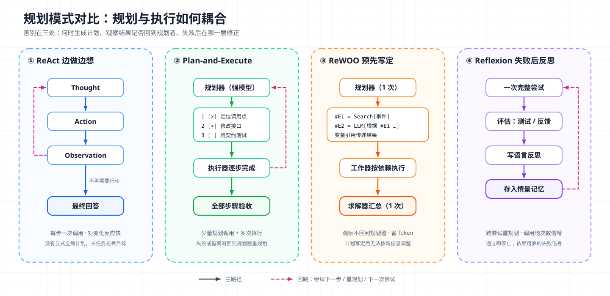
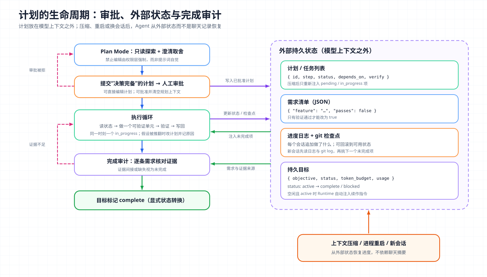

# 核心概念 06 - Planning：把目标变成可验证的步骤

> 技术快照：OpenAI Codex `6ff670bd`、Hermes Agent `30e947e`、DeerFlow `4e6248f`，产品功能以文末参考链接为准

> *本合集是一套面向 Agent 架构与工程实践的系统学习笔记，帮助读者建立从原理、Runtime、工具与权限到评测和多 Agent 编排的完整知识框架。*
>
> *本篇讨论 Agent 如何把目标分解为可执行、可验证的步骤，对比 ReAct、Plan-and-Execute、ReWOO、LLM+P 与 Reflexion 等规划模式，并拆解 todo 工具、Plan Mode 和持久化计划在 Codex、Claude Code 等产品中的实现，以及计划粒度、重规划、完成判定和常见失败模式。*

## 规划的定义与边界：计划是一份可检查的状态

Planning（规划）是把一个目标分解成有序步骤，使每一步都能被执行，并且能判断它是否完成。这个定义里有三个要素，缺一个都不算可用的计划：

- 可执行：每一步对应 Agent 手里的某种动作，例如读文件、改代码、跑测试、询问用户；
- 可验证：每一步有能观察到的完成信号，例如测试通过、文件存在、接口返回预期结果；
- 有终止条件：整个目标有明确的完成定义，不以“做得差不多了”收尾。

推断：一个最小的计划数据结构可以归纳为：

```text
Plan = {
  goal:        目标与完成条件
  steps:       [ { id, description, status, depends_on[], verify } ]
  assumptions: 计划依赖的前提
  revision:    版本号与修改原因
}
status ∈ { pending, in_progress, completed, cancelled, blocked }
```

各产品通常只落地其中一部分，最常见的是 `steps` 加 `status`。

### 规划与推理的区别

规划经常和 [Reasoning](05-reasoning.md) 混在一起讨论，两者的区别在对象和生命周期上：

| 维度 | Reasoning | Planning |
| --- | --- | --- |
| 对象 | 一个问题或一次决策 | 一个需要多次行动才能达成的目标 |
| 产出 | 结论、选择、下一步动作 | 步骤列表、依赖关系、完成条件 |
| 生命周期 | 一次请求内（可跨工具调用延续） | 跨越多次请求、多轮对话甚至多个会话 |
| 存放位置 | thinking 块，调用方看不到原文 | 可以是消息文本、工具状态或外部文件 |
| 是否可被 Harness 检查 | 否 | 可以，前提是结构化 |

推理可以在内部产生计划，但这种计划只存在于一次请求的推理里，下一轮可能被剥离，也无法被用户和 Harness 读取。作为工程概念的规划，要做的是把计划从模型内部搬到外部，让它可以被展示、审批、持久化、恢复和验收。

### 计划存放在哪里

| 位置 | 例子 | 可见性 | 跨压缩存活 | 跨会话存活 |
| --- | --- | --- | --- | --- |
| 模型推理内部 | 推理模型的 thinking | 不可见 | 否 | 否 |
| 对话文本 | 回答里写出的步骤列表 | 用户可见 | 取决于摘要质量 | 否 |
| 工具状态 | `update_plan`、Task 工具、`todo` | 结构化、UI 可渲染 | 取决于实现 | 取决于实现 |
| 外部文件或数据库 | 计划文件、feature list、goal 表 | 结构化、可审计 | 是 | 是 |

越往下，计划越独立于模型上下文，也越能支撑长任务。

## 规划模式对比：何时想、想多远、何时改



图中四种模式按规划与执行的耦合方式区分。ReAct 每步重新决定，Plan-and-Execute 先出计划再按需重规划，ReWOO 一次写定计划且观察不回到规划器，Reflexion 在整次尝试失败后反思重来。

### ReAct：边做边想

ReAct 让模型交替输出 Thought（思考）、Action（动作）和 Observation（观察），每一步都根据最新观察决定下一步。它没有显式的全局计划，计划隐含在逐步决策里。论文在 ALFWorld 和 WebShop 上分别比模仿学习和强化学习基线高出 34 和 10 个百分点的绝对成功率。

ReAct 是多数 [Agent Loop](03-agent-loop.md) 的底层形态，对环境变化反应快，但长任务容易丢失全局目标，调用次数等于步数。

### Plan-and-Execute：先规划再执行

Plan-and-Solve 提出先让模型“制定计划、再按计划逐步求解”，以减少 Zero-shot CoT 的漏步错误。Agent 框架把它推广为 Plan-and-Execute：规划器生成步骤列表，执行器（可以是更小的模型或 ReAct 子循环）逐步完成，每完成一步或遇到失败时，由规划器决定继续、修改还是结束。

规划器可以用强模型和高推理强度，执行器用便宜模型。计划只反映开始时的信息，假设不成立时必须重规划，否则执行会沿着过期计划走下去。

### ReWOO：规划与观察解耦

ReWOO（Reasoning WithOut Observation）更进一步：规划器一次性写出所有步骤，步骤之间用变量引用传递结果，工作器按依赖执行工具，最后由求解器汇总。

```text
Plan: 找到事件发生的年份
#E1 = Search[事件名称]
Plan: 查询该年份对应的人物
#E2 = LLM[根据 #E1 给出该年份的负责人]
Solver: 根据 #E1 #E2 回答原问题
```

ReAct 每步都把之前的思考和观察重新送入模型（推断：累计输入 Token 随步数近似二次增长），ReWOO 只调用规划器和求解器各一次。论文报告 Token 效率提升约 5 倍，HotpotQA 准确率提升 4%，工具失败时也更稳定。同一设计也限制了它的用途。计划写定后不能按观察调整，适合结构可预先确定的检索问答，不适合探索性的编码与排障。

### LLM+P：把规划交给经典规划器

LLM+P 让 LLM 把自然语言问题翻译成 PDDL（Planning Domain Definition Language，经典规划领域的标准描述语言），交给经典规划器求解，再把解翻译回自然语言。论文报告，LLM+P 对大多数问题能给出最优解，而 LLM 直接规划对大多数问题连可行计划都给不出。

Kambhampati 等人的 LLM-Modulo 观点与此一致，认为自回归 LLM 不能独立完成规划和自我验证，应由 LLM 提供候选和领域知识，外部验证器负责检查。这类做法适用于状态、动作和约束可形式化的领域，但要有人持续维护领域模型。

### Reflexion：失败后反思再规划

Reflexion 不修改模型参数，而是在一次尝试失败后，让模型根据失败信号（测试失败、环境反馈）写一段语言反思，存入情景记忆，下一次尝试把反思放进上下文。论文在 HumanEval 上达到 91% pass@1，高于当时 GPT-4 的 80%。

这是跨尝试的重规划，反思内容通常就是“上次计划错在哪、这次怎么改”。它依赖可靠的失败信号，信号不可靠时，反思可能只是换个说法重复错误。

### 模式对比

| 模式 | 规划时机 | 模型调用 | 适应环境变化 | 适用场景 |
| --- | --- | --- | --- | --- |
| ReAct | 每一步 | 每步一次 | 强 | 探索性任务、编码、排障 |
| Plan-and-Execute | 开始时 + 失败或偏离时 | 规划少量 + 执行多次 | 中，靠重规划 | 多步骤业务流程、长任务 |
| ReWOO | 开始时一次 | 规划 1 + 求解 1 + 工具调用 | 弱 | 结构固定的检索与问答 |
| LLM+P | 翻译后由规划器求解 | 少 | 取决于领域模型 | 可形式化的约束规划 |
| Reflexion | 每次尝试失败后 | 按尝试次数倍增 | 跨尝试调整 | 有明确评估信号的任务 |

生产中的编码 Agent 通常是组合：底层 ReAct 循环，上面挂一份模型可随时改写的计划，用测试失败驱动重规划，长任务再把计划写到外部状态。

## Agent 产品中的规划实现

### todo 工具：给模型一个结构化的自我备忘

主流编码 Agent 都提供了一种“计划工具”，让模型把步骤和状态写成结构化参数。

| 实现 | 工具 | 状态集合 | 主要约束 |
| --- | --- | --- | --- |
| Codex | `update_plan` | `pending` / `in_progress` / `completed` | 同一时刻最多一个 `in_progress`；每次提交完整列表 |
| Claude Code | `TaskCreate` / `TaskGet` / `TaskList` / `TaskUpdate`，旧版 `TodoWrite` | 待办、进行中、完成 | 支持依赖与细节；任务列表跨压缩保留 |
| Hermes Agent | `todo` | 另有 `cancelled` | 支持整表替换与按 id 合并；压缩后重新注入 |
| DeerFlow | `write_todos`（LangChain TodoListMiddleware） | `pending` / `in_progress` / `completed` | 允许多个任务并行 `in_progress`；仅在 plan mode 启用 |

Codex 的 `update_plan` 参数只有可选的 `explanation`（改计划的理由）和必填的 `plan` 数组，每项是 `step` 文本加三值 `status`，工具描述要求同一时刻最多一个 `in_progress`。处理器几乎不做事：

```rust
async fn handle_call(&self, invocation: ToolInvocation) -> Result<Box<dyn ToolOutput>, FunctionCallError> {
    // ...
    if turn.collaboration_mode.mode == ModeKind::Plan {
        return Err(FunctionCallError::RespondToModel(
            "update_plan is a TODO/checklist tool and is not allowed in Plan mode".to_string(),
        ));
    }
    let args = parse_update_plan_arguments(&arguments)?;
    session.send_event(turn.as_ref(), EventMsg::PlanUpdate(args)).await;
    Ok(boxed_tool_output(PlanToolOutput)) // 返回给模型的只有 "Plan updated"
}
```

Harness 不按计划调度任务，也不检查步骤是否完成，只把计划作为事件发给 UI 渲染，并让调用参数留在对话历史里。计划对模型的约束来自“自己写下的清单在上下文中可见”，对用户的价值是进度可观察。推断：这类工具相当于结构化备忘加进度面板，不驱动执行，把它当调度器会高估它的保证。

Codex 的系统提示对使用方式有具体要求：计划用于非平凡、多阶段、有顺序依赖的任务；每步 5 到 7 个词；开始下一步前把上一步标记为完成；中途改计划时通过 `explanation` 说明原因；不要为简单任务堆砌步骤。

### 计划随上下文压缩存活

计划写在对话历史里，就会面临 [Context Engineering](13-context-engineering.md) 中的压缩问题：摘要可能丢掉步骤和状态。Hermes Agent 的做法是把计划保存在会话对象上，压缩后重新注入：

```python
def format_for_injection(self) -> Optional[str]:
    if not self._items:
        return None
    markers = {"completed": "[x]", "in_progress": "[>]", "pending": "[ ]", "cancelled": "[~]"}
    # 只注入 pending / in_progress：注入已完成项会让模型在压缩后重做已完成的工作
    active_items = [item for item in self._items
                    if item["status"] in {"pending", "in_progress"}]
    if not active_items:
        return None
    lines = ["[Your active task list was preserved across context compression]"]
    for item in active_items:
        marker = markers.get(item["status"], "[?]")
        lines.append(f"- {marker} {item['id']}. {item['content']} ({item['status']})")
    return "\n".join(lines)
```

它还限制了单条内容长度（4,000 字符）和条目数（256），避免计划本身在每次压缩后膨胀。注释写明了已完成条目不注入的理由，它们会诱导模型重做。Claude Code 官方文档同样说明任务列表跨上下文压缩保留，并可以通过 `CLAUDE_CODE_TASK_LIST_ID` 让多个会话共享同一个命名任务列表。

### Plan Mode：先规划、审批、再执行

todo 工具跟踪执行中的进度，Plan Mode 在执行前对齐方案。Agent 只做不改变项目状态的探索，产出计划，经人审批后才切到可写的执行模式。

| 维度 | Codex Plan 协作模式 | Claude Code plan mode |
| --- | --- | --- |
| 允许的动作 | 不修改仓库跟踪文件的动作：读、搜索、静态分析、可能写缓存的测试和构建 | 读文件、运行探索性命令、写计划；不编辑源码 |
| 禁止的动作 | 编辑文件、改写文件的格式化器、打补丁、迁移、代码生成 | 源码编辑在批准前被阻止 |
| 与 todo 工具的关系 | Plan 模式下调用 `update_plan` 直接报错 | 独立的权限模式 |
| 提问方式 | 先探索再提问，用 `request_user_input` 给出选项 | 在对话中澄清 |
| 计划产出 | `<proposed_plan>` 块，要求“决策完备”，实现者无需再做决定 | 通过 `ExitPlanMode` 提交计划等待批准 |
| 审批后 | 用户切换出 Plan 模式并要求实现 | 选择自动模式执行、逐项确认编辑或继续规划；可用 Ctrl+G 直接编辑计划，可选择批准并清空规划上下文 |
| 强制方式 | 模板指令约束修改性动作，模式只由 developer 消息结束；源码中能确认的专属硬拦截是禁止 `update_plan` | 权限系统阻止编辑，非交互运行和 SDK 中同样生效 |

两者都把“先想清楚”做成显式的阶段边界。Claude Code 靠权限系统强制，Codex 主要靠模式指令。Codex 的模板把未知分两类处理，能从环境查到的事实先探索、不问用户；偏好和取舍才问，并给出带推荐默认值的选项。计划要做到“decision complete”，交给另一个工程师或 Agent 即可直接实施。

Claude Code 的“批准并清空上下文”选项再分离了一层：探索记录往往很长，执行只需要计划本身。推断：计划成了执行阶段的唯一交接物，与 [Subagent](10-subagent.md) 的交接思路相同。

### 计划作为外部持久状态



图中把计划放在模型上下文之外：Plan Mode 产出的计划经审批后写入外部状态，执行循环每轮读取和更新它；上下文压缩、进程重启或换一个会话后，Agent 从外部状态而不是聊天记录恢复进度；完成判定通过逐条核对证据完成，证据不足就回到执行或重规划。

单个上下文窗口装不下整个长任务，所以需要这层外部状态。Anthropic 的长时运行 Agent 实践用了三件套：

- JSON 格式的 feature list，列出全部需求（示例中超过 200 项），每项 `passes` 初始为 `false`；选 JSON 是因为模型较少不恰当地改写 JSON 文件；
- 一个按时间追加的进度日志文件，记录每个会话做了什么；
- git 提交，作为可回滚的检查点。

每个新会话开始时，Agent 先确认工作目录，读取 git 日志和进度文件，再从 feature list 中挑选优先级最高的未完成项，一次只做一项。

Codex 的 goal 扩展把同样的思想做成了运行时机制。目标（objective）、状态、Token 预算和用量保存在状态数据库中；会话恢复时读取活跃目标，Agent 空闲时如果目标仍是 `active`，Runtime 自动注入一条续作指令开启新一轮：

```rust
pub(crate) async fn continue_if_idle(&self) -> Result<(), String> {
    // ...
    let Some(goal) = self.inner.state_dbs.thread_goals()
        .get_thread_goal(self.thread_id()).await.map_err(|err| err.to_string())?
    else {
        self.inner.accounting_state.clear_active_goal();
        return Ok(());
    };
    if goal.status != codex_state::ThreadGoalStatus::Active {
        self.inner.accounting_state.clear_active_goal();
        return Ok(());
    }
    let item = continuation_steering_item(&protocol_goal_from_state(goal));
    if let Err(err) = thread.try_start_turn_if_idle(vec![item]).await {
        // 线程忙或被拒绝时跳过，本次不续作
    }
    // ...
}
```

模型只能通过 `update_goal` 把目标标为 `complete` 或 `blocked`，暂停、恢复和预算限制由用户或系统控制。任务是否结束因此由一次持久化的显式状态转换决定，不从某一轮回答的措辞里推断。

## 计划粒度、重规划与完成判定

### 粒度：一步对应一个可验证的结果

计划太粗，每一步内部又是需要规划的大任务；太细，维护清单比干活还费 Token。可操作的规则（推断，综合上述产品实践）：

- 一步对应一个能独立验证的结果，例如“订单接口改为新签名且单测通过”，而不是“修改 service.ts 第 40 行”；
- 同一时刻只有一个 `in_progress`（Codex 强制这一点），并行步骤交给子 Agent 而不是在同一上下文里交错；
- 长任务的顶层计划按功能或里程碑拆（Anthropic 的一次一个 feature），局部实现细节留给执行时的推理；
- 简单任务不写计划。Claude Code 更进一步：较新模型默认不提供任务跟踪工具，官方理由是这些模型不靠书面清单也能跟踪多步工作，而工具定义和提醒会占用上下文。

### 何时重规划

计划是基于当时信息的一组假设，出现以下信号时应改计划而不是继续执行：

| 信号 | 例子 | 处理 |
| --- | --- | --- |
| 验证失败 | 测试不通过、构建报错 | 先在当前步内修复；同一步反复失败则回到计划层重新拆解 |
| 假设被推翻 | 以为接口只有一个调用方，实际有十个 | 修改后续步骤并记录原因 |
| 用户 steering（运行中追加的方向调整） | “不要改数据库结构” | 立即更新计划与约束 |
| 反复阻塞 | 缺少权限、依赖服务不可用 | 达到阈值后标记 blocked 并请求外部输入 |
| 范围蔓延 | 发现一个无关的 bug | 记录为后续事项，不插入当前计划 |

Codex 给“阻塞”定了量化规则：同一阻塞条件连续三个目标轮次重复出现才能标 `blocked`，不能因为难、慢、不确定而标。重规划要保留理由（`update_plan` 的 `explanation` 字段），让用户和后续会话知道计划为什么变。

### 完成判定：证明完成，而不是找不到剩余工作

Codex 的目标续作模板对“完成审计”的要求很具体：

- 从目标和它引用的文件、规格、issue 中推导出具体需求，不能围绕已有工作重新定义成功；
- 对每一条显式需求、编号项、指定产物、命令、测试和门禁，找出能证明它完成的权威证据，并检查当前状态；
- 验证范围要与需求范围匹配，不能用窄检查支撑宽结论；
- 测试和绿色检查只有在确认它们覆盖了相关需求后才算证据；
- 不确定或间接的证据视为未完成。审计必须证明完成，而不是“没发现明显的剩余工作”。

它还禁止两种常见理由：预算快用完、准备停止工作。这些规则把“完成”变成逐条核对证据的过程，也就是计划中 `verify` 字段应承载的内容。

## 生产失败模式

| 失败模式 | 表现 | 对策 |
| --- | --- | --- |
| 过度规划 | 简单任务也写五步清单，计划文字比改动还多 | 设使用门槛（三步以上、有顺序依赖）；按模型能力决定是否默认提供计划工具 |
| 一次性做完 | 试图一个会话完成全部需求，上下文耗尽时留下半成品 | 一次推进一个可验证单元，完成即提交检查点和进度记录 |
| 计划与执行漂移 | 计划写改 A 模块，实际改了 B；步骤全标完成，产出物对不上 | 步骤带验证条件；完成判定检查产出物而非计划状态；高风险任务对照计划审查 diff |
| 提前宣布完成 | 后续会话看到已有进展就认为任务结束，是长任务中代价最高的失败 | 完整需求清单写入外部状态逐项标记；逐条证据审计；用端到端验证而非代码阅读确认 |
| 压缩后计划丢失或复活 | 摘要漏掉计划，或已完成项被重新注入导致重做 | 计划存于会话对象或外部状态，压缩后只注入未完成项 |
| 模式边界被绕过 | “规划”中顺手改了文件 | 审批边界由权限层强制；注意 Claude Code 在交互式终端开启绕过权限时不强制 plan mode 的阻止 |

## 架构推演

某团队要让编码 Agent 把一个中型服务从 REST 迁移到 gRPC：涉及 40 个接口、3 个下游调用方、一次数据库字段调整，预计跨多个会话完成，每个会话的上下文窗口放不下全部代码。要求迁移方案先经技术负责人审批，数据库变更需要单独审批，所有接口必须通过契约测试后才算完成。

请设计这套规划系统，并说明：

- Plan Mode 阶段允许哪些探索动作，计划需要包含哪些内容才算“决策完备”，审批后以什么形式交给执行阶段；
- 计划的持久化载体是什么（文件、任务列表还是数据库），字段如何设计，才能在压缩、重启和换会话后恢复；
- 计划粒度如何划分（按接口、按调用方还是按里程碑），哪些步骤可以交给子 Agent 并行；
- 哪些信号触发重规划，数据库变更审批被拒时计划如何调整；
- 完成判定如何设计，契约测试、端到端测试和人工审查各证明什么，如何防止后续会话提前宣布完成；
- 计划与实际 diff 如何核对，发现漂移时由谁处理。

一种做法是由 Harness 把计划作为外部状态管理。审批过的计划写入版本化文件，需求清单逐项带验证方式和通过标记，每个会话从这份状态恢复、一次推进一个单元并提交检查点，逐条证据齐全时目标才转为完成。

## 复习结论

- 规划是把目标分解为可执行、可验证、有终止条件的步骤。它跨越多次请求，存放在模型外部时才能被展示、审批、持久化和验收。
- ReAct 边做边想，适应性强但全局性弱；Plan-and-Execute 分离规划与执行，依赖重规划；ReWOO 以变量引用解耦观察，省 Token 但不适应变化；LLM+P 把规划交给经典规划器；Reflexion 以失败信号驱动跨尝试的修正。
- todo 类工具（Codex `update_plan`、Claude Code Task 工具、Hermes `todo`）是结构化备忘和进度面板，Harness 不据此调度或验证执行。
- Plan Mode 把“先规划、审批、再执行”做成显式阶段；Claude Code 由权限系统强制，Codex 主要靠模式指令，审批边界最终应由权限层保证。
- 长任务的计划应写入外部持久状态：需求清单、进度日志、检查点、持久化目标，会话恢复从这些状态读取。
- 粒度以“一步一个可验证结果”为准，简单任务不写计划；重规划由验证失败、假设推翻、用户 steering 和反复阻塞触发。
- 完成必须由逐条证据证明，而不是“找不到剩余工作”。提前宣布完成、计划与执行漂移和过度规划是最常见的失败模式。

## 参考

| 主题 | 来源 |
| --- | --- |
| 规划模式论文 | [ReAct](https://arxiv.org/abs/2210.03629) · [Plan-and-Solve Prompting](https://arxiv.org/abs/2305.04091) · [ReWOO](https://arxiv.org/abs/2305.18323) · [LLM+P](https://arxiv.org/abs/2304.11477) · [Reflexion](https://arxiv.org/abs/2303.11366) · [LLMs Can't Plan, But Can Help Planning in LLM-Modulo Frameworks](https://arxiv.org/abs/2402.01817) |
| Claude Code 规划功能 | [Tools reference](https://code.claude.com/docs/en/tools-reference) · [Permission modes: plan mode](https://code.claude.com/docs/en/permission-modes) · [Interactive mode: task list](https://code.claude.com/docs/en/interactive-mode) |
| 长时任务实践 | [Effective harnesses for long-running agents](https://www.anthropic.com/engineering/effective-harnesses-for-long-running-agents) |
| Codex 计划工具与 Plan 模式源码 | [`plan_spec.rs`](https://github.com/openai/codex/blob/6ff670bd/codex-rs/core/src/tools/handlers/plan_spec.rs) · [`plan.rs`](https://github.com/openai/codex/blob/6ff670bd/codex-rs/core/src/tools/handlers/plan.rs) · [`plan_tool.rs`](https://github.com/openai/codex/blob/6ff670bd/codex-rs/protocol/src/plan_tool.rs) · [`templates/plan.md`](https://github.com/openai/codex/blob/6ff670bd/codex-rs/collaboration-mode-templates/templates/plan.md) · [`default.md`](https://github.com/openai/codex/blob/6ff670bd/codex-rs/protocol/src/prompts/base_instructions/default.md) |
| Codex 持久目标源码 | [`spec.rs`](https://github.com/openai/codex/blob/6ff670bd/codex-rs/ext/goal/src/spec.rs) · [`runtime.rs`](https://github.com/openai/codex/blob/6ff670bd/codex-rs/ext/goal/src/runtime.rs) · [`continuation.md`](https://github.com/openai/codex/blob/6ff670bd/codex-rs/ext/goal/templates/goals/continuation.md) |
| Hermes Agent todo 源码 | [`todo_tool.py`](https://github.com/NousResearch/hermes-agent/blob/30e947e/tools/todo_tool.py) |
| DeerFlow Plan Mode | [`plan_mode_usage.md`](https://github.com/bytedance/deer-flow/blob/4e6248f/backend/docs/plan_mode_usage.md) |
