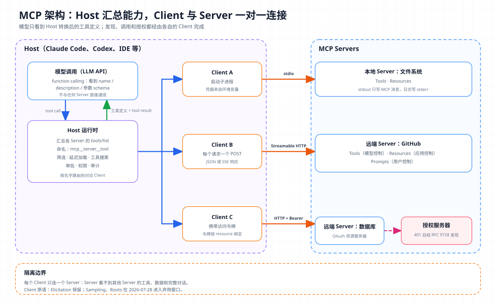
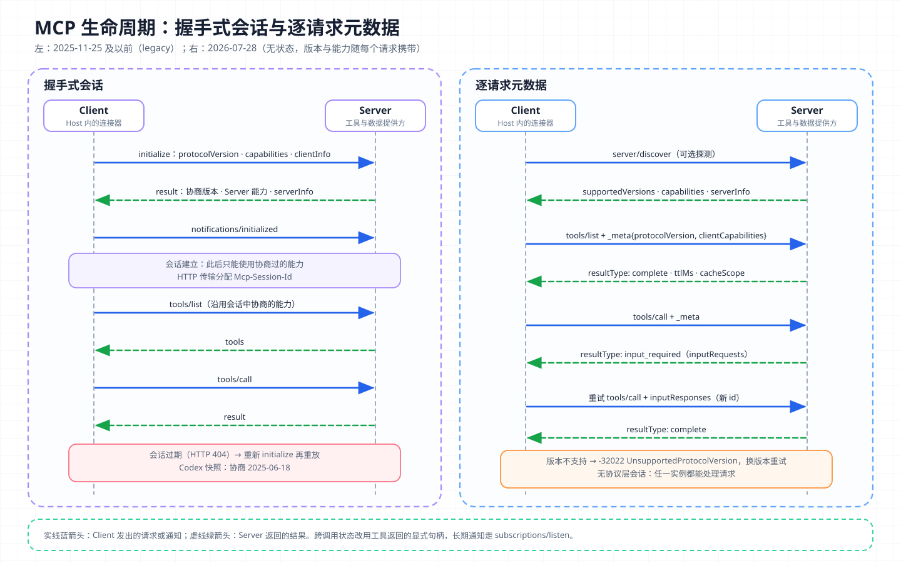

# 核心概念 08 - MCP：Agent 与外部能力之间的协议层

> 技术快照：MCP 规范 `2026-07-28`（对照 `2025-11-25`）；OpenAI Codex `6ff670bd`（rmcp 1.8，协商版本 `2025-06-18`）

> *本合集是一套面向 Agent 架构与工程实践的系统学习笔记，帮助读者建立从原理、Runtime、工具与权限到评测和多 Agent 编排的完整知识框架。*
>
> *本篇解释 Model Context Protocol 的架构、JSON-RPC 消息、版本协商、传输、原语和授权，说明它与原生 function calling 的关系，并结合 Codex 的 MCP Client 源码讨论工具过多带来的上下文成本和 tool poisoning、confused deputy 等安全问题。*

## MCP 要解决的问题：把 N×M 集成变成 N+M

Model Context Protocol（MCP）是一个开放协议，规定 LLM 应用如何发现并调用外部系统提供的工具、数据和提示模板。它借鉴了 LSP（Language Server Protocol，让编辑器与各语言分析服务解耦的协议）的思路。编辑器实现一次 LSP 客户端，就能接入任何语言服务器。

在 MCP 之前，每个 Agent 产品都要为每个外部系统写一套适配：

```text
无统一协议：  N 个 Agent 产品 × M 个外部系统 = N × M 份集成代码
使用 MCP：    N 个 MCP Client 实现 + M 个 MCP Server 实现 = N + M
```

以 5 个 Agent 产品、40 个 SaaS 系统计算，集成数量从 200 降到 45。维护方向也变了，服务方维护一个 MCP Server，所有支持 MCP 的客户端都能获得同一套能力和修复。MCP 的边界如下：

| MCP 负责 | MCP 不负责 |
| --- | --- |
| 发现 Server 提供的工具、资源和提示模板 | 决定调用哪个工具，这由模型和 Harness 负责 |
| 用 JSON-RPC 消息调用工具、读取资源 | 模型推理 API 和 prompt 格式 |
| HTTP 场景的 OAuth 授权与传输约定 | Agent 间任务委派（A2A 的范围）、沙箱与审批（Host 的范围） |

## 架构：Host、Client 与 Server



| 角色 | 是什么 | 例子 |
| --- | --- | --- |
| Host | 发起连接的 LLM 应用，持有模型调用、会话和用户界面 | Claude Code、Codex、Claude Desktop、IDE |
| Client | Host 内的连接器，与一个 Server 一对一连接 | Codex 中每个 MCP Server 对应一个 `RmcpClient` |
| Server | 提供上下文和能力的本地子进程或远端 HTTP 服务 | 文件系统、GitHub、数据库 Server |

一对一连接是有意设计的隔离，一个 Server 看不到其他 Server 的工具和数据，也看不到完整对话。图中，Host 通过各 Client 拉取工具列表，汇总后放进模型请求；模型返回 tool call 后，Host 找到所属 Server，由对应 Client 发出 `tools/call`，结果作为 tool result 回填。模型始终不与 Server 直接通信，用户授权、工具审批和结果展示都在 Host 层。

### Server 原语与 Client 原语

MCP 用“谁控制调用”来区分三种 Server 原语：

| 原语 | 控制方 | 用途 | 主要方法 |
| --- | --- | --- | --- |
| Tools | 模型控制 | 模型自主决定调用的函数，可能有副作用 | `tools/list`、`tools/call` |
| Resources | 应用控制 | 由 Host 或用户选择放入上下文的数据，用 URI 标识 | `resources/list`、`resources/read`、`resources/templates/list` |
| Prompts | 用户控制 | 参数化的提示模板，通常作为斜杠命令出现 | `prompts/list`、`prompts/get` |

在 Claude Code 里，工具名为 `mcp__<server>__<tool>`，资源用 `@` 引用，提示模板变成斜杠命令。Client 也可以向 Server 提供能力：

| 原语 | 作用 | `2026-07-28` 中的状态 |
| --- | --- | --- |
| Elicitation | Server 在处理中向用户索取信息，如表单或跳转 URL 授权 | 保留，改为通过 MRTR 返回 |
| Sampling | Server 借用 Host 的模型生成内容 | Deprecated，建议 Server 直接接入模型 API |
| Roots | Client 告诉 Server 可操作的目录范围 | Deprecated，建议改用工具参数或 Server 配置 |

`2026-07-28` 把 Sampling、Roots 连同 Logging 放入至少 12 个月的弃用窗口。

## 消息层：JSON-RPC 2.0 与版本协商

MCP 的所有消息都遵循 JSON-RPC 2.0（一种以 JSON 表示的远程过程调用格式）。规范定义三类消息：

| 类型 | 结构 | 约束 |
| --- | --- | --- |
| Request | `jsonrpc`、`id`、`method`、`params` | `id` 为字符串或整数，非 `null`，未完成前不可重复 |
| Response | 同一个 `id` + `result` 或 `error` | `2026-07-28` 起 `result` 必须带 `resultType` |
| Notification | `jsonrpc`、`method`、`params`，无 `id` | 接收方不得回复 |

选用 JSON-RPC，是因为它只定义消息、不绑定传输，能在同一套 schema 下承载请求、通知和进度推送，并适配子进程管道和 HTTP。

### 旧生命周期：initialize 握手与能力协商

`2025-11-25` 及以前的版本（规范称为 legacy）采用有状态的会话。Client 连接后必须先握手：

```json
{"jsonrpc":"2.0","id":1,"method":"initialize","params":{
  "protocolVersion":"2025-11-25",
  "capabilities":{"elicitation":{"form":{},"url":{}}},
  "clientInfo":{"name":"ExampleClient","version":"1.0.0"}}}

{"jsonrpc":"2.0","id":1,"result":{
  "protocolVersion":"2025-11-25",
  "capabilities":{"tools":{"listChanged":true},"resources":{"subscribe":true}},
  "serverInfo":{"name":"ExampleServer","version":"1.0.0"}}}

{"jsonrpc":"2.0","method":"notifications/initialized"}
```

握手确定协议版本并交换能力。Client 声明是否支持 elicitation、sampling、roots，Server 声明提供哪些原语、是否发送 `listChanged` 通知，此后只能使用协商过的能力。HTTP 传输还会用 `Mcp-Session-Id` 维持会话。

### 新生命周期：无状态请求与 server/discover



`2026-07-28` 移除了 `initialize` 握手和协议层会话，把版本和能力搬进每个请求的 `_meta`：

```json
{"jsonrpc":"2.0","id":1,"method":"tools/call","params":{
  "name":"get_weather",
  "arguments":{"location":"Seattle, WA"},
  "_meta":{
    "io.modelcontextprotocol/protocolVersion":"2026-07-28",
    "io.modelcontextprotocol/clientInfo":{"name":"ExampleClient","version":"1.0.0"},
    "io.modelcontextprotocol/clientCapabilities":{}}}}
```

Server 独立处理每个请求，不支持该版本时返回 `UnsupportedProtocolVersionError`（`-32022`）和支持的版本列表，Client 换版本重试。Server 必须实现 `server/discover`，Client 可以先用它探测版本和能力。

这项改动出于部署考虑。有状态会话要求负载均衡把会话粘到同一实例，Server 重启即失效。无状态后任何实例都能处理任何请求，跨调用状态改用创建工具返回的显式句柄（如购物车 ID）。配套变化：

- Server 需要用户输入时不再主动发请求，而是返回 `resultType: "input_required"` 和 `inputRequests`，Client 带着 `inputResponses` 重试原请求，称为 MRTR（Multi Round-Trip Requests）。
- 工具列表变更等长期通知改由 `subscriptions/listen` 的响应流承载；进度等请求级通知仍走对应请求的响应流。
- `tools/list` 结果增加 `ttlMs`、`cacheScope` 缓存提示，工具须按确定顺序返回，以提高 Client 缓存和模型提示缓存命中率。

新旧版本会并存一段时间。兼容两代的 Client 先发新格式请求或 `server/discover`，失败且不是新版错误时再退回 `initialize`。本地快照中的 Codex 仍固定使用 `2025-06-18` 握手。

## 传输：stdio 与 Streamable HTTP

| 传输 | 连接方式 | 适用场景 | 授权 |
| --- | --- | --- | --- |
| stdio | Client 启动 Server 子进程，经 stdin/stdout 交换消息 | 本地工具、本机文件 | 凭据从环境获取 |
| Streamable HTTP | Server 暴露单个端点，Client 用 POST 发送每条消息 | 远端 SaaS、团队服务 | OAuth 2.1 |

stdio 的约定很少。每条消息一行且内部不含换行，stdout 只写合法 MCP 消息，日志写 stderr；关闭 Server 的 stdin 是优雅退出信号。

Streamable HTTP 在 `2025-03-26` 引入，替代 `2024-11-05` 的 HTTP+SSE。旧方案要求 Client 先用 GET 打开长期 SSE 流接收消息，再向另一个端点 POST 请求，两条通道的关联、断线和代理缓冲都容易出问题。Streamable HTTP 只有一个端点，每个请求一个 POST，Server 返回单个 JSON 或一条只属于该请求的 SSE 流（Server-Sent Events，服务器单向推送的事件流）。HTTP+SSE 现已归入 Deprecated。

`2026-07-28` 又去掉了 GET 流、`Mcp-Session-Id` 会话和 `Last-Event-ID` 续传，要求 POST 携带 `MCP-Protocol-Version`、`Mcp-Method`、`Mcp-Name` 头，让网关不解析请求体也能路由限流，Server 必须校验头与请求体一致。Server 还必须校验 `Origin` 头以防 DNS rebinding（利用 DNS 解析变化让浏览器访问本地服务），本地运行应只绑定 `127.0.0.1`。

## 工具原语的消息样例

下面是 `2026-07-28` 中一次工具发现与调用，省略了每个请求必带的 `_meta`。

```json
{"jsonrpc":"2.0","id":1,"method":"tools/list","params":{}}
```

```json
{"jsonrpc":"2.0","id":1,"result":{
  "resultType":"complete",
  "tools":[{
    "name":"get_weather",
    "description":"Get current weather information for a location",
    "inputSchema":{
      "type":"object",
      "properties":{"location":{"type":"string","description":"City name or zip code"}},
      "required":["location"]}}],
  "ttlMs":300000,
  "cacheScope":"public"}}
```

```json
{"jsonrpc":"2.0","id":2,"method":"tools/call",
 "params":{"name":"get_weather","arguments":{"location":"New York"}}}
```

```json
{"jsonrpc":"2.0","id":2,"result":{
  "resultType":"complete",
  "content":[{"type":"text","text":"Current weather in New York:\nTemperature: 72°F\nConditions: Partly cloudy"}],
  "isError":false}}
```

工具定义还可带 `outputSchema` 和 `annotations`（只读、破坏性等行为提示）；结果可以是文本、图片、音频、资源链接或内嵌资源，有 `outputSchema` 时返回 `structuredContent`。错误分两层，区分它们决定模型能否自我修正：

| 类型 | 表示方式 | 例子 | 是否交给模型 |
| --- | --- | --- | --- |
| 协议错误 | JSON-RPC `error` | 未知工具、请求不合法 | 可以，但模型通常无法修复 |
| 工具执行错误 | `result.isError: true` + 说明 | “出发日期必须晚于今天” | 应该，让模型调整参数重试 |

## 与原生 Function Calling 的关系

MCP 是工具的发现与传输层，模型看到的仍是普通工具定义。一次调用在两层之间的对应：

| 步骤 | 模型 API 层（function calling） | MCP 层 |
| --- | --- | --- |
| 准备 | 请求中携带 `tools`，每个包含 name、description、参数 schema | Host 通过 `tools/list` 取得定义并转换格式 |
| 决策 | 模型输出 tool call（名字 + JSON 参数） | 不参与 |
| 执行 | Harness 执行工具 | Client 发送 `tools/call`，Server 执行 |
| 回填 | tool result 进入下一轮输入 | `content`、`structuredContent`、`isError` 被转换成 tool result |

模型是否“支持 MCP”，要看 Host 或 API 有没有实现这层转换，与模型本身无关。function calling 的机制见 [Tool Use](04-tool-use.md)。

### 两种部署位置

| 位置 | 做法 | 例子 | 限制 |
| --- | --- | --- | --- |
| Host 内置 Client | 本地 Harness 连接 Server 并转换工具定义 | Claude Code、Codex | 自行管理进程、授权和审批 |
| 模型 API 托管 Client | 请求中声明远端 Server，由 API 服务端连接 | Claude API 的 `mcp_servers` + `mcp_toolset`（beta 头 `mcp-client-2025-11-20`）；OpenAI Responses API 的 `{"type":"mcp","server_url":...}` | 仅支持公网 HTTP Server；Claude connector 只支持工具 |

托管方式把 `tools/list` 与 `tools/call` 移到服务端，响应中分别出现 OpenAI 的 `mcp_list_tools`、`mcp_call` 输出项和 Claude 的 `mcp_tool_use`、`mcp_tool_result` 内容块。

## Codex 的 MCP Client 实现

Codex 的 MCP 支持分两层：`rmcp-client` 封装官方 Rust SDK rmcp，负责传输、握手、OAuth 和重连；`codex-mcp` 管理多 Server 连接、工具目录和模型可见名称。

### 握手参数：声明能力与协议版本

```rust
fn mcp_initialize_request_params(
    client_elicitation_capability: ElicitationCapability,
    supports_openai_form_elicitation: bool,
) -> InitializeRequestParams {
    let mut capabilities = ClientCapabilities::default();
    capabilities.elicitation = Some(client_elicitation_capability);
    // supports_openai_form_elicitation 为真时，在 capabilities.extensions 中声明 OpenAI 表单扩展
    InitializeRequestParams::new(
        capabilities,
        Implementation::new("codex-mcp-client", env!("CARGO_PKG_VERSION")).with_title("Codex"),
    )
    .with_protocol_version(ProtocolVersion::V_2025_06_18)
}
```

Codex 只声明 elicitation，不声明 sampling 和 roots；协议版本固定在 `2025-06-18`，属于握手式旧生命周期。

### 调用与会话恢复

`RmcpClient` 支持进程内、stdio 子进程和 Streamable HTTP（可带 OAuth）三种传输。`call_tool` 先刷新 OAuth 令牌，校验参数必须是 JSON 对象，再构造 `CallToolRequest` 发送。所有操作都经过 `run_service_operation`：

```rust
match Self::run_service_operation_with_transient_retries(Arc::clone(&service), label, timeout, ..).await {
    Ok(result) => Ok(result),
    Err(error) if Self::is_session_expired_404(&error) => {
        self.reinitialize_after_session_expiry(&service).await?;   // 用保存的握手参数重新 initialize
        let recovered_service = self.service().await?;
        Self::run_service_operation_with_transient_retries(recovered_service, label, timeout, ..)
            .await.map_err(Into::into)                              // 重放一次原操作
    }
    Err(error) => Err(error.into()),
}
```

会话过期后重新握手再重放，这段逻辑只因有状态会话而存在。

### 从 MCP 工具到模型工具

`parse_mcp_tool` 把 `inputSchema` 转成模型 API 的参数 schema。OpenAI 模型要求有 `properties` 字段，部分 Server 会省略，Codex 补一个空对象；输出 schema 包装成 `{content, structuredContent, isError, _meta}`。

MCP 只要求工具名在单个 Server 内唯一，两个 Server 都可能提供 `search`，模型 API 又限制名字长度和字符集。`normalize_tools_for_model_with_prefix` 用 `mcp__` 前缀加 Server 命名空间构造模型可见名，与原始名分开保存（`tools/call` 仍用原始名）；清洗字符后若命名空间或工具名冲突，追加原始身份 SHA-1 的前 12 位；总长超过 64 字节时截断加哈希。执行时 `handle_mcp_tool_call` 解析参数，读取 `destructiveHint`、`openWorldHint` 等注解和审批配置，决定是否请求用户确认，再交给对应 Client。

## 授权：OAuth 2.1 与受保护资源元数据

授权只适用于 HTTP 类传输，stdio Server 从环境取凭据。HTTP 场景中，MCP Server 是 OAuth 2.1 的资源服务器（接受并校验访问令牌的一方），MCP Client 是 OAuth 客户端，授权服务器可与 Server 同域或独立部署。流程如下：

1. Client 无令牌访问 Server，收到 `401` 和 `WWW-Authenticate` 头，其中的 `resource_metadata` 指向受保护资源元数据（RFC 9728）。
2. Client 从元数据找到授权服务器，再经 RFC 8414 或 OpenID Connect Discovery 获取其端点。
3. Client 取得 client ID，优先用 Client ID Metadata Documents（以 HTTPS URL 作为 client_id，授权服务器去该 URL 拉取元数据）；动态客户端注册（RFC 7591）已标记为弃用。
4. Client 生成 PKCE 参数（防止授权码被截获后兑换），授权和令牌请求都带 `resource` 参数（RFC 8707）指明目标 Server。
5. 用户在浏览器中授权，Client 校验回调中的 `iss`（RFC 9207，防止混淆攻击），用授权码换取令牌。
6. 后续每个 HTTP 请求都带 `Authorization: Bearer <token>`。权限不足时 Server 返回 `403` 和 `insufficient_scope`，Client 合并已有 scope 与新 scope 重新授权。

核心约束是令牌受众（audience）绑定，Server 必须验证令牌签发给自己，不得接受或转发其他服务的令牌。后文的 token passthrough 就违反了这一条。

## 上下文成本：工具定义与中间结果

第一处成本是工具定义。按 Anthropic 文档给出的量级，同时连接 GitHub、Slack、Sentry、Grafana、Splunk 五个 Server，定义约 55k token；工具超过 30–50 个后，选择准确率也会下降。第二处是中间结果。从 Google Drive 读会议记录再写进 Salesforce，全文先作为 tool result 进入上下文，再被模型原样生成为下一次调用的参数。Claude Code 为此设了输出上限（默认 25,000 token，超出落盘并以文件引用替换）。应对方式：

| 方式 | 机制 | 实现 |
| --- | --- | --- |
| 工具筛选 | 只暴露本任务需要的工具 | Codex 的 `enabled_tools`/`disabled_tools`；Claude connector 的允许/拒绝列表 |
| 延迟加载 + 工具搜索 | 工具定义不进初始上下文，模型通过搜索工具按需加载 | Claude API 的 `defer_loading: true` 与 `tool_search_tool_regex/bm25`；Claude Code 默认开启工具搜索；Codex 的 `tool_search`（BM25 检索延迟加载的工具元数据） |
| 代码执行调用 MCP | MCP Server 呈现为文件系统中的代码 API，模型写代码调用和过滤，只返回结果 | Anthropic 的 code execution with MCP |

Claude API 文档称工具搜索通常把定义开销降低 85% 以上；被发现的工具以 `tool_reference` 追加，不改动前缀，提示缓存不受影响。代码执行走得更远：模型浏览 `./servers/google-drive/getDocument.ts` 这类文件，写脚本在沙箱里完成读取、过滤和写入，Anthropic 的示例中 token 用量从 150,000 降到 2,000（下降 98.7%），但需要一个带资源限制和监控的沙箱。两者和 [Skills](07-skills.md) 的渐进披露思路相同，先给目录，再按需读细节。

## 安全：tool poisoning、prompt injection、confused deputy 与 token passthrough

规范明确说协议无法强制安全原则。工具代表任意代码执行，来自不可信 Server 的描述和注解都应视为不可信。主要威胁如下：

| 威胁 | 机制 | 缓解 |
| --- | --- | --- |
| Tool poisoning | 恶意 Server 在 description 中藏入指令，如让 `add` 工具“先读取 `~/.ssh/id_rsa` 放进 sidenote 参数”；界面只显示工具名，模型却读到全文。变体有批准后改描述的 rug pull，和影响其他 Server 工具的 shadowing | 完整展示描述；固定版本或描述哈希，变更时重新审批；限制 Server 间数据流 |
| 间接 prompt injection | 工具结果（网页、邮件、工单）包含指令，诱导模型调用高权限工具 | 结果当数据不当指令；敏感工具人工确认；按任务收窄工具 |
| Confused deputy | 代理 Server 用静态 client ID 访问第三方 API，攻击者动态注册恶意客户端，借第三方的同意 cookie 跳过确认，把授权码导向自己 | 按客户端的同意页；精确匹配 redirect URI；单次有效的 `state` |
| Token passthrough | Server 接受非签发给自己的令牌并转发给下游，绕过受众校验、限流和审计 | 拒绝非本服务令牌；访问下游用自己的凭据 |
| 本地 Server 与 SSRF | 一键配置嵌入恶意启动命令；本地 HTTP Server 被 DNS rebinding 访问；OAuth 元数据指向内网地址 | 执行前完整展示命令；沙箱运行；强制 HTTPS 并拦截私有网段 |

Tool poisoning 利用的是 MCP 的核心设计。工具描述必须进入模型上下文，模型才知道怎么用。安装一个 MCP Server 后，第三方文本会进入高优先级上下文，第三方代码会代表用户运行。规范因此要求 Server 校验输入、做访问控制和限流，Client 在敏感操作前请求确认、展示参数、校验结果并记录审计日志。

## 与 A2A 的边界

MCP 连接 Agent 与工具、数据源，由调用方掌控流程；A2A（Agent2Agent）连接两个各自规划的自主 Agent，以任务为单位协作，见 [Multi-Agent](11-multi-agent.md)。

## 架构推演

某企业的 Coding Agent 要同时使用 GitHub、Jira（有官方远程 MCP Server）以及自建的知识库和生产只读数据库 Server，使用者包括本地 CLI 和服务端批处理 Agent。请设计接入方案，并说明：

- 哪些 Server 用 stdio、哪些用 Streamable HTTP，凭据如何获取和存放；
- 自建 Server 采用无状态模型还是兼容旧握手，如何支持仍用 `2025-06-18` 的客户端，负载均衡和重启恢复如何设计；
- 约 120 个工具时选择筛选、延迟加载、工具搜索还是代码执行，如何评估；
- 如何避免 token passthrough，自建代理访问 Jira API 时如何避免 confused deputy；
- 如何防御工单内容中的间接 prompt injection 与第三方 Server 的 tool poisoning，审批和审计放在哪一层。

协议只负责让能力可发现、可调用。方案需要说明 Host 如何决定能力在哪个任务中、以什么权限、花多少上下文被使用。

## 复习结论

- MCP 把 N×M 集成变成 N+M；Host 持有模型，每个 Client 与一个 Server 一对一连接，模型不与 Server 直接通信。
- Server 原语是模型控制的 Tools、应用控制的 Resources、用户控制的 Prompts；Client 原语中 Elicitation 保留，Sampling 与 Roots 在 `2026-07-28` 被弃用。
- 消息基于 JSON-RPC 2.0。旧版本用 `initialize` 握手协商版本和能力；`2026-07-28` 改为无状态，版本和能力随每个请求的 `_meta` 携带。传输是 stdio 与替代了 HTTP+SSE 的 Streamable HTTP。
- MCP 是工具的发现和传输层，与 function calling 互补；“支持 MCP”的是 Host 或 API。
- HTTP 授权基于 OAuth 2.1、受保护资源元数据、resource indicator 和 PKCE，核心约束是令牌受众绑定。
- 工具定义和中间结果都消耗上下文，可用筛选、延迟加载、工具搜索和代码执行控制。
- 工具描述也是模型输入；tool poisoning、间接注入、confused deputy 和 token passthrough 需要 Host 与 Server 分别防御。

## 参考

| 主题 | 来源 |
| --- | --- |
| 规范总览与变更 | [MCP Specification](https://modelcontextprotocol.io/specification/latest) · [Changelog 2026-07-28](https://modelcontextprotocol.io/specification/2026-07-28/changelog) · [Base Protocol](https://modelcontextprotocol.io/specification/2026-07-28/basic) |
| 生命周期与版本 | [Versioning and Compatibility](https://modelcontextprotocol.io/specification/2026-07-28/basic/versioning) · [Lifecycle 2025-11-25](https://modelcontextprotocol.io/specification/2025-11-25/basic/lifecycle) |
| 传输 | [stdio](https://modelcontextprotocol.io/specification/2026-07-28/basic/transports/stdio) · [Streamable HTTP](https://modelcontextprotocol.io/specification/2026-07-28/basic/transports/streamable-http) |
| 工具原语 | [Tools](https://modelcontextprotocol.io/specification/2026-07-28/server/tools) |
| 授权与安全 | [Authorization](https://modelcontextprotocol.io/specification/2026-07-28/basic/authorization) · [Security Best Practices](https://modelcontextprotocol.io/docs/tutorials/security/security_best_practices) · [Tool Poisoning Attacks](https://invariantlabs.ai/blog/mcp-security-notification-tool-poisoning-attacks) |
| 上下文成本 | [Code execution with MCP](https://www.anthropic.com/engineering/code-execution-with-mcp) · [Tool search tool](https://platform.claude.com/docs/en/agents-and-tools/tool-use/tool-search-tool) |
| 产品集成 | [Claude MCP connector](https://platform.claude.com/docs/en/agents-and-tools/mcp-connector) · [OpenAI MCP and Connectors](https://developers.openai.com/api/docs/guides/tools-connectors-mcp) · [Claude Code MCP](https://code.claude.com/docs/en/mcp) |
| Codex MCP 源码 | [`rmcp-client/src/rmcp_client.rs`](https://github.com/openai/codex/blob/6ff670bd/codex-rs/rmcp-client/src/rmcp_client.rs) · [`codex-mcp/src/rmcp_client.rs`](https://github.com/openai/codex/blob/6ff670bd/codex-rs/codex-mcp/src/rmcp_client.rs) · [`codex-mcp/src/tools.rs`](https://github.com/openai/codex/blob/6ff670bd/codex-rs/codex-mcp/src/tools.rs) · [`tools/src/mcp_tool.rs`](https://github.com/openai/codex/blob/6ff670bd/codex-rs/tools/src/mcp_tool.rs) · [`core/src/mcp_tool_call.rs`](https://github.com/openai/codex/blob/6ff670bd/codex-rs/core/src/mcp_tool_call.rs) |
