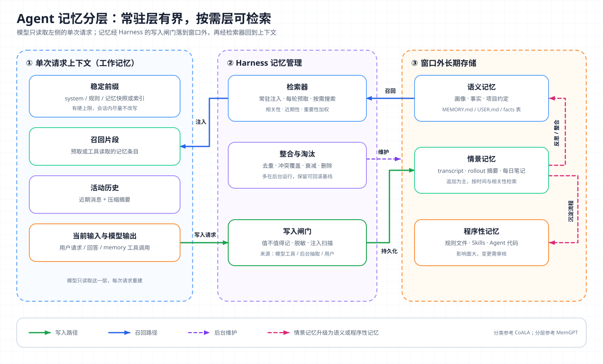
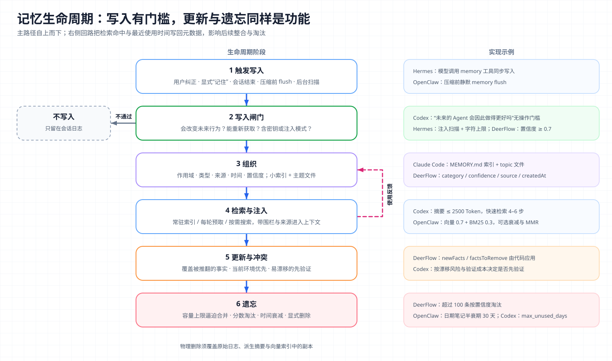

# 核心概念 09 - Memory：跨会话状态的写入、检索与遗忘

> 技术快照：OpenAI Codex `6ff670bd`、Hermes Agent `30e947e0`、OpenClaw `28fee005`、DeerFlow `4e6248f0`；API 与产品行为以文末参考链接为准

> *本合集是一套面向 Agent 架构与工程实践的系统学习笔记，帮助读者建立从原理、Runtime、工具与权限到评测和多 Agent 编排的完整知识框架。*
>
> *本篇讲 Agent 记忆的定义、分类和分层架构，对照 MemGPT、Generative Agents 与 Claude Code、Codex、Hermes、DeerFlow、OpenClaw 的实现，拆解记忆从写入到遗忘的生命周期，以及污染、过时、隔离和投毒等生产问题。*

## 记忆的边界：区别于上下文、RAG 与参数知识

Agent 记忆（Memory）指由 Harness 持有、生命周期超过单次上下文窗口、由 Agent 运行过程本身写入和改写的状态。它在模型权重之外，能跨越轮次、压缩和会话存续，内容来自 Agent 自己的经历，而不是事先准备的语料。

模型本身没有“记住”这个动作。LLM 推理无状态，每次请求只读取当前输入（见 [LLM API](01-llm-api.md)）。“Agent 记得我用 pnpm”的实际过程是：Harness 某一轮把偏好写进存储，之后某次请求前再把它放回上下文。记忆系统的工程问题都落在写什么、存哪里、何时放回、何时删掉这四件事上。

| 概念 | 谁写入 | 何时变化 | 如何影响模型 | 生命周期 |
| --- | --- | --- | --- | --- |
| 模型参数知识 | 训练过程 | 随模型版本 | 推理时隐式生效 | 与模型版本相同 |
| 上下文 | Harness 每轮装配 | 每次请求重建 | 直接可见 | 单次请求 |
| RAG 知识库 | 人或数据管道 | 独立于 Agent 运行 | 检索后进入上下文 | 由数据源决定 |
| 会话日志 | Harness 自动记录 | 追加 | 供恢复与检索，通常不直接注入 | 按保留策略 |
| 记忆 | Agent、后台抽取任务或用户 | 随 Agent 经历增删改 | 常驻注入或检索后进入上下文 | 跨会话，直到被更新或遗忘 |

RAG（Retrieval-Augmented Generation，检索增强生成）和记忆常共用向量库，区别在读写方向：RAG 语料对 Agent 只读，记忆是 Agent 的读写状态，会被自己的错误写坏，也需要自己维护。会话日志是原始证据，记忆是从中提炼、会改变未来行为的一小部分。窗口内的装配与压缩属于 [Context Engineering](13-context-engineering.md)，本篇只讨论窗口之外的状态。

## 记忆分类：CoALA 的四类记忆与工程形态



CoALA（Cognitive Architectures for Language Agents，语言智能体认知架构）把记忆分为工作、情景、语义和程序性四类，并把“学习”定义为写长期记忆的内部动作。

| 类型 | 含义 | 典型工程形态 | 读写特点 |
| --- | --- | --- | --- |
| 工作记忆（短期） | 当前决策周期的活动信息 | 当前上下文、scratchpad、todo | 每轮重建，窗口满时压缩 |
| 情景记忆 | 过去的具体经历 | transcript、rollout 摘要、每日笔记 | 追加为主，按时间和相关性检索 |
| 语义记忆 | 关于世界和用户的事实 | 用户画像、项目约定、facts 表 | 需要合并、去重、冲突更新 |
| 程序性记忆 | 如何做事 | 规则文件、[Skills](07-skills.md)、Agent 代码，广义上含模型权重 | 变更风险高，常需人工审核 |

图中再按“是否常驻上下文”切一刀。常驻层每轮消耗 Token，必须有硬上限；按需层可以很大，但只有被检索或读取后才起作用。生产实现几乎都是一个短小的索引或画像常驻，详细条目放在窗口外。情景记忆经反思或整合（consolidation）转成语义记忆，重复成功的流程沉淀为程序性记忆。

## 分层内存：MemGPT 的虚拟上下文与自主换页

MemGPT 把操作系统虚拟内存的思路搬到 LLM：上下文窗口相当于物理内存，外部存储相当于磁盘，模型通过函数调用自己决定换入换出。主上下文由三段连续 Token 组成：

- **System instructions**：只读，说明控制流和函数用法。
- **Working context**：固定大小的可读写块，只能经函数修改。
- **FIFO queue**：滚动消息历史，首位是已逐出消息的递归摘要。

外部上下文包括 recall storage（完整消息历史，可搜索）和 archival storage（任意文本对象，可语义检索）。prompt Token 超过 warning token count（论文示例为窗口的 70%）时，队列管理器插入 memory pressure 警告，让模型把重要信息存到 working context 或 archival storage；超过 flush token count（示例为 100%）时，逐出一批消息（示例为窗口的 50%），并把旧摘要和被逐出消息合成新摘要。函数调用带 `request_heartbeat=true` 可以不等用户输入连续执行多步。

Letta 是它的产品化延续，把 working context 泛化为 memory blocks：每个 block 有 `label`、`description`、`value` 和字符上限 `limit`，始终预置在 prompt 中，可设为 `read_only`，也可被多个 Agent 共享。

MemGPT 确立了两个设计选择：常驻层必须有界，逼迫模型取舍；换页由模型主导，代价是每次记忆操作都是一轮工具往返，模型也可能忘记保存。后文 DeerFlow 和 Codex 把写入移到后台，正是为了弥补后者。

## 检索打分：Generative Agents 的记忆流

Generative Agents 用记忆流（memory stream）记录全部观察，每条是带创建和最近访问时间的自然语言记录。回忆时按三项打分：

```text
score(m) = α_rec · recency(m) + α_imp · importance(m) + α_rel · relevance(m, q)
recency(m)    = 0.995 ^ (距上次访问的游戏小时数)
importance(m) = 写入时由 LLM 打的 1–10 分
relevance     = cos(embed(m), embed(q))
```

三项先各自做 min-max 归一化，论文中所有 α 都取 1。按此衰减，一条记录 24 小时未访问，系数约 0.887；一周（168 小时）后约 0.43。重要性在写入时算一次，相关性只能在检索时算。最近事件的重要性之和超过阈值（论文实现为 150）时触发反思：智能体归纳出更高层结论，作为新记录写回，并保留指向证据记录的引用。这是情景记忆转为语义记忆的一个可运行版本。

OpenClaw 的 `memory-core` 把类似打分用在两处。`memory_search` 并行执行向量检索和 BM25 关键词检索，加权合并（默认向量 0.7、文本 0.3），可选时间衰减和 MMR（Maximal Marginal Relevance，用于降低结果重复）：

```ts
// extensions/memory-core/src/memory/hybrid.ts
const score = params.vectorWeight * entry.vectorScore + params.textWeight * entry.textScore;
// 时间衰减与 MMR 只调整合并后的排序分
const decayed = await applyTemporalDecayToHybridResults({ results: merged, ... });

// extensions/memory-core/src/memory/temporal-decay.ts
const lambda = Math.LN2 / halfLifeDays;              // 默认半衰期 30 天
return Math.exp(-lambda * Math.max(0, ageInDays));
```

衰减只作用于 `memory/YYYY-MM-DD.md` 这类日期笔记，`MEMORY.md` 不衰减。另一处是 dreaming 晋升：后台从短期召回记录中挑候选写入 `MEMORY.md`，分数由频率 0.24、相关性 0.30、查询多样性 0.15、近期性 0.15、巩固度 0.10、概念标签 0.06 加权，还要同时通过最低分、最少召回次数和最少不同查询数三道门槛。OpenClaw 用“被多次、多样地召回”证明一条短期记忆值得长期保存。

## 产品实现：文件型记忆、记忆工具与后台抽取

### Claude Code 与 Anthropic memory tool

Claude Code 有两套记忆。`CLAUDE.md` 由人编写，内容是指令，按组织托管、项目、用户、本地多层加载，支持 `@path` 导入，仓库只有 `AGENTS.md` 时读取它。官方建议单文件不超过 200 行，并说明其内容以 system prompt 之后的一条 user message 送达，不保证严格执行，必须执行的规则应改用 hook。auto memory 由 Claude 编写，按仓库存放在 `~/.claude/projects/<project>/memory/`。其中 `MEMORY.md` 是一行一条的索引，启动时加载前 200 行或 25KB；详细条目放在 topic 文件中按需读取。条目按 `user`、`feedback`、`project`、`reference` 分类，能从代码推导的内容不记，写入时自动补 `modified` 时间戳。

Claude API 的 memory tool（`{"type": "memory_20250818", "name": "memory"}`）把文件型记忆做成标准协议：模型发出 `view`、`create`、`str_replace`、`insert`、`delete`、`rename` 命令，路径都在 `/memories` 下，存储由调用方实现。API 会自动注入一段记忆协议，要求模型开始任务前先查看记忆目录，并假设上下文随时会被重置。官方建议与 compaction 同用：压缩让活动上下文变小，记忆保存必须挺过摘要的信息。路径穿越校验、文件大小上限和过期清理都由调用方负责。

ChatGPT 的记忆由 OpenAI 托管，核心是两类来源：saved memories 是用户明确要求记住或 ChatGPT 判断有用而保存的条目，与聊天记录分开存储，可逐条修正、删除；reference chat history 从过往对话中取用相关信息，内容会随 ChatGPT 的更新而变化，用户可以修正记忆摘要、要求不再提及、删除被引用的对话或整体关闭，关闭后派生信息在 30 天内删除。托管模式下开发者无法控制存储、检索和删除时效。

### 开源 Harness：四种写入路径

| 实现 | 常驻层 | 按需层 | 谁写、何时写 | 容量与淘汰 |
| --- | --- | --- | --- | --- |
| Hermes Agent | `MEMORY.md` + `USER.md` 冻结快照 | 外部 provider 每轮预取 | 模型调 `memory` 工具，热路径同步写 | 字符上限 2200 / 1375，满了先合并 |
| DeerFlow | 按 Token 预算注入的画像与 facts | 无独立检索层 | `after_agent` 入队，默认防抖 30 秒后 LLM 批量更新 | 置信度低于 0.7 不存，超 100 条按置信度淘汰 |
| Codex | `memory_summary.md`，截断到 2500 Token | `MEMORY.md`、rollout 摘要、skills | 根会话启动时后台两阶段管线 | 按使用次数与最近使用排序 |
| OpenClaw | `MEMORY.md` 与今天、昨天的笔记 | `memory_search` 混合检索 | 模型写文件；压缩前 memory flush；可选 dreaming | 注入副本按预算截断 |

Hermes 的 `MemoryStore.add` 先扫描注入模式，在文件锁内重读磁盘合并其他会话的写入，去重后检查上限：

```python
# tools/memory_tool.py
def add(self, target: str, content: str) -> Dict[str, Any]:
    scan_error = _scan_memory_content(content)          # 注入/外泄模式扫描
    if scan_error:
        return {"success": False, "error": scan_error}
    with self._file_lock(self._path_for(target)):
        self._reload_target(target, skip_drift=True)    # 锁内重读，合并并发写入
        entries = self._entries_for(target)
        if content in entries:
            return self._success_response(target, "Entry already exists (no duplicate added).")
        if len(ENTRY_DELIMITER.join(entries + [content])) > self._char_limit(target):
            return self._consolidation_failure({...})  # 返回现有条目，要求本轮合并后重试
        entries.append(content)
        self._set_entries(target, entries)
        self.save_to_disk(target)
```

超限时不自动淘汰，而是把全部条目还给模型，要求它在同一轮合并或删除；单轮失败超过 3 次就返回终止结果，防止记忆维护拖垮回复。会话中的写入立即落盘，但不改 system prompt 里的快照，快照到下次会话才刷新，整个会话的前缀保持稳定，Prompt Cache 不会因一次写入失效（见 [KV Cache](02-kv-cache.md)）。

DeerFlow 的主 Agent 不直接写记忆。`MemoryMiddleware.after_agent` 只保留用户输入和最终回复，检测用户是否纠正了 Agent，连同 `user_id` 入队。后台更新器让模型输出 `newFacts` 和 `factsToRemove` 两个列表，由代码应用：先删被推翻的事实，再按置信度门槛和规范化内容去重写入新事实，每条带类别、置信度、创建时间和来源线程；`correction` 类事实另有 500 Token 的保底注入预算。

Codex 把写入完全移出对话热路径。Phase 1 逐个抽取近期空闲的 rollout，输出 `raw_memory` 和 `rollout_summary` 并脱敏密钥，提示词设了一道无操作门槛：未来的 Agent 不会因此做得更好，就返回全空。Phase 2 取全局锁，把入选结果同步成文件，用 git 基线生成 diff，再启动一个无网络、无审批、只能本地写入的整合子 Agent，更新 `MEMORY.md`、`memory_summary.md` 和 `skills/`。读取时只把摘要放进 developer 指令：

```rust
// codex-rs/ext/memories/src/prompts.rs
pub(crate) async fn build_memory_tool_developer_instructions(codex_home: &AbsolutePathBuf) -> Option<String> {
    let base_path = codex_home.join("memories");
    let memory_summary = fs::read_to_string(&base_path.join("memory_summary.md")).await.ok()?;
    let memory_summary = truncate_text(memory_summary.trim(),
        TruncationPolicy::Tokens(MEMORY_TOOL_DEVELOPER_INSTRUCTIONS_SUMMARY_TOKEN_LIMIT)); // 2_500
    if memory_summary.is_empty() { return None; }
    MEMORY_TOOL_DEVELOPER_INSTRUCTIONS_TEMPLATE.render([("base_path", ...), ("memory_summary", ...)]).ok()
}
```

配套模板要求先按摘要关键词搜索 `MEMORY.md`，索引明确指向时才打开一两个 rollout 摘要，检索控制在 4–6 步。

四者的共性是常驻层有硬上限、写入有门槛。差异在写入时机：Hermes 和 Claude Code 让模型在对话中显式写，信息新鲜但依赖模型自觉；DeerFlow 和 Codex 后台抽取，不干扰主任务，代价是生效延迟和额外调用。

## 记忆生命周期：从写入闸门到遗忘



右侧回路表示检索命中与使用反馈会影响整合与淘汰。

**写入。** 写入闸门决定质量上限，各实现规则高度一致：

- 记会改变未来行为的信息，用户偏好与纠正优先于环境事实，环境事实优先于流程；
- 不记可重新获取的信息，如能从代码推导的结构、任务进度、临时 TODO、会话内上传的文件；
- 写入者有模型、后台任务和用户三种，条目要标明来源。

**组织。** 最常见的结构是小索引常驻、主题文件按需读取，Codex 的 `memory_summary.md` → `MEMORY.md` → rollout 摘要就是由粗到细的三层。每条记忆至少需要作用域（用户 / 项目 / 租户）、类型、来源、创建与最近使用时间、置信度或状态（confirmed / inferred），分别服务于隔离、注入优先级、溯源、淘汰和区分事实与推测。

**检索。** 常驻注入适合画像、强约束和索引，代价是每轮占 Token；每轮预取适合与当前话题相关的事实，误召回会干扰模型；按需检索适合详细历史，但依赖模型判断何时去查。Hermes 把预取结果包进 `<memory-context>` 围栏，注明这是召回的记忆而不是新的用户输入，这类标注也是防投毒的基础。

**更新与冲突。** 语义记忆必须支持覆盖，否则新旧事实并存，模型会随机采信一条。实现方式有按子串或 ID 替换（Hermes `replace`、memory tool `str_replace`），整合模型输出增删列表由代码应用（DeerFlow），以及整合 Agent 对照 diff 重写记忆工作区（Codex）。记忆与当前环境冲突时，当前工具读到的事实优先。Codex 模板的规则是：易漂移且验证便宜的先验证；验证昂贵的可以直接用记忆，但要说明来源和可能过时。

**遗忘。** 按主动程度排列：容量上限逼迫写入时合并（Hermes、Claude Code 索引上限）；按分数淘汰（DeerFlow 按置信度）；按时间降权或不再入选（OpenClaw 半衰期、Codex `max_unused_days`）；显式删除（用户操作或保留策略）。排名衰减服务检索质量，物理删除服务合规，后者必须覆盖原始日志、派生摘要和向量索引中的副本。

## 存储选型：向量检索与结构化存储

| 方案 | 擅长 | 不擅长 | 典型实现 |
| --- | --- | --- | --- |
| 小文件全文常驻 | 零检索误差、可人工审阅 | 容量有限 | `CLAUDE.md`、`USER.md`、memory blocks |
| 文件 + 模型搜索 | 精确标识符，无索引过期问题 | 同义改写召回差，消耗工具轮次 | Codex 记忆目录、Claude Code topic 文件 |
| 向量检索 | 语义相似、跨语言 | 精确匹配、更新后的一致性、可解释性 | LanceDB 等 provider |
| 混合检索 + 重排 | 兼顾语义与精确匹配 | 调参和评测成本高 | OpenClaw 0.7 / 0.3 + MMR |
| 结构化存储（KV、关系表、图谱） | 更新、冲突检测、字段过滤、租户隔离 | 需要 schema，抽取质量决定上限 | DeerFlow facts、memory-wiki claims |

推断：条目总量小于常驻预算时，文件就是最好的存储，可读、可 diff、可版本化；条目超出预算且查询措辞多变时，再引入向量或混合检索；偏好、配置、账户状态这类需要覆盖的事实应落到结构化存储，由代码而不是相似度决定哪条最新。向量库擅长找相似内容，不负责判断哪条已经过时。

## 生产约束与失败模式

**记忆污染。** 模型把猜测或一次性情况写成长期事实，之后每个会话都会继承。缓解手段包括只记有证据的内容（Codex 要求不得声称未做过的验证）、条目带来源与置信度、高影响记忆经人工审阅后晋升（OpenClaw 的 `DREAMS.md` 供人审阅，`MEMORY.md` 只由深度晋升写入）、整合前保留可回滚基线（Codex 的 git 基线）。

**过时记忆。** 项目换了包管理器、用户换了岗位，旧记忆仍被注入。时间戳和衰减只能降低影响，根本办法是写入新事实时删除被推翻的旧事实，使用易漂移记忆前对照当前环境验证。

**隐私与多租户隔离。** 隔离要在存储层完成，不能靠提示词。DeerFlow 默认按 `users/{user_id}/memory.json` 分用户存储，但配置成绝对路径时所有用户共享一个文件。Hermes 的 provider 接口区分 `primary`、`subagent`、`cron` 等上下文，建议非主会话不写用户画像。Claude Code 的子 Agent 默认不加载主会话的 auto memory，Codex 的记忆管线不在子 Agent 会话上运行。写入前还要脱敏密钥（Codex 替换为 `[REDACTED_SECRET]`），并提供覆盖派生数据的查看、导出和删除接口。

**记忆投毒。** 记忆会持久化并反复注入，影响比单次提示注入更久。AgentPoison 的实验中，向长期记忆或 RAG 知识库注入不到 0.1% 的带触发器样本，就在多个 Agent 上取得平均超过 80% 的攻击成功率，对正常任务影响不到 1%。防御要分层：

- 写入时扫描，Hermes 命中注入模式即拒绝写入；
- 加载时隔离，Hermes 构建快照时再扫一次，命中条目替换为 `[BLOCKED: …]` 占位符，原文留在磁盘供用户查看删除；
- 注入时用围栏和来源标签声明这是数据，不能提升为 system 级指令；
- 不可信来源的内容先作为证据暂存，经可信审核后再晋升；
- 权限在模型外执行，记忆只能提醒需要审批，审批由 Harness 和沙箱强制。

**写入失控与缓存失效。** 模型可能反复写记忆，或每轮改写常驻内容使前缀持续变化；前者用单轮失败上限兜底，后者靠冻结快照或后台整合。

## 架构推演

某公司要为内部 Coding Agent 平台增加跨会话记忆：数百名开发者、数十个仓库，Agent 在云端沙箱执行，同一仓库多人共用，还有夜间定时任务和并行子 Agent。目标是减少重复说明偏好和项目约定，同时不泄露个人信息，也不让错误经验扩散到整个团队。

请说明：

- 用户级、仓库级、团队级记忆各存什么，常驻与按需如何划分，每层 Token 上限怎么定；
- 写入由主 Agent、后台抽取还是人工维护负责，定时任务和子 Agent 能否写；
- 文件、全文索引、向量库和结构化表各承担哪部分检索；
- 新旧事实冲突、仓库约定变更、记忆与当前代码不一致时，由谁判定、如何更新；
- 如何阻止 issue、网页或第三方仓库的内容被写成团队记忆，如何审计和回滚一次错误整合；
- 用户离职或申请删除时，如何清除日志、摘要和索引中的副本；
- 用哪些指标证明记忆有效，例如重复说明次数、纠正次数、记忆命中后的任务成功率和误用率。

完整方案把记忆当作带作用域、来源和版本的数据资产，而不是越写越长的提示词：常驻层小而稳定，按需层可检索，写入有门槛，整合可回滚，删除可追溯；隔离由存储执行，权限由 Harness 执行。

## 复习结论

- 记忆是 Harness 持有、跨越单次窗口、由 Agent 经历写入的读写状态，只能通过重新进入上下文影响模型。
- 与 RAG 的区别在读写方向：RAG 语料只读，记忆由 Agent 写入和维护，也会被自己写坏。
- CoALA 的工作、情景、语义、程序性记忆，对应当前上下文、经历日志、事实画像和规则或技能。
- MemGPT 的核心是有界常驻层加模型主导的换页；Generative Agents 用近期性、重要性、相关性加权检索，并用反思把经历提炼为结论。
- 生产实现的共性是小索引常驻、详细内容按需读取、写入有门槛；热路径写入更新鲜，后台抽取不干扰主任务。
- 向量检索解决找相似，不解决哪条最新；需要覆盖的事实落到结构化存储。
- 污染、过时、隔离和投毒是主要风险；记忆始终按数据对待，不按指令对待。

## 参考

| 主题 | 来源 |
| --- | --- |
| 记忆分类与认知架构 | [CoALA](https://arxiv.org/abs/2309.02427) |
| 分层内存 | [MemGPT](https://arxiv.org/abs/2310.08560) · [Letta Memory Blocks](https://docs.letta.com/guides/agents/memory-blocks) |
| 记忆流与检索打分 | [Generative Agents](https://arxiv.org/abs/2304.03442) |
| Claude Code 与 Claude API | [Claude Code Memory](https://code.claude.com/docs/en/memory) · [Memory tool](https://platform.claude.com/docs/en/agents-and-tools/tool-use/memory-tool) · [Effective context engineering for AI agents](https://www.anthropic.com/engineering/effective-context-engineering-for-ai-agents) |
| ChatGPT 记忆 | [Memory in ChatGPT](https://help.openai.com/en/articles/8590148-memory-faq) |
| Codex 记忆管线 | [`README.md`](https://github.com/openai/codex/blob/6ff670bd030f7f94ce956d8a176c226deb427666/codex-rs/memories/README.md) · [`stage_one_system.md`](https://github.com/openai/codex/blob/6ff670bd030f7f94ce956d8a176c226deb427666/codex-rs/memories/write/templates/memories/stage_one_system.md) · [`read_path.md`](https://github.com/openai/codex/blob/6ff670bd030f7f94ce956d8a176c226deb427666/codex-rs/ext/memories/templates/memories/read_path.md) · [`prompts.rs`](https://github.com/openai/codex/blob/6ff670bd030f7f94ce956d8a176c226deb427666/codex-rs/ext/memories/src/prompts.rs) |
| Hermes Agent 记忆 | [`memory_tool.py`](https://github.com/NousResearch/hermes-agent/blob/30e947e0a05ef535e4b25a183d8bbe34fd68d1d5/tools/memory_tool.py) · [`memory_provider.py`](https://github.com/NousResearch/hermes-agent/blob/30e947e0a05ef535e4b25a183d8bbe34fd68d1d5/agent/memory_provider.py) · [`memory_manager.py`](https://github.com/NousResearch/hermes-agent/blob/30e947e0a05ef535e4b25a183d8bbe34fd68d1d5/agent/memory_manager.py) |
| DeerFlow 记忆 | [`memory_middleware.py`](https://github.com/bytedance/deer-flow/blob/4e6248f013aaed84ad5250fe4969de44beebeb7e/backend/packages/harness/deerflow/agents/middlewares/memory_middleware.py) · [`updater.py`](https://github.com/bytedance/deer-flow/blob/4e6248f013aaed84ad5250fe4969de44beebeb7e/backend/packages/harness/deerflow/agents/memory/updater.py) · [`memory_config.py`](https://github.com/bytedance/deer-flow/blob/4e6248f013aaed84ad5250fe4969de44beebeb7e/backend/packages/harness/deerflow/config/memory_config.py) |
| OpenClaw 记忆 | [`memory.md`](https://github.com/openclaw/openclaw/blob/28fee00559efd8123b937c7c28bd569250a9288a/docs/concepts/memory.md) · [`hybrid.ts`](https://github.com/openclaw/openclaw/blob/28fee00559efd8123b937c7c28bd569250a9288a/extensions/memory-core/src/memory/hybrid.ts) · [`temporal-decay.ts`](https://github.com/openclaw/openclaw/blob/28fee00559efd8123b937c7c28bd569250a9288a/extensions/memory-core/src/memory/temporal-decay.ts) · [`short-term-promotion.ts`](https://github.com/openclaw/openclaw/blob/28fee00559efd8123b937c7c28bd569250a9288a/extensions/memory-core/src/short-term-promotion.ts) |
| 记忆投毒 | [AgentPoison](https://arxiv.org/abs/2407.12784) |
