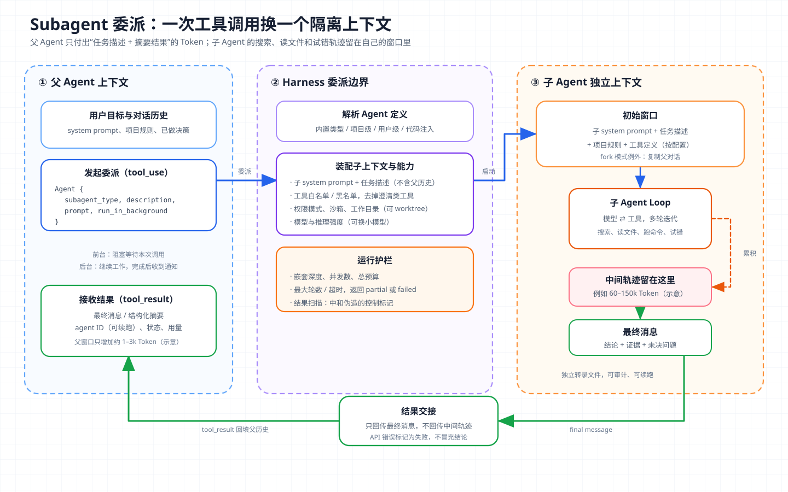

# 核心概念 10 - Subagent：用一次工具调用换一个隔离上下文

> 技术快照：OpenAI Codex `6ff670b`、DeerFlow `4e6248f`、Hermes Agent `30e947e`；Claude Code 与各 SDK 的行为以文末官方文档为准

> *本合集是一套面向 Agent 架构与工程实践的系统学习笔记，帮助读者建立从原理、Runtime、工具与权限到评测和多 Agent 编排的完整知识框架。*
>
> *本篇讲主 Agent 把子任务委派给隔离子 Agent 的机制：委派协议、配置面、前后台与并行执行、主流实现差异，以及委派带来的成本、信息损失和失控风险。*

## Subagent 的定义与边界

Subagent（子 Agent）是主 Agent 在运行中创建的 Agent 实例。它拥有独立的上下文窗口，完成一个明确的子任务后把结果交回主 Agent。它有自己的 system prompt、工具集、权限和模型配置，内部也跑一条完整的 [Agent Loop](03-agent-loop.md)，只是这条循环的轨迹不进入主 Agent 的上下文。

它的核心价值有两个：

- **上下文隔离**：搜索、读文件、跑命令产生的中间内容留在子 Agent 窗口里，主 Agent 的窗口不被只看一次的材料填满。
- **结果压缩**：几十轮工具调用的结论被写成一条最终消息，主 Agent 读到的是结论而不是原始轨迹。

权限收紧、换便宜模型、并行加速都建立在这两点之上。一个子任务如果既不产生大量噪声，也不能用一条摘要交付，就没有委派的理由。

| 相近概念 | 与 Subagent 的区别 |
| --- | --- |
| 普通工具调用 | 协议相同，但普通工具由确定性代码执行，Subagent 的执行体是另一个 LLM 循环 |
| [Skills](07-skills.md) | Skill 把说明加载进当前上下文执行，Subagent 在另一个上下文里执行 |
| Fork | Fork 复制父对话；默认的 Subagent 从空白对话起步，只拿到任务描述 |
| Handoff（控制权转交） | Handoff 后接手方直接面对用户；Subagent 结束后控制权回到主 Agent |
| [Multi-Agent](11-multi-agent.md) | Subagent 是一次委派的机制，多 Agent 讨论多个 Agent 的系统级编排 |

判断标准是任务所有权：主 Agent 始终持有它，子 Agent 只交付中间产物。子 Agent 一旦能直接对用户说话、能决定整体任务何时结束，就已经不是 Subagent 结构了。

## 委派协议：工具调用进，最终消息出



图中左侧是父 Agent 上下文，中间是 Harness（模型外负责执行工具、管理状态和权限的运行时）的委派边界，右侧是子 Agent 的独立上下文。父子之间只有两条数据通道：进去的是任务描述，出来的是最终消息。

### 一次委派的消息样例

主流实现都把委派建模成工具调用。Claude Code 中，模型发出名为 `Agent` 的 `tool_use`（早期名为 `Task`，仍可作别名）：

```json
{
  "type": "tool_use",
  "id": "toolu_01",
  "name": "Agent",
  "input": {
    "subagent_type": "Explore",
    "description": "定位支付回调入口",
    "prompt": "在 services/payment 下找出第三方支付回调的入口函数、签名校验位置和幂等键。只读。返回：文件路径+行号、调用链、未确认的疑点。",
    "run_in_background": false
  }
}
```

子 Agent 可能调用几十次 Grep、Read，读进十几万 Token，回到父 Agent 的只有一条 `tool_result`，内容是结论、证据位置、未确认的疑点，以及一行 `agentId: ...` 供后续续跑。

这样设计有三个原因：

1. **复用工具协议**。模型已经会发工具调用、会等结果，委派不需要新的对话原语；并行委派就是在一次响应里发多个调用。
2. **输入是自然语言任务描述**。子 Agent 不继承父对话时，任务描述是它了解背景的唯一渠道。Claude Agent SDK 文档明确说，父到子传递的唯一内容是 Agent 工具的 prompt 字符串，路径、错误信息和已做决策都要写进去。
3. **输出只取最终消息**。中间轨迹留在子 Agent 的转录文件里，父 Agent 只拿到最后一条消息和用于续跑的 agent ID。

### 子 Agent 启动时看到什么

以 Claude Code 为例，非 Fork 子 Agent 的初始上下文包括：自己的 system prompt 与环境信息、父 Agent 写的任务描述、项目规则文件 CLAUDE.md（可用 `omitClaudeMd` 关闭，内置 Explore 和 Plan 默认跳过）、继承或筛选后的工具定义，以及 `skills` 字段列出的预加载 Skill。它看不到父 Agent 的 system prompt、对话历史和工具结果。

Fork 模式则复制父对话再开始，省掉重新交代背景的成本，还能复用父对话预热的 Prompt Cache，代价是把父窗口的噪声一起带过去。Codex 的 `spawn_agent` 用 `fork_context` 参数切换两种模式。

### 隔离与压缩的 Token 账本

设子 Agent 运行 `n` 轮，第 `i` 轮输入为 `P + H_i`，其中 `P` 是固定前缀（system prompt、工具定义、任务描述），`H_i` 是累积的工具轨迹。委派后主 Agent 窗口只增加：

```text
ΔT_parent = T_call + T_result
```

整个系统的消耗则是：

```text
T_total ≈ T_parent_turns + Σ_{i=1..n} (P + H_i) + Σ output_i
```

对主窗口，Subagent 是压缩器：读了 80k Token 代码的子任务，回填可能只有 1–3k，主 Agent 后续每一轮都少带这 80k。对总花费，它是放大器：子 Agent 每轮重发前缀和累积轨迹，还要重新读主 Agent 已读过的背景。Anthropic 给出的量级是 Agent 约为普通对话的 4 倍 Token，多 Agent 系统约 15 倍（详见 [Multi-Agent](11-multi-agent.md)）。

所以 Subagent 省的是主窗口的上下文预算，不是总 Token。窗口是否紧张、主 Agent 后续还要跑多久，决定了这笔交换是否划算。

## 子 Agent 的配置面

子 Agent 的定义通常是一份角色文件：名字、何时使用的描述、system prompt，加上运行参数。

| 配置项 | Claude Code / Agent SDK | Codex | DeerFlow |
| --- | --- | --- | --- |
| 描述 | `description`（必填） | `description`（必填） | `description` |
| System prompt | 文件正文 / `prompt` | `developer_instructions` | `system_prompt` |
| 工具集 | `tools`、`disallowedTools` | 继承父会话，可配 `mcp_servers` | `tools`、`disallowed_tools`（默认含 `task`） |
| 权限 | `permissionMode`，受父会话继承规则约束 | 强制继承父回合的审批策略与权限配置 | 继承父线程的沙箱与工具组 |
| 模型 | 别名、完整 ID 或 `inherit` | `model`、`model_reasoning_effort` | 默认 `inherit` |
| 运行边界 | `maxTurns`、`isolation: worktree`、`background` | `max_depth`、并发线程上限 | `max_turns`、`timeout_seconds` |

三个配置点需要单独说明：

- **描述决定调度质量**。主 Agent 靠读 `description` 判断是否委派、委派给谁。描述写得泛，主 Agent 要么从不调用，要么什么都往里塞。这些描述常驻主 Agent 的工具说明，Claude Code 在自定义描述合计超过 15,000 Token 时会告警。
- **工具白名单是硬约束**。prompt 里写“不要修改文件”，模型仍可能调用 Edit；把 Edit 从工具集删掉，模型根本看不到它。只读分析类子 Agent 应当只给 Read、Grep、Glob。
- **权限只能收紧**。Codex 先套用角色配置，再用父回合的实际审批策略、工作目录和权限配置覆盖，角色文件无法放宽权限。Hermes Agent 默认自动拒绝子线程里的危险命令审批，因为后台线程里没有人能及时响应弹窗。

## 前台、后台与并行执行

执行方式有三种：前台同步，父 Agent 阻塞在这次调用上，结果即 `tool_result`（Claude Code 前台子 Agent、OpenAI `as_tool`、DeerFlow `task`）；后台异步，父 Agent 立即拿到句柄继续工作，完成后以通知进入后续轮次（Claude Code 后台子 Agent、Hermes 顶层委派）；显式等待，父 Agent 拿到句柄后按需调用等待工具（Codex `spawn_agent` + `wait_agent`）。

并行在协议上很简单：模型在一次响应里发出多个委派调用，Harness 并发执行，独立子任务的完成时间取决于最慢的那个。

后台模式的难点是结果如何回到对话。已发出的历史不能改，否则会破坏 Prompt Cache 的前缀，所以完成通知只能作为新一轮输入追加。Hermes Agent 把完成事件放进队列，等 Agent 空闲时转成新的一轮，模块注释说明这是为了保护 Prompt Cache；Codex 在子 Agent 进入终态时，向父会话注入一段不触发新回合的 `<subagent_notification>` 用户消息。

## 主流实现对比

| 实现 | 委派入口 | 上下文起点 | 默认嵌套深度 | 并发上限 | 回给父 Agent 的内容 |
| --- | --- | --- | --- | --- | --- |
| Claude Code / Agent SDK | `Agent` 工具 | 空白对话；Fork 复制父对话 | 主对话以下 3 层 | 同时运行 20 个 | 最终消息 + `agentId` |
| OpenAI Agents SDK | `Agent.as_tool()` 生成的函数工具 | `input_builder` 构造的输入 | 应用代码决定 | 应用代码决定 | 最终输出，可经 `custom_output_extractor` 处理 |
| Codex | `spawn_agent` + `wait_agent` 等 | 默认只有初始消息；`fork_context` 复制历史 | 1 | 6 个线程（本快照） | 状态枚举，完成态带最后一条消息 |
| DeerFlow | `task` 工具 | 新建 system + human 两条消息 | 不允许嵌套 | 单次响应最多 3 个 | `Task Succeeded. Result: ...` 字符串 |
| Hermes Agent | `delegate_task` | 全新 Agent，跳过上下文文件与记忆 | 1 | 3 个 | 每个任务的摘要、状态、Token、耗时、工具轨迹 |

共性是：委派都是工具调用，默认不继承父对话，回传最终消息而非轨迹，都对嵌套和并发设限。差异集中在三处：

- **嵌套**：Claude Code 默认允许三层，Codex、Hermes 默认一层，DeerFlow 直接从子 Agent 工具集拿掉 `task`。
- **等待语义**：多数实现是一次阻塞调用；Codex 把创建和等待拆成两个工具，父 Agent 可以在等待之间做别的事，或只等最先完成的那个。
- **回传结构**：从带前缀的字符串到带状态、用量、工具轨迹的结构化对象。结构越清楚，父 Agent 越容易区分完成、失败和超时。

OpenAI Agents SDK 的 `as_tool` 与 Handoff 的区别在控制权：前者由管理者 Agent 保持对话并汇总专家输出，后者由专家接管对话。pi 则是反例，README 明确写“No sub-agents”，只在扩展示例中用独立 pi 进程实现 `subagent` 工具，可见委派也能完全放在 Harness 之外实现。

### Codex：创建时检查深度，最后覆盖权限

Codex 本快照的 V1 多 Agent 工具包括 `spawn_agent`、`send_input`、`wait_agent`、`close_agent`、`resume_agent`。创建路径如下：

```rust
// codex-rs/core/src/tools/handlers/multi_agents/spawn.rs
let child_depth = next_thread_spawn_depth(&session_source);
let max_depth = turn.config.agent_max_depth;
if exceeds_thread_spawn_depth_limit(child_depth, max_depth) {
    return Err(FunctionCallError::RespondToModel(
        "Agent depth limit reached. Solve the task yourself.".to_string(),
    ));
}
let mut config =
    build_agent_spawn_config(&session.get_base_instructions().await, turn.as_ref())?;
if args.fork_context {
    // 复制父历史时，不允许改角色、模型和推理强度
    reject_full_fork_spawn_overrides(role_name, args.model.as_deref(), args.reasoning_effort.clone())?;
} else {
    apply_requested_spawn_agent_model_overrides(&session, turn.as_ref(), &mut config,
        args.model.as_deref(), args.reasoning_effort.clone()).await?;
    apply_role_to_config(&mut config, role_name).await
        .map_err(FunctionCallError::RespondToModel)?;
}
// 用父回合的 approval_policy、cwd、permission_profile 覆盖
apply_spawn_agent_runtime_overrides(&mut config, turn.as_ref())?;
```

- **深度**：根会话为 0，子 Agent 为 1，`DEFAULT_AGENT_MAX_DEPTH = 1`，默认配置下子 Agent 不能再派生。超限时告诉模型“自己完成任务”，而不是让回合失败。
- **Fork**：完整复制父历史的子 Agent 必须沿用父 Agent 的类型和模型。Fork 时只保留 system、developer、user 消息和 assistant 的最终回答，丢弃推理、工具调用与输出。
- **权限**：运行时覆盖排在角色配置之后，角色文件无法把权限调得比父 Agent 宽。

结果用状态机表达：`AgentStatus` 有 `PendingInit`、`Running`、`Interrupted`、`Completed(Option<String>)`、`Errored(String)`、`Shutdown`、`NotFound`，`Completed` 携带最后一条消息。`wait_agent` 接收一组 ID，任一进入终态即返回，超时默认 30 秒，限制在 10 秒到 1 小时之间。`close_agent` 的说明特别提醒：已完成但未关闭的子 Agent 仍占并发名额。

### DeerFlow：同步外观下的后台执行

DeerFlow 的 `task` 工具对模型是一次同步调用，内部是后台执行加后端轮询：

```python
# backend/packages/harness/deerflow/tools/builtins/task_tool.py
# Subagents should not have subagent tools enabled (prevent recursive nesting)
available_tools_kwargs = {
    "model_name": effective_model,
    "groups": parent_tool_groups,
    "subagent_enabled": False,
}
tools = get_available_tools(**available_tools_kwargs)
executor = SubagentExecutor(**executor_kwargs)  # 含 sandbox_state、thread_data、trace_id
task_id = executor.execute_async(prompt, task_id=tool_call_id)
max_poll_count = (config.timeout_seconds + 60) // 5
writer({"type": "task_started", "task_id": task_id, "description": description})
while True:
    result = get_background_task_result(task_id)
    if result.status == SubagentStatus.COMPLETED:
        _report_subagent_usage(runtime, result)  # 子 Agent 用量汇入父运行记录
        return f"Task Succeeded. Result: {result.result}"
    elif result.status == SubagentStatus.TIMED_OUT:
        return f"Task timed out. Error: {result.error}"
    # FAILED / CANCELLED 同理
    await asyncio.sleep(5)
```

模型不必学会轮询，前端仍能通过 `task_started`、`task_running`、`task_completed` 事件看到子 Agent 进度。子 Agent 与父线程共享沙箱和线程目录，文件产物可以直接交接，但不共享消息历史。

并发上限由中间件在模型响应之后强制执行，超出的 `task` 调用直接从消息里删除：

```python
# backend/packages/harness/deerflow/agents/middlewares/subagent_limit_middleware.py
task_indices = [i for i, tc in enumerate(tool_calls) if tc.get("name") == "task"]
if len(task_indices) <= self.max_concurrent:
    return None
indices_to_drop = set(task_indices[self.max_concurrent :])
truncated_tool_calls = [tc for i, tc in enumerate(tool_calls) if i not in indices_to_drop]
updated_msg = clone_ai_message_with_tool_calls(last_msg, truncated_tool_calls)
return {"messages": [updated_msg]}
```

类注释写着“This is more reliable than prompt-based limits”。上限默认 3，限制在 2 到 4 之间；主 Agent 的 prompt 同时告诉模型多余调用会被丢弃，需要分批发出。子 Agent 的 `max_turns` 作为 LangGraph 的 `recursion_limit` 传入，内置 `general-purpose` 为 150，`bash` 为 60，全局执行超时默认 1800 秒。

### Hermes Agent：用禁用表划定能力边界

Hermes Agent 的子 Agent 是跳过上下文文件和记忆的全新实例，能力边界由一张禁用表确定：

```python
# tools/delegate_tool.py
DELEGATE_BLOCKED_TOOLS = frozenset(
    [
        "delegate_task",  # no recursive delegation
        "clarify",  # no user interaction
        "memory",  # no writes to shared MEMORY.md
        "send_message",  # no cross-platform side effects
        "execute_code",  # children should reason step-by-step, not write scripts
        "cronjob",  # no scheduling more work in the parent's name
    ]
)
```

这六项对应四类风险：递归派生、绕过主 Agent 与用户交互、污染共享状态、以父 Agent 名义产生外部副作用。任何 Subagent 实现都应对这四类能力逐项表态。

## 设计取舍：何时委派，委派什么

### 适合委派的任务

| 条件 | 倾向委派 | 倾向留在主 Agent |
| --- | --- | --- |
| 中间产物 | 大量搜索结果、日志、文件内容，之后不再引用 | 中间产物是后续步骤的输入 |
| 交付形态 | 一条摘要或结构化结果 | 需要反复来回、边做边调 |
| 上下文依赖 | 少量可写进任务描述的背景 | 大量主对话中形成的隐含决策 |
| 权限 | 需要比主 Agent 更窄的工具集 | 需要完整能力 |
| 延迟 | 能接受子 Agent 重新收集背景 | 用户在等快速的小改动 |

最典型的委派对象是只读调研：代码探索、文档检索、日志分析、多角度审查。它们噪声大、结果可摘要，而且不写文件，不会与主 Agent 的修改冲突。

模型本身的委派倾向也要约束。Codex 的工具说明写着：除非用户或 AGENTS.md、Skill 明确要求，否则不要创建子 Agent，“要求深入彻底”不算授权。Claude Agent SDK 文档提到 Opus 5 比早期模型更愿意委派，建议同时设置深度、并发和预算上限。

### 交接时的两次有损压缩

主 Agent 把自己的理解压成任务描述，子 Agent 把自己的工作压成最终消息。第一次损失让子 Agent 在错误范围里工作（“不要动 v1 接口”没写进去，它就不知道）；第二次损失让主 Agent 拿到缺证据的结论，或把猜测当事实。对应的做法是把交接写成合同：

- **任务描述**：目标、范围与禁区、已知事实和决策、完成条件、输出格式。
- **最终消息**：结论、证据（路径与行号、命令输出、URL）、置信度、未完成事项。
- **大块产物走文件**：完整报告写入约定路径，最终消息只放摘要和路径。

Fork 能减少第一次损失，代价是带入噪声并失去换模型的自由。推断：依赖大量隐含背景的任务适合 Fork，边界清楚的调研适合空白启动。

### 子 Agent 不能向用户澄清

主流实现都拿走了子 Agent 与用户交互的能力：Claude Code 对所有子 Agent 过滤 `AskUserQuestion`，Hermes 禁用 `clarify`，DeerFlow 内置子 Agent 禁用 `ask_clarification`。子 Agent 常在后台并行运行，各自弹问题会打乱交互，主 Agent 也无法掌握任务状态。

所以任务描述中的歧义只能由子 Agent 自行处理。应在子 Agent 的 system prompt 里约定：遇到无法消解的歧义就停止，返回“阻塞 + 需要确认的问题”，由主 Agent 决定自己回答、问用户还是重新委派。Claude Code 可以用 `SendMessage` 带 agent ID 续跑子 Agent 并保留其完整历史，这让补充信息后继续执行的成本较低。

## 生产约束与失败模式

| 失败模式 | 表现 | 控制手段 |
| --- | --- | --- |
| 递归失控 | 子 Agent 继续派生，成本指数增长 | 深度上限：Claude Code 3 层，Codex、Hermes 1 层，DeerFlow 禁止嵌套 |
| 扇出爆炸 | 一次派出大量子 Agent，打满速率限制 | 并发上限：Claude Code 20、Codex 本快照 6、DeerFlow 3、Hermes 3，超限拒绝或截断 |
| 跑飞与卡死 | 反复试错、工具挂起、永不返回 | 最大轮数、墙钟超时、心跳检测；超限返回 partial 或 timed_out |
| 失败冒充结论 | 限流或服务错误文本被当作调研结果 | Claude Code 自 v2.1.199 起把 API 错误报告为失败，不作为发现返回 |
| 自报成功 | 声称“已上传”“已写入”但实际没有 | 要求返回可核验句柄（URL、ID、路径、状态码），父 Agent 自行验证 |
| 结果携带注入 | 读到的恶意内容出现在最终消息里，冒充系统指令 | Claude Code 扫描最终消息，中和伪造的控制标签与轮次标记 |
| 并发写冲突 | 多个子 Agent 改同一文件 | 只读优先；按文件划分所有权，或 `isolation: worktree` |
| 预算失控 | 大量委派导致总花费不可预期 | Agent SDK 的 `max_budget_usd`：到达后拒绝新委派并停止后台子 Agent |
| 资源泄漏 | 已完成子 Agent 占着并发名额 | 显式关闭（Codex `close_agent`）或完成后自动回收 |

**结果校验**分三层。一是格式校验，由代码检查输出结构，例如 Codex 的 CSV 批量任务 `spawn_agents_on_csv` 支持 `output_schema`，工作 Agent 必须调用 `report_agent_job_result` 上报，未上报视为失败。二是证据校验，结论必须带出处，主 Agent 抽查原文。三是独立复核，高风险结论交给另一个只读子 Agent，或用测试、类型检查、构建等确定性工具验证。Hermes 在工具说明里写得很直白：子 Agent 摘要是 SELF-REPORTS，不是已验证事实。

**可观测性**要求子 Agent 轨迹虽不进主上下文，但必须进日志：父子关系、子 Agent 类型和模型、轮数、Token 与费用、耗时、终止原因、最终消息。Claude Agent SDK 在子 Agent 消息上标注 `parent_tool_use_id`，DeerFlow 在调用链中传递 `trace_id` 并把子 Agent 用量汇入父运行记录。缺少这层关联，排查“这次任务为什么花了十倍 Token”时只能看到主 Agent 的一行委派调用。

## 架构推演

某团队要让 Coding Agent 对包含 30 个服务的单体仓库做安全审计：找出所有未做鉴权的内部 HTTP 接口，给出修复补丁并跑通测试。主 Agent 有效窗口约 20 万 Token，全仓代码远超这个量级；团队要求单次审计费用可预期，补丁经人工审批后合入。

请设计其中的 Subagent 部分，并说明：

- 枚举、扫描、确认、修复、测试分别由谁完成，扫描子 Agent 的输出合同、工具白名单、模型与轮数上限；
- 任务描述必须写入的信息（鉴权中间件识别规则、豁免清单、已知误报）和最终消息结构；
- 30 个服务如何分批并行，并发与预算上限设为多少，子 Agent 返回“无法判断”时如何处理；
- 修复阶段如何避免文件冲突，如何校验报告的漏洞确实存在、如何发现漏报；
- 需要哪些观测字段，才能事后解释每个服务的审计成本与结论来源。

合理的方案会把扫描做成只读、可并行、输出结构化的子 Agent，把确认与修复留在主 Agent 或少量串行的写入型子 Agent 中；主窗口只保存每个服务的结构化结论和证据路径，完整报告写入文件。评价方案时，看它能否同时回答窗口预算、总费用和结论可信度三个问题。

## 复习结论

- Subagent 是主 Agent 通过工具调用创建、拥有独立上下文、完成后只交回最终消息的 Agent 实例，任务所有权始终在主 Agent。
- 核心价值是上下文隔离和结果压缩。它省下的是主窗口预算，总 Token 通常上升。
- 委派协议统一为任务描述进、最终消息出。默认不继承父对话；Fork 复制父对话以减少交接损失，代价是带入噪声。
- 配置面包括描述、system prompt、工具集、权限、模型和运行边界。工具白名单是硬约束，权限只能收紧。
- 前台模式阻塞等待，后台模式以追加的新一轮输入回传结果以保护 Prompt Cache，Codex 把创建与等待拆成独立工具。
- 各家共性是工具化委派、默认隔离、摘要回传和上限控制，差异在嵌套深度、等待语义和回传结构。
- 交接有两次有损压缩，应把任务描述和最终消息写成合同，大块产物走文件；子 Agent 不能向用户澄清，歧义以“阻塞 + 问题”返回。
- 生产控制要覆盖深度、并发、轮数、超时、预算、错误分离、结果扫描和写冲突；子 Agent 的结论是自我报告，关键结论要用证据和确定性工具验证。

## 参考

| 主题 | 来源 |
| --- | --- |
| Claude Code 子 Agent | [Create custom subagents](https://code.claude.com/docs/en/sub-agents) · [Tools reference](https://code.claude.com/docs/en/tools-reference) |
| Claude Agent SDK 子 Agent | [Subagents in the SDK](https://code.claude.com/docs/en/agent-sdk/subagents) |
| OpenAI Agents SDK | [Tools：Agents as tools](https://openai.github.io/openai-agents-python/tools/) · [Agent orchestration](https://openai.github.io/openai-agents-python/multi_agent/) |
| Codex 子 Agent 文档 | [Codex Subagents](https://developers.openai.com/codex/subagents) |
| Codex 源码 | [`multi_agents/spawn.rs`](https://github.com/openai/codex/blob/6ff670b/codex-rs/core/src/tools/handlers/multi_agents/spawn.rs) · [`multi_agents_common.rs`](https://github.com/openai/codex/blob/6ff670b/codex-rs/core/src/tools/handlers/multi_agents_common.rs) · [`multi_agents_spec.rs`](https://github.com/openai/codex/blob/6ff670b/codex-rs/core/src/tools/handlers/multi_agents_spec.rs) · [`agent/registry.rs`](https://github.com/openai/codex/blob/6ff670b/codex-rs/core/src/agent/registry.rs) · [`agent/control/spawn.rs`](https://github.com/openai/codex/blob/6ff670b/codex-rs/core/src/agent/control/spawn.rs) · [`subagent_notification.rs`](https://github.com/openai/codex/blob/6ff670b/codex-rs/core/src/context/subagent_notification.rs) · [`config/mod.rs`](https://github.com/openai/codex/blob/6ff670b/codex-rs/core/src/config/mod.rs) |
| DeerFlow 源码 | [`task_tool.py`](https://github.com/bytedance/deer-flow/blob/4e6248f/backend/packages/harness/deerflow/tools/builtins/task_tool.py) · [`subagent_limit_middleware.py`](https://github.com/bytedance/deer-flow/blob/4e6248f/backend/packages/harness/deerflow/agents/middlewares/subagent_limit_middleware.py) · [`subagents/config.py`](https://github.com/bytedance/deer-flow/blob/4e6248f/backend/packages/harness/deerflow/subagents/config.py) · [`subagents/builtins`](https://github.com/bytedance/deer-flow/tree/4e6248f/backend/packages/harness/deerflow/subagents/builtins) |
| Hermes Agent 源码 | [`delegate_tool.py`](https://github.com/NousResearch/hermes-agent/blob/30e947e/tools/delegate_tool.py) · [`async_delegation.py`](https://github.com/NousResearch/hermes-agent/blob/30e947e/tools/async_delegation.py) |
| pi 子 Agent 扩展示例 | [pi README](https://github.com/earendil-works/pi/blob/c8c3cd4/packages/coding-agent/README.md) · [`examples/extensions/subagent`](https://github.com/earendil-works/pi/tree/c8c3cd4/packages/coding-agent/examples/extensions/subagent) |
| 多 Agent Token 量级 | [How we built our multi-agent research system](https://www.anthropic.com/engineering/multi-agent-research-system) |
