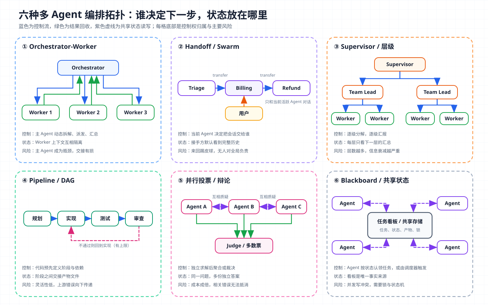
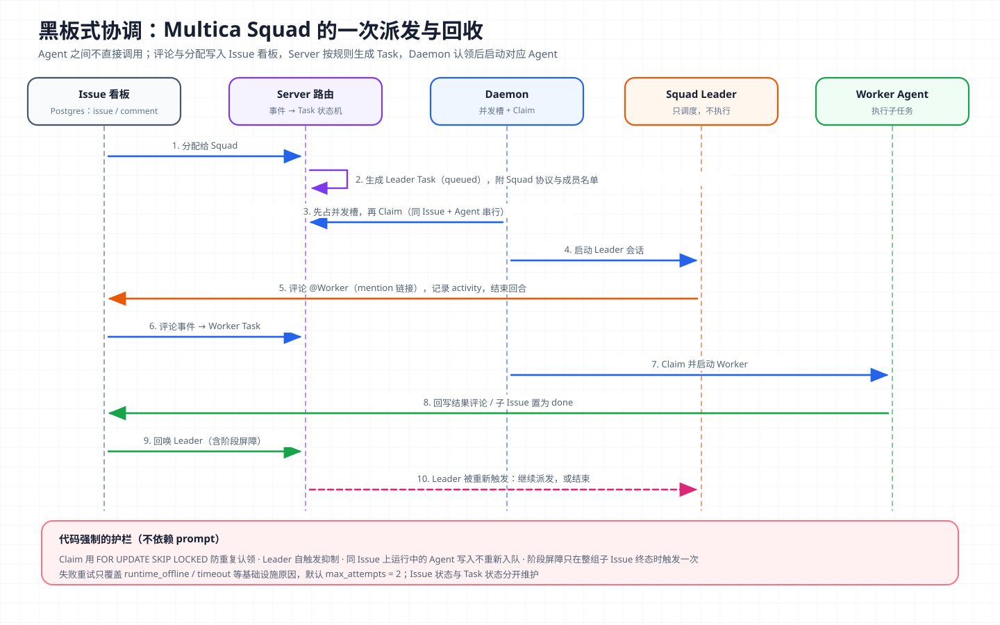

# 核心概念 11 - Multi-Agent：编排拓扑、共享状态与失败模式

> 技术快照：Multica `0b054b5c8`、AgentTeams `2202c8c`；产品行为、协议版本与研究数据以文末参考链接为准

> *本合集是一套面向 Agent 架构与工程实践的系统学习笔记，帮助读者建立从原理、Runtime、工具与权限到评测和多 Agent 编排的完整知识框架。*
>
> *本篇讨论多个 Agent 组成系统时的编排问题：什么任务值得拆成多 Agent，常见编排拓扑的取舍，Agent 之间如何通信和共享状态，A2A 与 MCP 的分工，以及多 Agent 系统特有的失败模式、终止、成本和评测方法。*

## 多 Agent 系统的定义与适用边界

多 Agent 系统（Multi-Agent System，MAS）是由两个及以上 LLM Agent 组成、各自持有独立上下文和角色、通过编排逻辑协作完成同一目标的系统。编排逻辑可以由某个 LLM 决定（让模型决定下一步交给谁），也可以由代码决定（预先写好阶段、路由和并行）。

它与 [Subagent](10-subagent.md) 的关系是：Subagent 讲一次委派的机制，即主 Agent 如何通过工具调用创建隔离的子 Agent 并收回结果；本篇讲多个 Agent 的系统级结构，即谁拥有控制权、状态放在哪里、系统何时结束。orchestrator-worker 是 Subagent 机制最直接的系统形态，但 handoff、pipeline、blackboard 等拓扑并不依赖“主 Agent 调子 Agent”这一结构。

判断一个系统是否需要多 Agent，要先看支持方和反对方各自的证据。

### 支持方的数据：并行广度换取效果

Anthropic 在《How we built our multi-agent research system》中复盘了其 Research 功能。系统采用 orchestrator-worker 结构：LeadResearcher 分析问题、制定策略并写入 Memory，并行派出子 Agent 搜索和评估信息，最后由 CitationAgent 核对引用。文中的关键数据：

- Opus 4 作主 Agent、Sonnet 4 作子 Agent 的系统，在内部研究评测上比单 Agent Opus 4 高 90.2%。
- BrowseComp 评测中，Token 用量、工具调用次数和模型选择三个因素解释了 95% 的性能方差，其中 Token 用量单独解释 80%。
- Agent 约为普通对话 4 倍 Token，多 Agent 约 15 倍。
- 主 Agent 同时派出 3–5 个子 Agent、子 Agent 并行调用 3 个以上工具，复杂问题的研究时间最多缩短 90%。

文章同时写明了不适合的场景：需要所有 Agent 共享同一上下文的领域、Agent 之间依赖很多的任务，以及多数编码任务。由此可以推出多 Agent 起作用的机制：单个窗口装不下的信息被拆到多个窗口并行处理，多 Agent 本质上是扩大有效 Token 预算的方式，收益必须覆盖十几倍的成本。

### 反对方的论证：上下文共享与决策冲突

Cognition 在《Don't Build Multi-Agents》中给出了两条原则：

1. **共享上下文，而且共享完整的 Agent 轨迹，不只是单条消息。**
2. **行动隐含决策，互相冲突的决策会带来坏结果。**

文中的例子是把“做一个 Flappy Bird 克隆”拆成背景和小鸟两个子任务：子 Agent 1 误解了子任务，做成了超级马里奥风格的背景；子 Agent 2 做出的小鸟既不像游戏素材，动作也完全不像 Flappy Bird，汇总者只能拼合两份误解，这对应第一条原则。即使把完整任务上下文交给每个子 Agent，两者看不到对方在做什么，仍可能做出视觉风格完全不同的小鸟和背景，这对应第二条原则。Cognition 当时的建议是单线程线性 Agent，长任务靠额外的压缩模型管理上下文。

Cognition 在后续文章《Multi-Agents: What's Actually Working》中收窄了这一立场：原来的判断对并行写入的 Agent 群仍然成立，但多 Agent 在“写操作保持单线程，其他 Agent 贡献智能而非行动”的结构下可以工作。即多个 Agent 可以并行调研、审查、提出方案，但对共享产物的修改只由一个 Agent 执行。

### 两种观点的交集

| 任务特征 | 倾向多 Agent | 倾向单 Agent |
| --- | --- | --- |
| 信息量 | 超过单窗口，可按来源或主题切分 | 能装进一个窗口 |
| 子任务依赖 | 互相独立，结果只需汇总 | 后一步依赖前一步的隐含决策 |
| 产物形态 | 调研结论、审查意见、候选方案 | 一份需要风格和结构统一的产物 |
| 写操作 | 可以按文件或资源划分所有权，或集中到一个写入者 | 多方需要同时修改同一对象 |
| 任务价值 | 足以覆盖数倍到十几倍的 Token 成本 | 对成本和延迟敏感 |

推断：多 Agent 最稳妥的用法是“读并行、写串行”。并行部分贡献信息，写入部分保持单一决策者。

## 编排拓扑对比



图中六种拓扑按两个问题区分：下一步由谁决定，状态放在哪里。蓝色是控制流，绿色是结果回收，紫色虚线是对共享状态的读写。

| 拓扑 | 控制权 | 上下文与状态 | 适合 | 主要风险 | 代表实现 |
| --- | --- | --- | --- | --- | --- |
| Orchestrator-Worker | 主 Agent 动态拆解、派发、汇总 | Worker 相互隔离，结果回到主 Agent | 广度优先调研、多角度审查 | 主 Agent 成为瓶颈；交接有损 | Anthropic Research、Claude Code 子 Agent、DeerFlow |
| Handoff / Swarm | 当前活跃 Agent 决定把会话交给谁 | 接手方默认看到完整历史 | 客服分流、按领域路由 | 反复转交；没有 Agent 对全局负责 | OpenAI Agents SDK handoffs |
| Supervisor / 层级 | 逐级分解、逐级汇报 | 每层只看下一层的汇总 | 团队规模大、需要分组管理 | 层数越多信息衰减越严重 | AgentTeams Manager → Leader → Worker |
| Pipeline / DAG | 代码预先定义阶段与依赖 | 阶段之间交接产物 | 流程稳定的生产任务 | 灵活性低；上游错误向下传递 | 代码编排、AgentTeams DAG、Multica 阶段屏障 |
| 并行投票 / 辩论 | 多个 Agent 独立求解，由裁判或投票聚合 | 同一问题的多份独立答案 | 高不确定性判断、根因排查 | 成本成倍；相关错误无法抵消 | Claude Code Agent Teams 竞争假设 |
| Blackboard 共享状态 | Agent 按状态认领任务，或由调度器触发 | 看板是唯一事实来源 | 长周期、多人参与、异步协作 | 并发写冲突；状态机复杂 | Multica Issue 看板、Claude Code 共享任务列表 |

### LLM 编排与代码编排

OpenAI Agents SDK 文档把编排分成两类：由 LLM 编排，让模型规划并决定步骤；由代码编排，让速度、成本和效果更可预测，常见写法是结构化输出路由、Agent 链式串联、评估器循环和 `asyncio.gather` 并行。推断：实际系统通常用代码固定拓扑（阶段、并发上限、终止条件），把拓扑内部的决策交给模型（怎么拆、派给谁、结果是否合格）。Claude Agent SDK 也是这种分层：少量委派用子 Agent，协调几十到几百个 Agent 时用 Workflow 工具把编排移到脚本里，在对话上下文之外执行。

### Handoff：控制权转交

OpenAI Agents SDK 中，Handoff 对模型呈现为名为 `transfer_to_<agent_name>` 的工具；调用后新 Agent 接管对话，默认看到之前的完整历史。`input_filter` 可以裁剪接手方看到的历史，`input_type` 让模型转交时附带结构化参数，`on_handoff` 回调可在转交时预取数据。Handoff 适合“谁来回答”本身就是主要问题的场景，如客服分诊。它的风险是没有 Agent 对全局负责，A 转给 B、B 又转回 A；控制手段是用 `is_enabled` 限制可转交目标，并在代码层计数，超限转人工。

层级结构则是把 orchestrator-worker 叠成多层，每层只看下一层的汇总，每多一层就多一次有损压缩，下文 AgentTeams 部分展开；Claude Code Agent Teams 不支持嵌套团队。

### 投票与辩论

并行投票让多个 Agent 独立解同一问题，再由多数票或裁判聚合；辩论让 Agent 互相质疑。Claude Code 文档的“竞争假设”用例派 5 个队员分别调查不同根因并互相反驳，以避免顺序排查被第一个合理解释锚定。这种拓扑的前提是错误相互独立。推断：若所有 Agent 用同一模型、同一提示、同一份资料，错误高度相关，多数票只会放大同一偏见，应当在模型、提示角度或资料来源上制造差异。

## 通信与状态：消息传递还是共享存储

Agent 之间的信息交换有三种载体：

| 方式 | 传递什么 | 优点 | 缺点 | 例子 |
| --- | --- | --- | --- | --- |
| 消息传递 | 指令、提问、结果摘要 | 语义清楚，容易追踪因果 | 每次转述都有损；消息进入接收方上下文，占 Token | Claude Code Agent Teams 邮箱、AgentTeams 的 Matrix @提及 |
| 共享存储 | 任务状态、依赖、锁、进度 | 单一事实来源，可恢复，可审计 | 需要并发控制和状态机；Agent 需要主动读取 | Multica Issue 看板、Claude Code 共享任务列表 |
| 产物交接 | 报告、代码、数据文件 | 不经转述，保真；不占消息上下文 | 需要约定路径和格式；读者需要再次读取 | Anthropic 研究系统的子 Agent 写文件、AgentTeams 的 MinIO 任务目录 |

Anthropic 的经验是让子 Agent 把输出直接写入文件系统，再把轻量引用交给协调者，以减少“传话游戏”带来的信息损失和 Token 开销。AgentTeams 把两种通道分开：Matrix 房间里的 @提及只承载控制信号（“新任务 task-xxx，去拉取 spec.md”），任务说明和结果以文件形式放在共享存储的 `shared/tasks/{task-id}/` 下。

共享存储一旦有多个写入者，就需要并发控制：Claude Code Agent Teams 用文件锁防止多个队员同时认领同一任务，任务有 pending、in progress、completed 三种状态并可声明依赖；AgentTeams 用默认 15 分钟过期的 `.processing` 锁文件保护共享任务目录，防止持锁者崩溃后永久阻塞；Multica 在数据库层用 `FOR UPDATE SKIP LOCKED` 认领任务，下文展开。

另一条经验来自 Cognition 的修正：共享状态的“读”可以并发，对同一产物的“写”最好只有一个执行者。Claude Code 文档给出的建议也一致：两个队员编辑同一文件会互相覆盖，应让每个队员负责不同的文件集合。

## 协议分工：MCP 连接工具，A2A 连接 Agent

跨进程、跨厂商的多 Agent 系统需要标准协议。当前有两个互补的协议：

| 维度 | [MCP](08-mcp.md) | A2A（Agent2Agent） |
| --- | --- | --- |
| 连接对象 | Agent 与工具、数据源 | Agent 与 Agent |
| 方向 | 纵向：加深单个 Agent 的能力 | 横向：跨越 Agent 边界协作 |
| 对端性质 | 输入输出结构化的工具与资源 | 有自主推理和长期状态的 Agent，内部实现不透明 |
| 核心对象 | Tool、Resource、Prompt | Agent Card、Task、Message、Part、Artifact |
| 典型交互 | 调用一次工具，拿到结果 | 提交任务，跟踪状态，接收流式更新或产物 |

A2A 官方文档用汽修店做例子：顾客与店长、店长与技师、技师与配件供应商之间的沟通走 A2A；技师使用诊断仪、维修手册、升降机走 MCP。一个 Agent 对外用 A2A 与其他 Agent 协作，对内用 MCP 使用自己的工具。

A2A 当前发布的规范版本为 1.0.0，由 Google 发起，2025 年进入 Linux Foundation，之后成为 Agentic AI Foundation 托管的项目。它的关键设计有四点：

- **发现**：服务方在 `/.well-known/agent-card.json` 发布 Agent Card，描述身份、能力、技能、端点和认证要求。
- **任务状态机**：Task 有 submitted、working 两个活动态，completed、failed、canceled、rejected 四个终态，以及 input-required、auth-required 两个中断态。中断态让远端 Agent 可以回头向调用方要信息，这是本地子 Agent 通常不具备的能力。
- **传输绑定**：JSON-RPC、gRPC、HTTP+JSON 三种绑定在功能上等价。
- **长任务支持**：流式订阅和推送通知配置，适合长时间运行的远端任务。

一次 JSON-RPC 形式的 `SendMessage` 请求如下，服务方可以直接回复一条 Message，也可以创建一个 Task 异步处理：

```json
{
  "jsonrpc": "2.0",
  "method": "SendMessage",
  "params": {
    "message": {
      "messageId": "msg-123",
      "role": "ROLE_USER",
      "parts": [{ "text": "Process this request" }]
    }
  },
  "id": 1
}
```

A2A 解决的是互操作，不解决编排。它规定了 Agent 之间如何提交任务、查询状态和交付产物，谁来拆解任务、何时终止、如何校验结果，仍由上层系统设计。

## 共享黑板：Multica 如何用任务看板协调 Agent



Multica 是一个把多个 Coding Agent（Claude Code、Codex 等）接入 Issue 看板的协作平台。它的多 Agent 协调完全建立在共享状态上：Agent 之间不直接调用，评论里的提及链接和 Issue 分配被 Server 转成任务队列中的新任务，本地 Daemon 认领任务后启动对应的 Agent CLI。图中 1–10 步是一次 Squad（由一个 Leader 和若干成员组成的小组）派发与回收的完整回路。

### 认领：数据库行锁保证不重复执行

多个 Daemon 同时轮询任务队列时，必须保证一个任务只被一个执行者拿走，同一 Agent 也不能在同一 Issue 上并行跑两份。Multica 用一条 SQL 同时解决这两个问题：

```sql
-- server/pkg/db/queries/agent.sql
-- name: ClaimAgentTask :one
UPDATE agent_task_queue
SET status = 'dispatched',
    dispatched_at = now(),
    prepare_lease_expires_at = now() + make_interval(secs => @prepare_lease_secs::double precision)
WHERE id = (
    SELECT atq.id FROM agent_task_queue atq
    WHERE atq.agent_id = $1 AND atq.status = 'queued'
      AND NOT EXISTS (
          SELECT 1 FROM agent_task_queue active
          WHERE active.agent_id = atq.agent_id
            AND active.status IN ('dispatched', 'running', 'waiting_local_directory')
            AND (
              (atq.issue_id IS NOT NULL AND active.issue_id = atq.issue_id)
              OR (atq.chat_session_id IS NOT NULL AND active.chat_session_id = atq.chat_session_id)
              -- 快速创建类任务：四个外键都为空时按同类任务串行
            )
      )
    ORDER BY atq.priority DESC, atq.created_at ASC
    LIMIT 1
    FOR UPDATE SKIP LOCKED
)
RETURNING *;
```

`FOR UPDATE SKIP LOCKED` 让并发认领者跳过已被锁定的行，不会阻塞也不会重复拿到同一任务；`NOT EXISTS` 子查询保证同一 (Issue, Agent) 组合串行，不同 Agent 仍可在同一 Issue 上并行。认领后任务进入 `dispatched` 并带一个准备租约，Daemon 若未在租约内开始执行，任务可以被回收。Daemon 侧还遵循“先占本地并发槽，再认领”的顺序，避免拿到任务后没有资源执行。

### Squad Leader：用协议约束“只调度，不执行”

Squad 的 Leader 是一个普通 Agent，被认领时 Server 在它的指令中注入一段操作协议、成员名单（含可用的提及链接和成员技能）和用户的 Squad 说明。协议的开头是：

```go
// server/internal/handler/squad_briefing.go
const squadOperatingProtocol = `## Squad Operating Protocol

**If you are reading this section, you have been activated as a squad LEADER
for this task ...** Your job is to
**coordinate**, NOT to do the work yourself. ...

2. **Delegate by @mention.** Post a single comment on this issue that
   @mentions the chosen member(s) and tells them what to do.
   - **Be terse.** Every Multica agent already has full context of the
     issue (title, description, all prior comments, attachments) ...
3. **Record your evaluation.** After every trigger ... record it:
   multica squad activity <issue-id> <outcome> --reason "<short reason>"
4. **Stop after dispatching.** Once your delegation comment is posted
   and evaluation recorded, end your turn. ...`
```

这段协议体现了黑板式协调与 orchestrator-worker 的差别。在 orchestrator-worker 中，主 Agent 必须把背景写进任务描述，因为子 Agent 看不到父上下文；在 Multica 中，每个成员都能直接读取 Issue 的标题、描述、全部评论和附件，所以 Leader 的派发评论只需说明“派给谁、为什么、额外约束”。共享状态替代了交接时的转述，第一次有损压缩被省掉了。

“派发后结束回合”让 Leader 不在会话中等待成员完成，成员回写后由 Server 重新唤醒 Leader，既不长时间占用执行槽，也避免 Leader 在等待中自己动手。

### 路由守卫：自触发抑制写在代码里

评论触发任务的机制天然有环路风险：Leader 的评论触发成员，成员的评论触发 Leader，Leader 的评论还可能触发 Leader 自己。Multica 在 Server 层放了三道守卫：`shouldSuppressSquadLeaderSelfTrigger` 阻止 Leader 自己的评论重新唤醒自己；Agent 在它正在运行的同一 Issue 上写入时，不会把自己重新入队；Agent 写的评论不参与面向人类成员的通用路由，只保留一条窄路径，即成员在 Squad 负责的 Issue 上回写结果时唤醒 Leader，让“Leader → 成员 → Leader”的回路闭合。

### 汇合：阶段屏障由服务端判断

父 Issue 拆成多个子 Issue 时，需要在子任务完成后通知父 Issue 的负责人。Multica 最初让子 Agent 按提示词规则自己去父 Issue 发通知，后来改成由 Server 发系统评论。源码注释记录了改动原因：

```go
// server/internal/handler/issue_child_done.go
// notifyParentOfChildDone posts a top-level system comment on the parent
// issue when a child issue transitions from non-done into done. This replaces
// the agent-prompt rule that previously made child agents post the
// notification themselves (... the agent rule caused
// self-mention loops, planner ping-pong, ...).
//   - the completion must close a STAGE barrier ... the
//     notification + wake fire only when every sibling in the lowest
//     unfinished stage is terminal (stageBarrierClosed). ...
```

这是 pipeline 与 blackboard 的结合：子 Issue 按 `stage` 分组，同一阶段内并行，阶段之间串行；屏障检测是确定性代码，“是否推进下一阶段”仍由被唤醒的 Agent 决定。它也是一个典型的工程教训：把“何时通知谁”写进提示词，会产生自提及循环和规划者之间的来回拉扯；把它挪到代码里，环路就消失了。

失败重试同样由代码约束。只有 `runtime_offline`、`runtime_recovery`、`timeout`、`codex_semantic_inactivity` 这类基础设施原因会自动重试，任务的 `max_attempts` 默认为 2；达到迭代上限、API 请求非法等失败会被暴露给用户，不会被重试掩盖。

## 层级监督：AgentTeams 的通信拓扑与 DAG 调度

AgentTeams 是采用 Manager-Workers 架构的多 Agent 运行平台：Kubernetes Operator 管理各 Agent 容器，Matrix 即时通信服务器承载人与 Agent、Agent 与 Agent 的消息，MinIO 存放共享文件，AI 网关持有真实的模型凭证。它的层级不只是提示词约定，而是由控制器在生成每个 Worker 的通道配置时写死的访问控制：

```go
// hiclaw-controller/internal/agentconfig/generator.go
// Default allow list: Manager + Admin
groupAllowFrom := []string{managerMatrixID, adminMatrixID}
// Team worker: use Leader + Admin instead
if req.TeamLeaderName != "" {
	leaderMatrixID := fmt.Sprintf("@%s:%s", req.TeamLeaderName, domain)
	groupAllowFrom = []string{leaderMatrixID, adminMatrixID}
}
cfg := map[string]interface{}{
	"groupPolicy":    "allowlist",
	"groupAllowFrom": groupAllowFrom,
	"groups": map[string]interface{}{
		"*": map[string]interface{}{"allow": true, "requireMention": true},
	},
}
```

团队内的 Worker 只接受 Leader 和管理员的消息，且只有被 @提及时才会被唤醒。Manager 即使想绕过 Leader 直接指挥 Worker，消息也不会被处理；`requireMention` 同时是成本控制，群里的普通消息不会唤醒每个 Agent 各跑一轮。

Team Leader 的项目计划可以写成 DAG，由 `ready_nodes` 计算可派发的任务：暂停的项目返回空集，`validate_dag` 用拓扑排序检查环，只有依赖全部完成的 pending 节点才就绪。另一种循环计划必须声明停止条件和 `max_iterations`（至少为 1）。与之对照，AgentTeams 的防环路规则主要写在 Worker 提示词里，例如“连续两轮以上 @ 往来没有新任务、问题或决定，立即停止回复”。这类规则有用，但属于软约束。推断：凡是可能形成环路的触发规则，都应有一层代码级守卫兜底，Multica 把子任务通知从提示词移到 Server 就是例子。

## 失败模式：MAST 分类

《Why Do Multi-Agent LLM Systems Fail?》对多 Agent 系统的失败做了系统归纳。研究团队分析了 7 个主流多 Agent 框架的执行轨迹，建立了 MAST（Multi-Agent System Failure Taxonomy，多 Agent 系统失败分类），专家标注一致性 κ = 0.88；配套数据集 MAST-Data 包含 1600 多条标注轨迹，并提供 LLM-as-a-Judge（用 LLM 按评分标准自动判定）标注流程。MAST 把失败归为 3 类 14 种：

| 类别 | 失败模式（占比） | 对应的工程控制 |
| --- | --- | --- |
| 系统设计问题 | 违反任务规格（11.8%）、违反角色规格（1.5%）、步骤重复（15.7%）、丢失对话历史（2.8%）、不知道终止条件（12.4%） | 结构化任务合同；角色能力用工具权限硬限制；重复检测；显式终止条件 |
| Agent 间失配 | 对话重置（2.2%）、未请求澄清（6.8%）、任务偏离（7.4%）、信息隐瞒（0.85%）、忽略其他 Agent 输入（1.9%）、推理与行动不一致（13.2%） | 共享状态作为事实来源；允许返回“阻塞 + 问题”；汇总时逐条核对来源 |
| 任务验证 | 过早终止（6.2%）、没有或不完整的验证（8.2%）、错误验证（9.1%） | 独立验证者；确定性检查；完成条件由代码判断 |

这组数据的主要结论是：大量失败来自系统设计，而不是模型能力。步骤重复和不知道终止条件合计接近 28%，这两项都可以用代码层的计数器和终止条件直接压低。前面两个源码案例对应的也正是这两类：Multica 的自触发抑制针对重复触发，AgentTeams 的 `max_iterations` 和 DAG 就绪判断针对终止。

## 终止、成本、评测与可观测性

**终止条件要分层写进代码。** 多 Agent 比单 Agent 多一类终止问题：每个 Agent 都可能认为别人还没做完，也可能都以为别人会收尾。任务级完成条件由结构化状态判断（子任务全部终态、DAG 无未完成节点、验收通过）；拓扑级给转交次数、辩论轮数、循环迭代设上限，超限转人工或输出当前最佳结果；资源级设总 Token 预算、墙钟超时和并发上限；消息触发的系统还要有自触发与无效往来的守卫。Claude Code Agent Teams 的已知限制里同时出现了两种相反的失败：队员没把任务标记完成而阻塞依赖任务，Lead 在任务真正完成前就宣布结束。对应的控制是 `TaskCompleted`、`TeammateIdle` 等 Hook，在标记完成或即将空闲时运行检查脚本，不满足条件就拒绝并反馈。

**成本随活跃 Agent 数线性增长**，协调开销另计。常用手段有：

- 按复杂度分配规模。Anthropic 在提示中写明：简单事实查找用 1 个 Agent、3–10 次工具调用；直接对比用 2–4 个子 Agent，各 10–15 次；复杂研究用 10 个以上职责清晰的子 Agent。Claude Code 建议多数工作流从 3–5 个队员起步，每人 5–6 个任务。
- 模型分层，协调者用强模型、执行者用较便宜的模型。
- 按需唤醒，只有被提及或被分配时才运行（AgentTeams 的 `requireMention`、Multica 的事件触发）。
- 大块产物走文件，并设任务级总预算。

**评测看最终状态，而不只看轨迹。** 同一问题两次运行可能派出不同数量的子 Agent、走不同路径，却都正确。Anthropic 从约 20 个代表真实使用的查询起步，用单次 LLM-as-a-Judge 调用按事实准确性、引用准确性、完整性、来源质量、工具效率打分；对会修改状态的任务评测最终状态；再用人工测试捕捉自动评测漏掉的偏差。MAST 的分类可以给失败轨迹打标签，统计分布后再决定改拓扑、改提示还是加验证。

**可观测性要能还原协作图。** 需要记录每个 Agent 被谁、因哪条消息或状态变化触发（trace ID 在父子间传递），每个 Agent 的 Token、工具调用和耗时，协调者的决策记录（Multica 要求 Leader 每次触发都写 `squad activity`），以及共享状态的迁移历史。Anthropic 还提到部署约束：多 Agent 是长时间运行的有状态进程，他们用彩虹部署让新旧版本并存、流量逐步切换，避免中途打断运行中的 Agent。

## 架构推演

某研发团队要建设一个“需求到合并请求”的多 Agent 系统：产品经理在 Issue 看板提交需求，系统完成技术调研、方案设计、跨前后端实现、测试和代码审查，最后提交合并请求等待人工审批。一个需求通常涉及 2–4 个仓库、20–60 个文件，团队每天处理几十个需求，要求单个需求的模型费用有上限，并且任何时候都能说明某段代码由哪个 Agent 根据什么依据写出。

请设计这个系统，并说明：

- 哪些阶段并行、哪些阶段保持单一写入者，选用哪种拓扑组合（如 pipeline 外壳、调研阶段 orchestrator-worker、审查阶段并行投票）；
- 需求、方案、任务分解、代码和审查意见分别存在看板、文件还是仓库，哪些信息走消息、哪些走产物；
- 同一仓库的并发修改如何避免冲突，任务认领与状态机如何在 Agent 崩溃或 Daemon 离线后安全恢复且不重复执行；
- 返工上限、Agent 往来上限和需求级 Token 预算如何设定；
- 跨团队或跨厂商的 Agent 是否通过 A2A 接入，哪些工具能力通过 MCP 接入；
- 如何用 MAST 分类评估上线后的失败，用哪些指标判断多 Agent 比单 Agent 更值得。

一个合格的方案应当能解释两件事：多花的 Token 换来了什么（更广的调研覆盖、更低的漏检率、更短的墙钟时间），以及每一个“写”动作的唯一责任者是谁。

## 复习结论

- 多 Agent 系统由多个持有独立上下文和角色的 Agent 通过编排逻辑协作。Subagent 是一次委派的机制，多 Agent 讨论控制权、状态和终止的系统结构。
- Anthropic 的数据显示多 Agent 在可并行的研究任务上显著提升效果，收益主要来自更多 Token，成本约为普通对话的 15 倍；Cognition 指出上下文不共享和隐含决策冲突会让并行写入失败。两者的交集是读并行、写串行。
- 六种拓扑按“谁决定下一步”和“状态放在哪里”区分。实际系统通常用代码固定拓扑，让模型在拓扑内部决策。
- Agent 间信息走消息、共享存储或产物文件。大块内容走文件，共享状态需要锁和状态机，同一产物只有一个写入者。
- MCP 连接 Agent 与工具，A2A 连接 Agent 与 Agent；A2A 规定发现、任务状态和传输，不负责编排。
- Multica 与 AgentTeams 的共同经验是把认领、路由、通信白名单、阶段汇合等环路敏感的规则写进代码，而不是只写进提示词。
- MAST 显示大量失败来自系统设计。终止、成本、评测和可观测性都要在代码层落实。

## 参考

| 主题 | 来源 |
| --- | --- |
| 多 Agent 研究系统 | [How we built our multi-agent research system](https://www.anthropic.com/engineering/multi-agent-research-system) |
| 反方与修正 | [Don't Build Multi-Agents](https://cognition.com/blog/dont-build-multi-agents) · [Multi-Agents: What's Actually Working](https://cognition.com/blog/multi-agents-working) |
| 失败模式研究 | [Why Do Multi-Agent LLM Systems Fail?](https://arxiv.org/abs/2503.13657) |
| OpenAI Agents SDK 编排 | [Agent orchestration](https://openai.github.io/openai-agents-python/multi_agent/) · [Handoffs](https://openai.github.io/openai-agents-python/handoffs/) · [Tools：Agents as tools](https://openai.github.io/openai-agents-python/tools/) |
| Claude Code 多 Agent | [Orchestrate teams of Claude Code sessions](https://code.claude.com/docs/en/agent-teams) · [Subagents in the SDK](https://code.claude.com/docs/en/agent-sdk/subagents) · [Dynamic workflows](https://code.claude.com/docs/en/workflows) |
| A2A 协议 | [A2A Specification](https://a2a-protocol.org/latest/specification/) · [A2A and MCP](https://a2a-protocol.org/latest/topics/a2a-and-mcp/) · [A New Chapter for A2A: Joining the Agentic AI Foundation](https://a2a-protocol.org/latest/blog/2026/08/27/a-new-chapter-for-a2a-joining-the-agentic-ai-foundation/) · [Linux Foundation 发布 A2A 项目](https://www.linuxfoundation.org/press/linux-foundation-launches-the-agent2agent-protocol-project-to-enable-secure-intelligent-communication-between-ai-agents) |
| Multica 源码 | [`agent.sql`](https://github.com/multica-ai/multica/blob/0b054b5c8/server/pkg/db/queries/agent.sql) · [`squad_briefing.go`](https://github.com/multica-ai/multica/blob/0b054b5c8/server/internal/handler/squad_briefing.go) · [`squad.go`](https://github.com/multica-ai/multica/blob/0b054b5c8/server/internal/handler/squad.go) · [`comment.go`](https://github.com/multica-ai/multica/blob/0b054b5c8/server/internal/handler/comment.go) · [`issue_child_done.go`](https://github.com/multica-ai/multica/blob/0b054b5c8/server/internal/handler/issue_child_done.go) · [`service/task.go`](https://github.com/multica-ai/multica/blob/0b054b5c8/server/internal/service/task.go) |
| AgentTeams 源码 | [README](https://github.com/agentscope-ai/AgentTeams/blob/2202c8c/README.md) · [`generator.go`](https://github.com/agentscope-ai/AgentTeams/blob/2202c8c/hiclaw-controller/internal/agentconfig/generator.go) · [`task.py`](https://github.com/agentscope-ai/AgentTeams/blob/2202c8c/copaw/src/copaw_worker/task.py) · [Worker `AGENTS.md`](https://github.com/agentscope-ai/AgentTeams/blob/2202c8c/manager/agent/worker-agent/AGENTS.md) |
