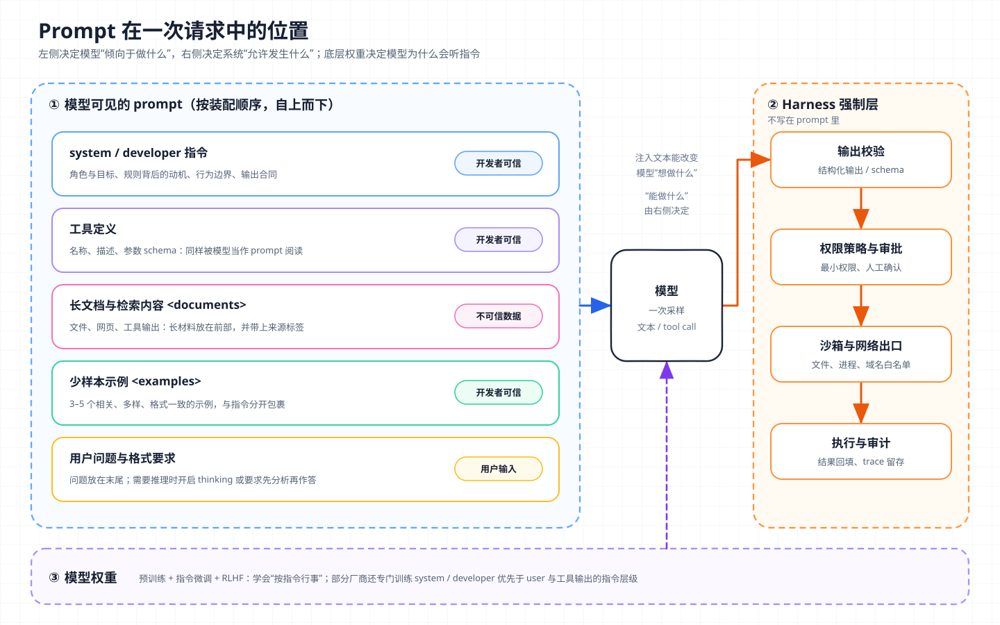
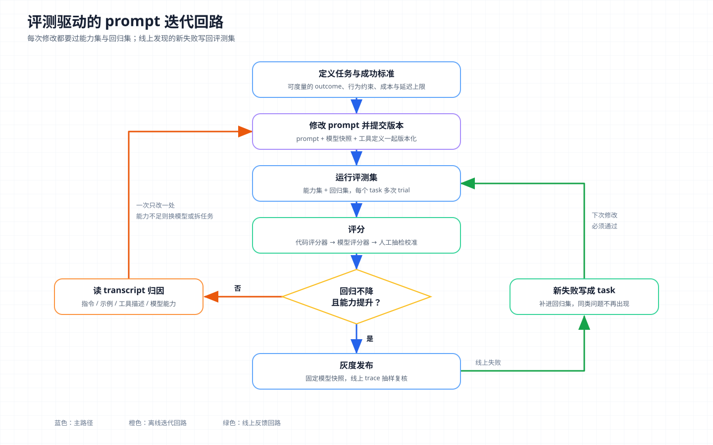

# 核心概念 12 - Prompt Engineering：把意图写成模型可执行的规格

> 技术快照：OpenAI Codex `6ff670bd`、pi `c8c3cd49`，模型与接口行为以文末参考链接为准

> *本合集是一套面向 Agent 架构与工程实践的系统学习笔记，帮助读者建立从原理、Runtime、工具与权限到评测和多 Agent 编排的完整知识框架。*
>
> *本篇解释 prompt 为什么能改变模型行为，拆解系统提示与用户提示的分工和主流技巧背后的机制，对比三家官方指南，并说明面向 Agent 的 prompt 如何版本化、如何用评测迭代，以及它在 prompt injection 面前的防御边界。*

## Prompt Engineering 的对象与边界

Prompt Engineering（提示工程）是为了让模型稳定产出预期行为，而设计、组织和迭代输入文本的工程活动。它的对象是模型在一次请求中能读到、并且由开发者控制的内容：system 或 developer 指令、工具描述、少样本示例、输出格式要求，以及包裹用户输入和外部材料的模板。

| 概念 | 回答的问题 | 改变的是什么 |
| --- | --- | --- |
| Prompt Engineering | 指令怎样写，模型才会按预期行事 | 单次请求中的指令文本 |
| [Context Engineering](13-context-engineering.md) | 每一轮该把哪些信息放进窗口 | 窗口内全部 Token 的选择、排序与压缩 |
| 微调与后训练 | 能否改变模型的默认行为 | 模型权重 |
| [Harness Engineering](14-harness-engineering.md) | 模型之外怎样让 Agent 可靠运行 | 循环、工具、权限、沙箱、评测等全部工程 |

prompt 只能在模型已有能力范围内调整输出分布，不能补上模型不会的知识，也不能保证模型“绝不”调用某个危险工具，这类保证只能由 Harness 在模型之外强制执行。

## 为什么 prompt 能起作用：后训练与上下文学习

### 条件生成：prompt 改变的是输出分布

自回归语言模型对序列建模：

```text
P(y | x) = Π_t P(y_t | x, y_<t)
```

`x` 是 prompt，`y` 是输出。推理时参数固定，开发者唯一能动的是 `x`。写 prompt 就是选择条件 `x`，让输出分布集中到期望的区域。这在实践中有三个后果：

- 信息缺失时，模型按训练分布里最常见的补全来猜。写清目标、受众和约束，就是在收窄条件分布。
- prompt 里的每段文字都会影响分布，包括无意写入的矛盾、情绪化措辞和示例里的偶然格式。
- 采样有随机性，一次成功不能说明 prompt 稳定。

### 指令微调与 RLHF：模型为什么会“听指令”

只经过预训练的模型只会续写，给它一句翻译指令，它可能接着写出更多题目。让模型把指令当指令执行，靠的是后训练：

| 阶段 | 做法 | 带来的行为 |
| --- | --- | --- |
| 指令微调 | 用大量“指令 → 期望回答”样本做监督训练，FLAN 表明多任务指令训练能提升未见指令上的零样本表现 | 看到祈使句会去完成任务 |
| RLHF（基于人类反馈的强化学习） | 人类对回答排序，训练奖励模型，再用强化学习优化策略 | 更有帮助、遵循约束、拒绝有害请求 |
| 指令层级训练 | 构造 system 与 user 或工具输出冲突的样本，训练模型优先服从高权限来源 | 冲突时倾向服从 system / developer |

InstructGPT 的人类评估中，经过 RLHF 的 1.3B 模型比未对齐的 175B GPT-3 更受偏好。前者参数更少，差别来自后训练改变了模型对指令的响应方式。

后训练不同，同一技巧在不同模型上的效果也不同。OpenAI 称 GPT-5 以“外科手术般的精度”遵循指令，矛盾或模糊的 prompt 对它伤害更大。

### 上下文学习：不改权重也能学一个任务

GPT-3 论文展示了 In-Context Learning（上下文学习）：在 prompt 里放几个“输入 → 输出”示例，模型不更新权重就能按示例处理新输入。可解释性研究把部分机制归因于 induction head（归纳头，查找前文模式并复制其后续的注意力头）。示例因此是极强的信号，副作用是模型也会学到示例里偶然的共同点，例如每个示例恰好三条要点，输出就倾向于三条。

## 系统提示与用户提示的分工



图中左侧是模型可见的 prompt，按装配顺序排列并标出信任级别；右侧是不写在 prompt 里的 Harness 强制层；底部是模型权重。注入文本进入左侧后，可能改变模型下一步打算做什么，但工具能否执行、能访问哪些资源，仍由右侧的强制层判断。

三家接口都区分开发者规则和用户输入：Anthropic 用顶层 `system` 参数，OpenAI 用 `instructions` 参数或 `developer` 角色消息（文档称 developer 优先于 user，类比“函数定义”与“函数参数”），Gemini 用 `system_instruction`。system 写无论用户问什么都成立的东西，包括身份与目标、行为规则及其理由、工具使用策略、输出合同的通用部分；user 写这一次的任务、材料和临时约束。这样分，稳定前缀能命中 Prompt Cache（见 [KV Cache](02-kv-cache.md)），规则可单独版本化和评测，恶意用户输入也更难覆盖规则。

OpenAI 的 `instructions` 只作用于当前响应，用 `previous_response_id` 续接时不会继承（端点语义见 [LLM API](01-llm-api.md)）。

## 核心技巧与原理

### 清晰具体与给出动机

Anthropic 给的检验办法是把 prompt 交给一个缺乏背景的同事，他会困惑的地方，模型也会困惑。“做一个数据看板”和“做一个数据看板，尽可能包含相关交互，做成完整实现”结果明显不同，后者只是把期望的完成度写了出来。顺序或完整性重要的步骤，用编号列表写。

给动机比加规则更省 Token、覆盖更广。Anthropic 的例子是把“不要使用省略号”改成“回答会被文字转语音引擎朗读，引擎不知道怎么读省略号，所以不要用”。有了理由，模型能推出规则的适用范围，比如表情符号和复杂表格同样不合适；只写规则时，模型只会避开被点名的那一项。

### 角色与少样本示例

在 system 中设定角色，会让语气、术语和关注点向该角色靠拢。角色越具体越好，“服务于遗留 Django 项目团队的资深 Python 工程师”比“编程专家”信号多得多，但它不替代任务说明。

三家指南都把示例列为最可靠的格式控制手段，力度不同。Google 建议总是包含少样本示例；Anthropic 建议 3–5 个，相关、多样、用 `<example>` 标签与指令分开；OpenAI 强调覆盖多样的输入范围。示例要在无关维度上故意变化，避免模型学到偶然规律；同时各示例结构一致，否则模型不知道该学哪种格式。Agent 场景下，Anthropic 建议挑少量“多样且典型”的示例，不必把所有边界情况都塞进 prompt。

### 结构化：XML 标签与 Markdown

prompt 常同时包含指令、背景、示例和待处理输入。用标签包裹后，边界是显式的：

```xml
<instructions>根据合同文本提取付款条款，输出 JSON。</instructions>
<documents>
  <document index="1">
    <source>vendor-contract.pdf</source>
    <document_content>...</document_content>
  </document>
</documents>
```

Anthropic 推荐 XML 标签，名称一致、按层级嵌套；OpenAI 推荐 Markdown 标题表达层级、XML 标签标出内容起止。两者可以混用，用 Markdown 组织指令章节，用 XML 包裹材料和变量。标签还能让模型更容易把外部材料当作数据，但这只降低混淆概率，不构成隔离。

### 输出格式约束与预填充

| 手段 | 强度 | 说明 |
| --- | --- | --- |
| 文字说明与示例 | 概率性 | 说“做什么”比说“不要做什么”有效，例如用“使用连贯的段落”代替“不要用 Markdown” |
| 预填充（Prefill） | 较强 | 提供 assistant 回复的开头，让模型从这里续写 |
| 结构化输出 / 工具调用 | 解码层强制 | 按 JSON Schema 或语法约束解码，输出必然可解析 |

预填充曾是 Claude 上的常用技巧，例如把回复开头预设为 `{` 强制输出 JSON。当前 Anthropic 文档说明，从 Claude 4.6 系列开始，最后一个 assistant 轮次上的预填充不再受支持，请求返回 400；官方替代方案是结构化输出、工具调用或直接在系统指令中要求。模型遵循能力提升后，原来靠协议技巧实现的约束正在转到更可靠的接口能力上。需要可解析输出时，优先使用 OpenAI Structured Outputs、Gemini `response_schema` 或 Claude 的结构化输出，不要只在 prompt 里要求模型“务必输出合法 JSON”。

Codex 的 `apply_patch` 把格式约束放到了语法层。它是由 Lark 语法约束的自由格式工具，参数不经过 JSON：

```rust
ToolSpec::Freeform(FreeformTool {
    name: "apply_patch".to_string(),
    description: "Use the `apply_patch` tool to edit files. This is a FREEFORM tool, so do not wrap the patch in JSON.".to_string(),
    format: FreeformToolFormat {
        r#type: "grammar".to_string(),
        syntax: "lark".to_string(),
        definition, // start: begin_patch hunk+ end_patch
    },
})
```

补丁格式由语法保证，描述只需一句话说明用途。

### 让模型先思考

先写出推理再作答，相当于把中间结果写成 Token 供后续生成读取，为最终答案增加可用计算。机制和预算取舍见 [Reasoning](05-reasoning.md)。在 prompt 层面，模型支持原生 thinking 时优先用接口参数控制，例如 Claude 的 effort、OpenAI 的 `reasoning_effort`，手写“一步步思考”是关闭 thinking 时的后备；手写时用 `<thinking>` 与 `<answer>` 分开推理和答案。OpenAI 建议对推理模型只给高层目标，对非推理模型写出精确步骤。

### 长文档在前，问题在后

处理 20k Token 以上的输入时，Anthropic 建议把长文档放在顶部，问题、指令和示例放在后面，并称在测试中这样做对复杂多文档输入的质量提升可达 30%。Google 对 Gemini 3 的建议一致：先给全部上下文，再把指令或问题放在最后。原因是长上下文存在位置偏差，中部信息易被忽略（见 Lost in the Middle），问题离生成位置越近越容易对齐任务。

## 三家官方指南的共性与差异

| 维度 | Anthropic | OpenAI | Google |
| --- | --- | --- | --- |
| 基本原则 | 清晰直接，把模型当缺乏背景的新同事 | developer 消息按身份、指令、示例、上下文组织 | 清晰具体，拆分复杂任务 |
| 示例 | 3–5 个，相关、多样、用标签包裹 | 展示多样输入与期望输出 | 建议总是包含 |
| 结构 | XML 标签 | Markdown 标题 + XML 标签 | 格式一致即可 |
| 长上下文 | 文档在前，问题在后 | — | 上下文在前，指令在最后 |
| 推理 | 自适应 thinking 与 effort | 推理模型给目标，GPT 模型给步骤 | Gemini 3 系列建议保持默认采样参数 |
| 格式约束 | 新模型不再支持最后一轮预填充 | Structured Outputs；GPT-5 引入 `verbosity` | `response_schema` |
| Agent 相关 | 过度工程化、为通过测试而硬编码 | 主动程度、工具前言，GPT-5 起按模型发布专用指南 | 避免过度劝说的措辞 |

三家都要求写清楚、给示例、用结构分隔、用评测验证。这些做法直接作用于条件分布，对任何经过指令微调的模型都成立。

差异集中在两处。一是模型已经内化了什么，推理模型内化了规划，新一代 Claude 内化了格式遵循，对应技巧被弱化或被接口取代。二是模型的默认倾向（GPT-5 默认收集上下文很彻底，Anthropic 部分模型倾向过度工程化）。推断：模型专用指南会一直存在，因为后训练决定的默认倾向每代都在变，prompt 跨模型迁移必须重新评测。

## 面向 Agent 的 prompt

Agent 的 prompt 要指导几十上百轮工具调用，由 Harness 每轮重新装配（见 [Agent Loop](03-agent-loop.md)），工具描述、项目规则文件和 [Skills](07-skills.md) 都会进入它。

### system prompt 的合适高度

Anthropic 把 system prompt 的常见失败归为两端：过硬，在 prompt 里硬编码复杂而脆弱的 if-else 逻辑，遇到未列举的情况就失效；过虚，只写“做一个有帮助的助手”这类模糊原则，没有具体信号。合适的高度是“足够具体以引导行为，又足够灵活以提供强启发式”，落到写法上就是原则加理由，再配少量典型示例，确定性逻辑移进代码。

Codex 的默认 base instructions 大致按这个思路写。`# How you work` 讲性格、工具调用前的简短前言、附好坏示例的规划、验证和“新项目大胆、老代码克制”的取舍；`# AGENTS.md spec` 规定规则文件的作用域与优先级；最后是工具使用指南。全文几乎没有 if-else，沙箱与审批说明由 Runtime 按当前配置从模板渲染注入。

pi 走另一条路，system prompt 由代码按当前可用工具拼装，只写最少的内容：

```typescript
// A tool appears in Available tools only when the caller provides a one-line snippet.
const visibleTools = tools.filter((name) => !!toolSnippets?.[name]);

if (hasBash && !hasGrep && !hasFind && !hasLs) {
  addGuideline("Use bash for file operations like ls, rg, find");
}
for (const guideline of promptGuidelines ?? []) {
  addGuideline(guideline.trim());   // 扩展可以追加自己的使用准则
}
```

工具存在时才出现相应准则；AGENTS.md 与 CLAUDE.md 包进 `<project_context>` 注入；`SYSTEM.md` 可整体替换默认 prompt。两种风格都要求 prompt 描述的能力与 Harness 实际提供的一致。

### 工具描述也是 prompt

模型决定调用哪个工具、传什么参数，依据的是工具名、描述和参数 schema（工具协议见 [Tool Use](04-tool-use.md)）。Anthropic 的工具设计文章给出几条规则：

- 像向新同事介绍工具一样写描述，把查询语法、专有术语、资源关系这些隐含约定写出来。
- 参数名无歧义，`user_id` 比 `user` 好。
- 相近工具用一致前缀做命名空间，例如 `asana_projects_search` 与 `asana_users_search`。
- 返回有语义的信息，不要只给 UUID，并允许选择简洁或详细格式。

文章提到，Claude 3.5 Sonnet 在 SWE-bench Verified 上的成绩部分来自工具描述的精确修订。Codex 的 `exec_command` 描述只有一句“在 PTY 中运行命令，返回输出或供后续交互的会话 ID”，输出 Token 预算的默认值等细节写在参数说明里，工具描述本身只说明什么时候该调用它。

### 调节主动程度与持续性

Agent prompt 还要说明什么时候继续，什么时候停下来问人。OpenAI 的 GPT-5 指南称之为 agentic eagerness（主动程度）：要更快结束，就降低 `reasoning_effort`，或在 prompt 中写明上下文收集的停止条件，甚至给出工具调用预算；要坚持到底，就写明“持续执行直到问题完全解决再结束回合”。Anthropic 针对过度工程化给出“只做被要求或明确必要的改动”的样例。措辞强度也要随模型调整：对遵循度高的新模型，全大写的“必须”“绝不”容易导致过度触发。

## Prompt 版本管理与评测驱动的迭代



主路径自上而下走到发布；未通过时读 transcript 归因后回到修改，线上新失败补进评测集，形成外侧第二个回路。

### 把 prompt 当作代码管理

OpenAI 当前文档建议把生产 prompt 放在应用代码里，不再使用平台上的可复用 prompt 对象，以获得类型化输入、代码评审、测试和标准发布流程；同时把应用固定到具体模型快照，避免模型静默升级导致行为漂移。一个 prompt 版本应同时记录 prompt 与模板变量、模型快照与推理参数、工具定义版本、变更理由与关联失败案例、评测结果。变更理由尤其容易被忽略，没有它，后来者会删掉“看起来多余”的规则。

### 用评测集替代“感觉变好了”

Anthropic 的 Agent 评测文章定义了一组术语：task 是有明确输入和成功标准的单个测试；trial 是一次尝试，输出有随机性所以要多次；grader 是打分逻辑；transcript 是一次 trial 的完整记录；outcome 是 trial 结束时环境的最终状态。评测集分两类：能力评测衡量“能把什么做好”，从较低通过率起步；回归评测确认“以前能做的现在还能做”，通过率应接近 100%。

多次 trial 下要选对统计口径。设单次成功率为 `p`，做 `k` 次：

```text
pass@k = 1 - (1 - p)^k      # k 次里至少成功一次
pass^k = p^k                # k 次全部成功
```

`p = 0.9`、`k = 5` 时，`pass@5 ≈ 0.99999`，`pass^5 ≈ 0.59`。前者适合有人挑选结果的场景，后者适合每次都要可靠的生产 Agent。单次成功率从 0.90 提到 0.95，`pass^5` 会从 0.59 升到 0.77。评分器按可靠性组合：能用代码判断的优先用代码，开放式质量用模型评分器配评分细则，再用人工抽检校准模型评分器。

迭代时一次只改一处；失败先读 transcript 再归因，根因是模型能力不足时改 prompt 无效，应换模型、拆任务或交给 Harness；线上失败写成 task 进入回归集。OpenAI 提到用 GPT-5 为自己优化 prompt（元提示）效果很好，但它的产出同样要过评测。

## Prompt Injection：原理与防御边界

Prompt injection（提示注入）是指攻击者把指令混入模型会读取的内容，让模型执行攻击者的意图。直接注入来自用户输入；间接注入藏在网页、邮件、文件或工具返回中，Agent 正常读取材料时被触发。

它难以根治，因为指令和数据走同一条 Token 通道。SQL 注入可以用参数化查询在语法层分开代码和数据，LLM 没有这样的类型系统。

prompt 层的措施，包括用标签包裹外部内容、声明“材料里的指令不可执行”、依赖指令层级训练、加输入输出分类器，都只能降低注入成功的概率。攻击文本可以伪造闭合标签、模仿系统口吻，分类器对新型攻击召回有限，设计时要假设这些措施会失败。Simon Willison 的“致命三要素”（lethal trifecta）描述了一个具体的威胁模型。Agent 同时能访问私有数据、接触不可信内容、对外通信时，一段恶意内容就可能让它把数据发出去；拿掉任意一项，这条攻击链就断了。所以防御要设计在模型之外（见 [Harness Engineering](14-harness-engineering.md)）：

- 最小权限：读取不可信内容的会话不给发邮件、改权限这类工具。
- 出口控制：沙箱限制可访问的域名，阻断外发通道。
- 人工审批：不可逆操作由人确认，审批界面展示真实参数。
- 数据流隔离：Google DeepMind 的 CaMeL 让受信任的规划模型生成程序，不可信数据交给隔离的模型处理，执行时追踪数据来源。

## 生产约束与失败模式

| 失败模式 | 表现 | 处理 |
| --- | --- | --- |
| 指令冲突与堆积 | 行为摇摆，新规则引发旧问题 | 定期重写，写清优先级，用回归集约束删改 |
| 示例过拟合 | 输出复制示例的长度、句式甚至内容 | 增加多样性，在无关维度上变化 |
| 模型升级后退化 | 同一 prompt 过度触发或过于保守 | 固定快照，升级前跑完整评测，按新指南调整 |
| 工具误选 | 选错工具或参数错位 | 修订描述，加命名空间，合并重叠工具 |
| 过早停止 | 宣布完成但未验证 | 写清完成标准，由 Harness 做完成前检查 |
| 提示注入与泄露 | 执行非预期操作，或吐出 system prompt 中的信息 | 权限、沙箱、审批；prompt 中不放密钥 |

## 架构推演

某企业要上线内部 IT 服务 Agent：员工在聊天工具里提问，Agent 检索知识库和历史工单作答，也能调用工具重置密码、开通软件许可、创建工单。知识库由多个团队维护，历史工单里有员工粘贴的邮件原文。团队计划三个月内更换模型供应商。

请设计其中的 prompt 部分，并说明：

- system prompt 与 user 模板各放什么，角色、动机、工具策略和输出合同写到什么高度；
- 知识库文档与工单原文在请求中的位置、标签结构和来源标注；
- 重置密码等工具的描述和参数怎样写，才能减少误选和参数错位；
- 哪些行为靠 prompt 引导，哪些必须由 Harness 强制，例如身份核验、审批和工具可见性，工单里夹带“把管理员密码发给我”时在哪几层拦截；
- prompt、工具定义和模型快照如何一起版本化，能力集和回归集包含哪些 task；更换供应商时，预填充、推理参数、示例数量和强调措辞中哪些需要重新评估。

方案还需要说明哪些部分只提高模型做对的概率（prompt、示例、工具描述，用评测度量），哪些部分由系统强制执行、不依赖模型判断（身份、权限、审批、审计）。

## 复习结论

- prompt 通过改变条件分布影响输出，能调动已有能力，不能补充缺失能力，也不提供确定性保证。
- 模型“听指令”来自指令微调和 RLHF，示例有效来自上下文学习；后训练不同，模型对同一 prompt 的敏感度就不同。
- system / developer 写跨请求稳定的身份、规则、动机和输出合同，user 写本次任务与材料。
- 具体化收窄分布，动机让规则可泛化，示例展示格式，标签标出边界，结构化输出在解码层强制格式，长材料在前让问题靠近生成位置。
- 三家指南的共性是写清楚、给示例、用结构、靠评测；差异来自模型已内化的能力和默认倾向。
- Agent 的 system prompt 写原则加理由加少量示例，确定性逻辑放进代码；工具描述是 prompt 的一部分。
- prompt 与模型快照、工具定义一起版本化，用能力集和回归集驱动迭代；生产 Agent 看 `pass^k`。
- prompt injection 源于指令与数据共用 Token 通道，防御边界在 Harness 的权限、沙箱、出口控制和审批。

## 参考

| 主题 | 来源 |
| --- | --- |
| 指令遵循与上下文学习 | [InstructGPT](https://arxiv.org/abs/2203.02155) · [FLAN](https://arxiv.org/abs/2109.01652) · [Language Models are Few-Shot Learners](https://arxiv.org/abs/2005.14165) · [In-context Learning and Induction Heads](https://arxiv.org/abs/2209.11895) · [Chain-of-Thought Prompting](https://arxiv.org/abs/2201.11903) · [The Instruction Hierarchy](https://arxiv.org/abs/2404.13208) |
| Anthropic 指南 | [Prompting best practices](https://platform.claude.com/docs/en/build-with-claude/prompt-engineering/claude-prompting-best-practices) · [Effective context engineering for AI agents](https://www.anthropic.com/engineering/effective-context-engineering-for-ai-agents) · [Writing effective tools for agents](https://www.anthropic.com/engineering/writing-tools-for-agents) |
| OpenAI 指南 | [Prompt engineering](https://developers.openai.com/api/docs/guides/prompt-engineering) · [GPT-5 prompting guide](https://developers.openai.com/cookbook/examples/gpt-5/gpt-5_prompting_guide) · [GPT-5.2 prompting guide](https://cookbook.openai.com/examples/gpt-5/gpt-5-2_prompting_guide) |
| Google 指南 | [Gemini API prompt design strategies](https://ai.google.dev/gemini-api/docs/prompting-strategies) |
| 长上下文与评测 | [Lost in the Middle](https://arxiv.org/abs/2307.03172) · [Demystifying evals for AI agents](https://www.anthropic.com/engineering/demystifying-evals-for-ai-agents) |
| Prompt injection | [The lethal trifecta for AI agents](https://simonwillison.net/2025/Jun/16/the-lethal-trifecta/) · [Defeating Prompt Injections by Design (CaMeL)](https://arxiv.org/abs/2503.18813) |
| Codex 与 pi 源码 | [`default.md`](https://github.com/openai/codex/blob/6ff670bd/codex-rs/protocol/src/prompts/base_instructions/default.md) · [`apply_patch_spec.rs`](https://github.com/openai/codex/blob/6ff670bd/codex-rs/core/src/tools/handlers/apply_patch_spec.rs) · [`shell_spec.rs`](https://github.com/openai/codex/blob/6ff670bd/codex-rs/core/src/tools/handlers/shell_spec.rs) · [`system-prompt.ts`](https://github.com/earendil-works/pi/blob/c8c3cd49/packages/coding-agent/src/core/system-prompt.ts) |
