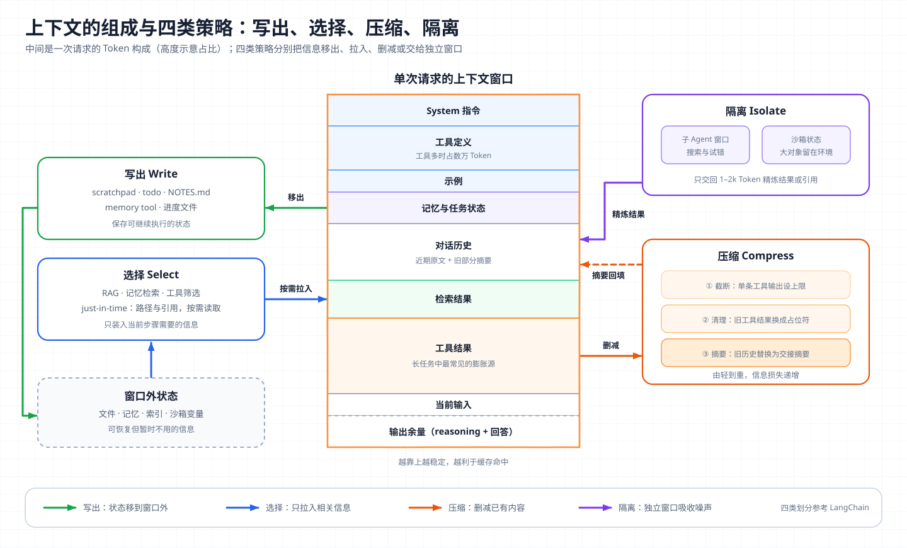
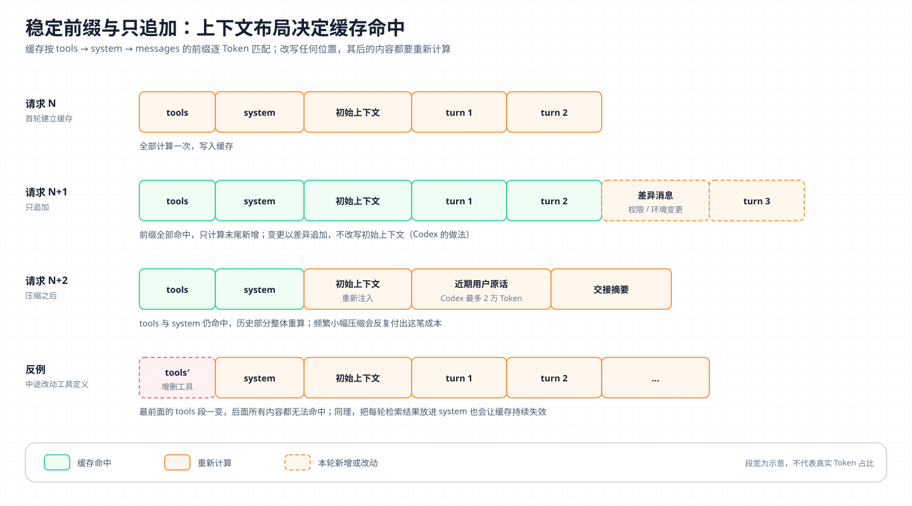

# 核心概念 13 - Context Engineering：为每次推理装配最小高信号工作集

> 技术快照：OpenAI Codex `6ff670bd`、Hermes Agent `30e947e0`；Claude API 字段与模型能力以文末参考链接为准

> *本合集是一套面向 Agent 架构与工程实践的系统学习笔记，帮助读者建立从原理、Runtime、工具与权限到评测和多 Agent 编排的完整知识框架。*
>
> *本篇讲 Context Engineering 的定义、注意力预算与 context rot 的成因、上下文的组成，以及写出、选择、压缩、隔离四类策略在 Claude API 与 Codex 中的实现，并讨论它与 KV Cache 的关系、评估方法和常见失败模式。*

## 定义与边界：从写提示词到管理每轮输入

Anthropic 把 Context Engineering 定义为：在 LLM 推理时，筛选和维护最优 Token 集合的一组策略，这个集合包括提示词之外所有可能进入上下文的信息。它要回答的问题是“什么样的上下文配置最可能让模型产生期望行为”，目标是找到“能最大化期望结果概率的最小高信号 Token 集合”。

| 维度 | [Prompt Engineering](12-prompt-engineering.md) | Context Engineering |
| --- | --- | --- |
| 对象 | 指令文本，主要是 system prompt | 一次请求中的全部 Token：指令、工具、示例、记忆、历史、检索结果、工具结果 |
| 时间尺度 | 离散的一次性编写 | 每轮都重新筛选，随任务推进迭代 |
| 执行者 | 人 | Harness 代码加模型自身（模型决定读什么、记什么） |
| 典型问题 | 措辞、结构、示例是否清楚 | 放什么、放多少、放哪里、何时移除 |

Context Engineering 管“这一次请求里有什么”。跨会话的持久状态属于 [Memory](09-memory.md)，决定何时循环、调用哪些工具、如何恢复的外层控制属于 [Harness Engineering](14-harness-engineering.md)。

## 注意力预算：更长的上下文为什么会变差

Transformer 中每个 Token 都要和其他所有 Token 建立注意力关系，n 个 Token 就有 n² 对关系。Anthropic 用“注意力预算”描述这个约束：上下文越长，分给每条信息的注意力越稀薄；训练数据中短序列远多于长序列，模型处理长距离依赖的经验也更少。因此上下文应被当作边际收益递减的有限资源。

Chroma 的 context rot 报告在 18 个模型上验证了这一点：

- 即使是非词汇匹配的检索、原样复述文本这类简单任务，性能也随输入长度增加而下降，且不均匀；
- 问题与目标信息的语义相似度越低，长上下文下衰减越快；
- 主题相关的干扰项会进一步拉低准确率，不同模型受影响程度不同；
- 逻辑连贯的背景文档反而比随机打乱的句子更伤性能；
- 在 LongMemEval 上，只给相关片段（约 300 Token）的聚焦输入，全部模型都明显优于带无关历史的完整输入（约 113k Token）。

Lost in the Middle 更早观察到位置效应：相关信息在开头或结尾时表现最好，在中部时显著下降，呈 U 形。

两组结果说明，标称窗口衡量的是“能接受多少”，不是“能可靠使用多少”。

## 上下文的组成与预算账本



| 组成 | 典型内容 | 稳定性 | 主要风险 | 设计要点 |
| --- | --- | --- | --- | --- |
| System 指令 | 身份、边界、输出合同 | 高 | 过细变脆弱，过粗无约束 | Anthropic 称为找准“高度”：给启发式，不写硬编码分支 |
| 工具定义 | 名称、描述、JSON Schema | 高 | 数量多时占大量 Token，功能重叠导致误选 | 人都分不清该用哪个工具时，模型也分不清（见 [Tool Use](04-tool-use.md)） |
| 示例 | few-shot 输入输出 | 高 | 堆砌边界情况 | 选少量多样的典型示例 |
| 记忆与任务状态 | 画像、规则、计划、检查点 | 中 | 过时、冲突 | 有上限，压缩后重新注入 |
| 对话历史 | 用户与助手消息、reasoning | 低 | 随轮数线性增长 | 保留近期原文，旧部分摘要 |
| 检索结果 | 文件、文档片段 | 低 | 误召回、过期 | 按需检索，保留来源 |
| 工具结果 | 命令输出、搜索结果、网页 | 低 | 单条可达数万 Token，最常见的膨胀源 | 截断、清理、落盘只留引用 |
| 输出余量 | reasoning 与回答 | — | 被输入挤占导致截断 | 预留固定比例 |

一个粗略的账本（推断，用于说明量级）：接入 30 个 MCP 工具、每个定义约 600 Token，工具就占 18k；Coding Agent 运行 40 轮，每轮读一个 3k Token 的文件、跑一次 2k Token 的测试输出，工具结果累计约 200k。此时决定下一步的通常只是最近几次输出和当前文件。长任务的膨胀主要来自工具结果，而不是用户对话。

## 四类策略：写出、选择、压缩、隔离

LangChain 把上下文管理归纳为四类操作，对应图中环绕窗口的四个方向。

### 写出：把状态移到窗口外

写出（write）指把信息保存到上下文之外，以便后续取回。任务内用 scratchpad、todo 或进度文件，跨会话用记忆。Anthropic 把结构化笔记列为长任务的三种核心技术之一：Agent 定期把进度、决策和待办写入 `NOTES.md` 一类文件，上下文重置后读回即可继续。Claude API 的 memory tool 自动注入的协议也是同一思路，要求模型假设上下文随时可能被重置，及时记录进度。

写出的内容应是可继续执行的状态，例如目标、完成条件、已验证事实和下一步，而不是对话流水账。

### 选择：只在需要时把信息拉进来

选择（select）指每轮只装入与当前步骤相关的信息，包括：

- **检索**：RAG、记忆检索，按查询取片段；
- **即时加载（just-in-time）**：只在上下文里保留路径、URL、查询语句等轻量引用，需要时用工具读取；
- **工具选择**：根据任务只暴露部分工具，或先暴露工具搜索能力；
- **渐进披露**：只加载技能的名称和描述，触发后再读正文（见 [Skills](07-skills.md)）。

Claude Code 采用混合策略：`CLAUDE.md` 启动时直接加载，代码由模型用 glob、grep 即时探索，避开了预建索引过期的问题，代价是探索更慢、依赖模型会用工具。

### 压缩：保留继续执行所需的最少 Token

压缩（compress）从轻到重有三档：

| 手段 | 作用对象 | 信息损失 | 典型实现 |
| --- | --- | --- | --- |
| 截断 | 单条过长的工具输出 | 丢掉超出部分 | Codex 模型目录的截断策略为每条工具输出 10,000 Token，写入历史前执行 |
| 清理 | 旧的工具结果、旧 thinking 块 | 原文替换为占位符，调用记录保留 | Claude API context editing |
| 摘要（compaction） | 较早的整段历史 | 有损，依赖摘要质量 | Claude API compaction、Codex compact |

截断和清理是确定性规则，应该先用；摘要需要额外调用且可能丢掉隐含约束，留作高水位手段。

### 隔离：用独立窗口吸收噪声

隔离（isolate）把上下文拆到不同处理空间。最常见的是子 Agent：子 Agent 在自己的窗口里搜索、试错，只把 1,000–2,000 Token 的精炼结果交回主 Agent（见 [Subagent](10-subagent.md)）。另一种是沙箱状态：大对象（数据帧、图片、长日志）留在执行环境的变量或文件里，上下文只保存引用和摘要，需要时再用代码查询。

隔离的代价在交接：委派说明不足时子 Agent 会做错，主 Agent 无法核验时只能照单全收，并行还会成倍增加 Token（见 [Multi-Agent](11-multi-agent.md)）。

## Claude API 的服务端上下文管理

### Context editing：按规则清理

Context editing 在请求到达模型前于服务端执行，客户端仍保留完整历史。需要 beta 头 `context-management-2025-06-27`，在 `context_management.edits` 中配置策略。

`clear_tool_uses_20250919` 在上下文超过阈值时，把旧的工具结果替换为占位文本：

| 参数 | 默认值 | 作用 |
| --- | --- | --- |
| `trigger` | 100,000 输入 Token | 触发条件，也可按工具调用次数 |
| `keep` | 3 次工具调用 | 保留最近几组调用与结果 |
| `clear_at_least` | 无 | 每次至少清理多少 Token |
| `exclude_tools` | 无 | 永不清理的工具 |
| `clear_tool_inputs` | `false` | 是否连同调用参数一起清理 |

`clear_thinking_20251015` 管理扩展思考产生的 thinking 块，可以保留全部或最近 N 轮，默认值随模型而定。两个策略同时使用时，thinking 策略必须排在前面。响应中的 `context_management.applied_edits` 会报告清理了多少轮次和 Token。清理工具结果会让被清理位置之后的缓存前缀失效，`clear_at_least` 的意义就是保证每次清理的收益足以抵消一次缓存重建。

### Compaction：服务端摘要

Compaction 由 Claude 在服务端生成摘要，替换较早的对话。目前有两种形态：

| 形态 | 配置 | 谁决定时机 | 摘要块位置 |
| --- | --- | --- | --- |
| 阈值触发 | beta `compact-2026-01-12`，`context_management.edits` 中 `{"type": "compact_20260112"}`，`trigger` 默认 150,000、最小 50,000 输入 Token | API | 放在被总结的消息之后，API 自动丢弃块之前的内容 |
| 按需触发 | beta `compact-2026-09-04`，顶层 `"compaction": {"type": "summarize"}` | 调用方 | 返回带签名的 `compaction` 块，调用方把它放在 `messages` 首位并删除被总结的消息 |

按需形态的一次交互如下：

```json
// 请求：带上当前完整对话
{ "model": "claude-opus-5-5", "max_tokens": 4096,
  "messages": [ ...完整历史... ],
  "compaction": { "type": "summarize" } }

// 响应：只有一个 compaction 块，stop_reason 为 "compaction"
{ "content": [ { "type": "compaction", "content": "Summary of the conversation: ...", "signature": "EuYB..." } ],
  "stop_reason": "compaction",
  "usage": { "input_tokens": 0, "output_tokens": 0,
             "iterations": [ { "type": "compaction", "input_tokens": 144, "output_tokens": 276 } ] } }
```

边界如下：阈值形态可用 `pause_after_compaction` 暂停，由调用方把近期消息原样接回；`instructions` 会整体替换默认摘要提示词；计费要看 `usage.iterations` 的合计，而不是顶层字段；`compaction` 与 `context_management` 不能出现在同一个请求里。按需形态的文档还提示，被总结范围内的图片、文档和中途插入的 system 消息会随摘要消失，仍需生效的指令要重新声明。官方默认摘要提示词要求记录状态、下一步和经验，并用 `<summary>` 包裹。

## Codex 的压缩实现

### 触发阈值

Codex 的自动压缩阈值取配置值与有效窗口 90% 中的较小者：

```rust
// codex-rs/protocol/src/openai_models.rs
pub fn auto_compact_token_limit(&self) -> Option<i64> {
    let context_limit = self.resolved_context_window().map(|w| (w * 9) / 10);
    let config_limit = self.auto_compact_token_limit;
    if let Some(context_limit) = context_limit {
        return Some(config_limit.map_or(context_limit, |limit| std::cmp::min(limit, context_limit)));
    }
    config_limit
}
```

### 本地摘要与历史重建

本地压缩把一段固定提示词作为用户输入发给模型，要求写一份交给“另一个 LLM”继续任务的交接摘要，内容包括进度与关键决策、约束与用户偏好、剩余步骤和继续所需的关键数据。摘要返回后，Codex 并不简单地用摘要替换全部历史：

```rust
// codex-rs/core/src/compact.rs
let summary_text = format!("{SUMMARY_PREFIX}\n{summary_suffix}");
let user_messages = collect_user_messages(history_items);
let mut new_history = build_compacted_history(Vec::new(), &user_messages, &summary_text);

fn build_compacted_history_with_limit(mut history, user_messages, summary_text, max_tokens /* 20_000 */) {
    // 从最新的用户消息往回取，直到用完 2 万 Token 预算；最后一条放不下时截断
    for message in user_messages.iter().rev() { ... }
    selected_messages.reverse();
    for message in &selected_messages { history.push(user_message(message)); }
    history.push(user_message(summary_text));   // 摘要作为最后一条
    history
}
```

新历史由三部分组成：按时间顺序保留的近期用户原话（最多 2 万 Token）、带前缀的摘要，以及视情况重新注入的初始上下文。摘要前缀告诉模型“另一个语言模型已开始解决这个问题并写了这份摘要”，让它当交接材料读。保留用户原话，是因为用户的要求和纠正最不应被摘要改写。

初始上下文（指令、环境、权限）在回合开始前或手动压缩时不注入，由下一轮完整重注入；回合中途压缩时插在最后一条真实用户消息之前，让摘要保持在历史末尾。压缩请求本身超出窗口时，Codex 删掉最早的一条历史再重试。

### 远端压缩

模型提供方支持时，Codex 改走 `/responses/compact` 端点，由服务端完成压缩。发送前会先裁剪旧的函数调用输出以适应端点容量，并在前后运行 pre-compact / post-compact hook。v2 路径则沿用服务端默认的 64k 保留消息预算。

### 两种实现的对照

| 维度 | Claude API | Codex |
| --- | --- | --- |
| 执行位置 | 服务端，客户端只传参数或回传块 | 本地摘要，或提供方支持时走远端端点 |
| 触发 | 阈值（默认 150k）或调用方按需 | 默认有效窗口的 90% |
| 近期原文 | 按需形态可保留近期轮次；阈值形态需暂停后手动接回 | 固定保留最多 2 万 Token 的用户原话 |
| 摘要可见性 | 可读文本加签名，必须原样回传 | 普通消息，带交接前缀 |
| 规则式清理 | context editing 清理工具结果和 thinking | 写入历史前截断每条工具输出 |

两者都把摘要设计成交接文档；差异在于 Claude API 把摘要块做成带签名的协议对象，Codex 把保留用户原话写进了重建算法。其他 Harness 在压缩前补救：OpenClaw 在压缩前运行一次静默的 memory flush 回合，提醒 Agent 把重要信息写入记忆文件；Hermes 的记忆 provider 有 `on_pre_compress` 钩子，可在历史被压缩前抽取信息。

## 与 KV Cache 的关系：稳定前缀与只追加



Prompt Cache 复用相同前缀的 KV 计算结果（见 [KV Cache](02-kv-cache.md)），命中条件是逐 Token 的前缀完全一致。Claude API 按 `tools` → `system` → `messages` 的顺序构建缓存前缀，修改工具定义会让全部缓存失效；缓存读取按基础输入价的 0.1 倍计费。OpenAI 同样要求渲染后的前缀完全匹配，并建议把稳定指令和共享材料放在最前面，时间戳和用户相关内容放在末尾。

这让上下文布局有了一条硬约束：变化越频繁的内容越要靠后，已经发出的内容尽量不改，只在末尾追加。Codex 的每轮上下文更新就是按这个原则写的：

```rust
// codex-rs/core/src/session/mod.rs
let should_inject_full_context = reference_context_item.is_none();
// 完整初始上下文重置基线；之后的回合只持久化变化量
let (mut context_items, world_state_item) = if should_inject_full_context {
    let context_items = self.build_initial_context_with_world_state_and_mcp(...).await;
    ...
} else {
    // 稳态路径：只追加内置上下文的差异项
    let mut context_items = self.build_settings_update_items(reference_context_item.as_ref(), turn_context).await;
    ...
};
```

环境、权限或模型设置改变时，Codex 在历史末尾追加一条差异消息，而不是改写开头的初始上下文。Hermes 的记忆快照是同一原则在记忆上的应用：会话中写入的记忆只落盘，不改 system prompt，前缀在整个会话内不变。

这条约束与其他策略之间存在直接冲突：

- 清理和压缩都会改写历史，使该位置之后的缓存全部失效，所以要设最小清理量、避免频繁小幅压缩；
- 动态注入的检索结果和记忆放在前缀里会破坏缓存，应放在历史末尾或当前用户消息附近；
- 工具集合随任务动态变化会让最前面的 `tools` 段失效，工具选择与缓存命中率需要权衡；
- 正确性优先于命中率，权限或规则变更时必须让旧上下文失效，不能为了缓存继续用过期状态。

## 评估上下文策略

上下文策略要在真实长任务上评估，needle-in-a-haystack 只能证明能找回某个字符串。方法有三类：

1. **消融对比。** 同一批任务分别用完整上下文、聚焦上下文、不同清理和压缩阈值运行，比较成功率、成本和延迟。Chroma 用 LongMemEval 比较约 300 Token 聚焦输入与约 113k Token 完整输入，就是这种设计。
2. **压缩保真探针。** 在压缩前后向 Agent 提问目标、约束、已修改文件、失败尝试、外部资源 ID 和下一步，检查答案是否一致，也可以直接比较压缩后任务能否继续完成。
3. **运行时遥测。** 在生产轨迹上持续记录下表指标。

| 指标 | 说明的问题 |
| --- | --- |
| 各组成部分的 Token 占比 | 膨胀来自工具结果、历史还是工具定义 |
| 缓存命中 Token / 输入 Token | 前缀布局是否稳定 |
| 清理与压缩次数、每次回收的 Token | 阈值是否合理 |
| 压缩后的任务成功率与返工率 | 摘要是否丢了关键信息 |
| 被清理内容的重新读取率 | 清理是否过于激进 |
| 检索片段的引用率 | 选择策略是否在装入无用信息 |

## 失败模式：污染、干扰、混淆、冲突与压缩丢失

Drew Breunig 总结的四类上下文失败加上压缩特有的问题，构成主要排查清单：

| 失败 | 表现 | 缓解 |
| --- | --- | --- |
| 污染（poisoning） | 幻觉或错误结论进入上下文，被后续步骤反复引用 | 区分已验证与推测；摘要标注状态；关键事实回到工具重新确认 |
| 干扰（distraction） | 上下文过长，模型过度依赖历史而不是推理 | 降低压缩阈值，拆给子 Agent，缩短保留窗口 |
| 混淆（confusion） | 无关工具或资料影响决策 | 按任务筛选工具与检索结果，删除重复规则 |
| 冲突（clash） | 新旧信息或多来源指令相互矛盾 | 显式废弃旧状态；定义来源优先级；当前环境事实优先于历史 |
| 压缩丢失约束 | 摘要漏掉用户早期提出的限制、权限条件或失败副作用 | 保留用户原话；把约束放进结构化状态并在压缩后重注入；自定义摘要指令 |
| 破坏工具调用配对 | 裁剪后留下孤立的调用或结果 | 按完整调用 / 结果对裁剪；未完成的工具调用先补结果再压缩 |

压缩丢失约束最隐蔽。Claude API 文档明确提示，被总结范围内的 system 消息会随摘要失效；Codex 的做法是把用户原话留在摘要之外。无论哪种实现，都不能把权限控制寄托在早期的一段提示词上，必须执行的边界应由 Harness 的权限系统和沙箱强制。

## 架构推演

某团队要构建一个长时间运行的数据分析 Agent：面对上千张表的数据仓库，单个任务持续 2–4 小时，包含 200 次以上的 SQL 执行和代码运行，最终产出带图表的报告。模型有效窗口约 200k Token，查询结果可能有数万行，用户会在中途追加要求。

请说明：

- system 指令、工具定义、表结构、任务状态、历史、查询结果分别如何放置，哪些常驻、哪些按需加载；
- 表结构检索用预建索引、即时查询元数据还是两者结合，如何避免索引过期；
- 查询结果如何截断、落盘或留在沙箱变量中，上下文里保留什么引用；
- 清理、摘要、新窗口和子 Agent 分别在什么水位或什么任务边界触发；
- 如何设计上下文布局以维持缓存命中，用户中途追加要求时如何注入；
- 压缩后如何确认分析口径、过滤条件、已排除的假设和用户追加要求没有丢失；
- 用哪些离线评测和线上指标比较不同策略，如何在成功率、成本和延迟之间取舍。

合理方案会把大数据留在沙箱，上下文只放结论和引用；分析口径和用户要求进入压缩后必须重注入的结构化状态；规则式清理处理日常膨胀，摘要和子 Agent 留给任务边界；阈值和布局由真实轨迹的消融实验决定，而不是由窗口大小决定。

## 复习结论

- Context Engineering 管理每次请求中的全部 Token，目标是用最小的高信号集合获得期望行为；Prompt Engineering 是其中针对指令文本的部分。
- 注意力随上下文变长而稀释，context rot 和 Lost in the Middle 表明标称窗口不等于可靠使用范围。
- 长任务的上下文膨胀主要来自工具结果，其次是历史，工具定义在工具数量多时也很可观。
- 四类策略分工明确：写出把状态移到窗口外，选择按需拉入，压缩删减已有内容，隔离用独立窗口吸收噪声。
- 压缩按截断、清理、摘要三档递进；Claude API 提供服务端 context editing 与 compaction，Codex 在 90% 窗口处压缩并保留最多 2 万 Token 的用户原话。
- 缓存要求前缀稳定、只追加；清理和压缩会使缓存失效，需要用最小清理量和合理阈值平衡。
- 策略要在真实长任务上用消融、压缩保真探针和运行时遥测评估。
- 污染、干扰、混淆、冲突和压缩丢失约束是主要失败模式，硬性边界不能只放在提示词里。

## 参考

| 主题 | 来源 |
| --- | --- |
| 定义与策略 | [Effective context engineering for AI agents](https://www.anthropic.com/engineering/effective-context-engineering-for-ai-agents) · [Context Engineering for Agents (LangChain)](https://www.langchain.com/blog/context-engineering-for-agents) |
| 长上下文质量 | [Context Rot (Chroma)](https://www.trychroma.com/research/context-rot) · [Lost in the Middle](https://arxiv.org/abs/2307.03172) |
| Claude API 上下文管理 | [Context editing](https://platform.claude.com/docs/en/build-with-claude/context-editing) · [Compaction](https://platform.claude.com/docs/en/build-with-claude/compaction) · [Compaction on demand](https://platform.claude.com/docs/en/build-with-claude/compaction-on-demand) · [Compaction at a token threshold](https://platform.claude.com/docs/en/build-with-claude/compaction-threshold) · [Memory tool](https://platform.claude.com/docs/en/agents-and-tools/tool-use/memory-tool) |
| Prompt Cache | [Claude Prompt caching](https://platform.claude.com/docs/en/build-with-claude/prompt-caching) · [OpenAI Prompt caching](https://developers.openai.com/api/docs/guides/prompt-caching) |
| Codex 压缩 | [`compact.rs`](https://github.com/openai/codex/blob/6ff670bd030f7f94ce956d8a176c226deb427666/codex-rs/core/src/compact.rs) · [`compact_remote.rs`](https://github.com/openai/codex/blob/6ff670bd030f7f94ce956d8a176c226deb427666/codex-rs/core/src/compact_remote.rs) · [`compact_remote_v2.rs`](https://github.com/openai/codex/blob/6ff670bd030f7f94ce956d8a176c226deb427666/codex-rs/core/src/compact_remote_v2.rs) · [`prompt.md`](https://github.com/openai/codex/blob/6ff670bd030f7f94ce956d8a176c226deb427666/codex-rs/prompts/templates/compact/prompt.md) · [`summary_prefix.md`](https://github.com/openai/codex/blob/6ff670bd030f7f94ce956d8a176c226deb427666/codex-rs/prompts/templates/compact/summary_prefix.md) |
| Codex 窗口、截断与上下文差异 | [`openai_models.rs`](https://github.com/openai/codex/blob/6ff670bd030f7f94ce956d8a176c226deb427666/codex-rs/protocol/src/openai_models.rs) · [`models.json`](https://github.com/openai/codex/blob/6ff670bd030f7f94ce956d8a176c226deb427666/codex-rs/models-manager/models.json) · [`session/mod.rs`](https://github.com/openai/codex/blob/6ff670bd030f7f94ce956d8a176c226deb427666/codex-rs/core/src/session/mod.rs) |
| 压缩前记忆抽取 | [OpenClaw Memory overview](https://github.com/openclaw/openclaw/blob/28fee00559efd8123b937c7c28bd569250a9288a/docs/concepts/memory.md) · [Hermes `memory_provider.py`](https://github.com/NousResearch/hermes-agent/blob/30e947e0a05ef535e4b25a183d8bbe34fd68d1d5/agent/memory_provider.py) · [Hermes `memory_tool.py`](https://github.com/NousResearch/hermes-agent/blob/30e947e0a05ef535e4b25a183d8bbe34fd68d1d5/tools/memory_tool.py) |
