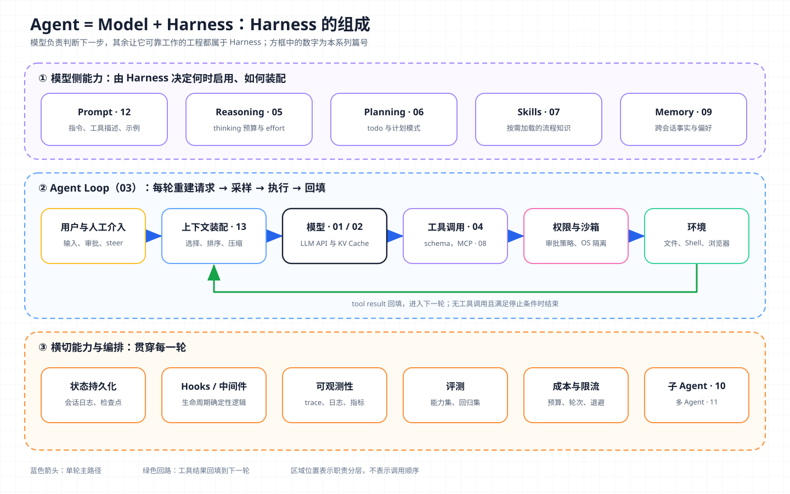
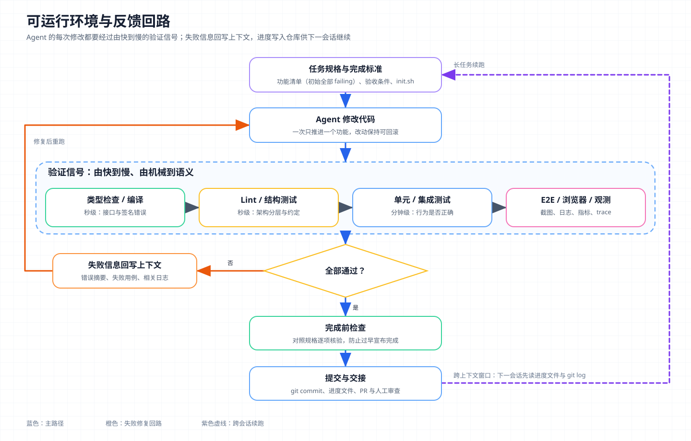

# 核心概念 14 - Harness Engineering：模型之外的全部工程

> 技术快照：OpenAI Codex `6ff670bd`、pi `c8c3cd49`、Hermes Agent `30e947e0`、OpenClaw `28fee005`，产品功能以文末参考链接为准

> *本合集是一套面向 Agent 架构与工程实践的系统学习笔记，帮助读者建立从原理、Runtime、工具与权限到评测和多 Agent 编排的完整知识框架。*
>
> *本篇是核心概念系列的收官篇：给出 Harness Engineering 的定义，把前 13 篇的概念放进同一张组成清单，对比四个开源 Harness 的设计取舍，并讨论可运行环境、反馈回路以及 Harness 如何随模型能力演进。*

## Harness Engineering 的定义与边界

LangChain 的 Vivek Trivedy 把 Agent 写成一个等式：

```text
Agent = Model + Harness
```

他把 Harness 定义为“除模型本身之外的每一段代码、配置和执行逻辑”：如果你不是模型，你就是 Harness。Harness Engineering 是设计、实现和迭代这部分系统的工程活动，目标是让模型在真实任务中可靠、安全、可度量地工作。

三份常被引用的材料从不同角度描述了这门工程：

| 来源 | 关注点 | 代表性结论 |
| --- | --- | --- |
| OpenAI《Harness engineering》 | 为 Coding Agent 构建工作环境 | 5 个月、约 1,500 个合并 PR、约 100 万行代码，无一行手写；起初只有 3 名工程师驱动 Codex，后来团队增至 7 人；“人掌舵，Agent 执行” |
| Anthropic《Effective harnesses for long-running agents》 | 跨多个上下文窗口推进长任务 | 功能清单、进度文件、`init.sh`，每个会话只推进一个功能 |
| LangChain《The Anatomy of an Agent Harness》等 | Harness 的组成与只改 Harness 的收益 | 同一模型在 Terminal Bench 2.0 上从 52.8% 升到 66.5% |

Anthropic 在评测文章中还区分了两个容易混淆的词：agent harness（也叫 scaffold）是“让模型作为 Agent 行动的系统”；evaluation harness 是端到端运行评测、记录每一步并评分汇总的基础设施。本文讨论前者，评测作为它的组成部分出现。

三门工程学科是包含关系。[Prompt Engineering](12-prompt-engineering.md) 管写给模型的指令，[Context Engineering](13-context-engineering.md) 管每轮窗口放什么，Harness Engineering 包含这两者，再加上循环、工具、权限、沙箱、状态、观测、评测、成本和人工介入。

把它单独作为一门工程，是因为 Harness 的差异会直接反映在结果上。LangChain 固定模型只改 Harness，榜单位置从 30 名左右升至前 5。Anthropic 的实验中，单 Agent 花 9 美元、20 分钟产出无法运行的应用，完整 Harness 花 200 美元、6 小时产出可用产品。

## Harness 的组成清单



图分三层：中层是 Agent Loop 单轮主路径，工具结果沿绿色回路回填；顶层是由 Harness 决定何时启用的模型侧能力；底层是横切能力与多 Agent 编排。数字为本系列篇号。

逐项的一句话定义如下：

| 组件 | 一句话 | 篇目 |
| --- | --- | --- |
| LLM API | 无状态请求与事件流，每轮重新构造完整输入 | [01](01-llm-api.md) |
| KV Cache | 前缀稳定才能复用计算，决定装配顺序和成本 | [02](02-kv-cache.md) |
| Agent Loop | 采样、执行、回填、判断是否继续的控制循环 | [03](03-agent-loop.md) |
| Tool Use | 把模型意图变成经过校验的结构化调用 | [04](04-tool-use.md) |
| Reasoning | 在回答前分配推理预算 | [05](05-reasoning.md) |
| Planning | 把目标拆成可验证的步骤并维护计划状态 | [06](06-planning.md) |
| Skills | 按需加载的流程知识 | [07](07-skills.md) |
| MCP | 用统一协议接入外部工具与资源 | [08](08-mcp.md) |
| Memory | 跨会话事实的写入、检索和遗忘 | [09](09-memory.md) |
| Subagent | 用一次工具调用换一个隔离上下文 | [10](10-subagent.md) |
| Multi-Agent | 多个 Agent 的分工、通信与终止 | [11](11-multi-agent.md) |
| Prompt | 指令、示例、工具描述写到合适的高度 | [12](12-prompt-engineering.md) |
| 上下文装配 | 选择、排序、裁剪、压缩窗口内容 | [13](13-context-engineering.md) |
| 权限、沙箱、Hooks、可观测性、评测、成本与限流、人工介入 | 没有独立篇目的横切能力 | 本篇下文 |

状态持久化在 03 与 09 中已有讨论，下面只补充没有独立篇目的几项。

### 权限与沙箱：两道互补的边界

权限在执行前判断一个动作能不能做，沙箱在执行中限制动作最多影响到哪里。只有权限时，被批准的命令仍可能越界。只靠沙箱，Agent 也可能在沙箱内删掉全部成果。

Codex 把两者编排在同一个工具执行器里：先按审批策略决定是否请求用户确认，再选择沙箱执行，沙箱拒绝时可以请求升级后重试。审批策略有 `UnlessTrusted`、`OnRequest`、`Granular`、`Never` 几档；沙箱在 macOS 上用 Seatbelt，在 Linux 上用 bubblewrap 与 Landlock，并提供只读、工作区可写、完全访问三种模式。Claude Code 的官方文档也是这个思路，Bash 沙箱由操作系统强制文件和网络边界，让大多数命令无需逐条审批。

[Prompt Engineering](12-prompt-engineering.md) 中 prompt injection 一节提到的防御，就落在这里的权限和沙箱上，它们决定系统允许发生什么。

### Hooks 与生命周期中间件：确定性逻辑的插入点

Hook（钩子）是 Harness 在固定生命周期点（工具调用前后、压缩前、会话开始、回合结束）调用的用户代码，用来把“必须每次执行”的规则从 prompt 移到代码里，例如格式化、敏感路径拦截、审计日志、完成前检查。

Claude Code 的 `PreToolUse`、`UserPromptSubmit` 等事件可以阻断操作；Codex 的 hooks 覆盖 `PreToolUse`、`PermissionRequest`、`PostToolUse`、`PreCompact`、`SessionStart`、`Stop` 等，Stop hook 阻断时追加提示并让本轮继续；LangChain Deep Agents 以中间件包裹模型和工具调用。

LangChain 的实验用了两个中间件。`PreCompletionChecklistMiddleware` 在 Agent 准备结束时要求对照任务规格验证一次；`LoopDetectionMiddleware` 统计对同一文件的反复编辑，超过阈值就提示换思路。

### 可观测性：先能看见，才能改进

失败可能发生在模型决策、上下文、工具 schema、权限、工具实现或外部依赖任何一层，没有 trace 时它们在最终输出上一模一样。一条可用的 trace 要串起每轮的输入构成、模型输出与 tool call、工具参数与结果、审批决定、耗时和费用。四个开源项目的观测实现见下文对比表。LangChain 的改进流程直接把 trace 当输入，先用一个 Agent Skill 拉取实验 trace，再派生多个分析 Agent 并行归纳失败模式，最后决定改哪个旋钮。

### 评测：度量的是模型与 Harness 的组合

task、trial、grader、transcript、outcome 等术语和 `pass^k` 口径已在 [Prompt Engineering](12-prompt-engineering.md) 展开。放到 Harness 层面还要补充两点。评测对象是“模型 + Harness”的组合，同一模型换 Harness 成绩可差十几个百分点，报告成绩必须同时说明 Harness 配置。评分尽量看 outcome，即环境最终状态，不以 Agent 的自述为准。

### 成本与限流：给循环加上预算

Agent Loop 容易失控，工具失败后会重试，上下文膨胀后会压缩，压缩后又重新读取。Harness 要为每个任务设置多维预算，包括轮次（Hermes Agent 默认 `max_iterations` 为 90，耗尽时记录 `budget_exhausted`）、Token 与费用、墙钟时间、按阶段分配的推理强度（LangChain 在规划和验证阶段用最高档，实现阶段用次高档），以及子 Agent 并发数和供应商速率限制下的退避重试。

### 人工介入：设计成状态，而不是异常

人工介入有四种形态：执行前审批、信息不足时澄清、执行中转向（steer）、强制中断。Harness 应把“等待人”建模成状态机里的正常状态，可持久化、可超时、恢复后从原处继续。审批界面展示即将执行的真实参数。

## 四个开源 Harness 的设计差异

Codex、pi、Hermes Agent、OpenClaw 都实现了完整的 Agent Loop，但它们对“Harness 该内置什么”给出了不同答案。

| 维度 | Codex | pi | Hermes Agent | OpenClaw |
| --- | --- | --- | --- | --- |
| 定位 | 在本机运行的 Coding Agent | 极简终端 Coding Harness，靠扩展适配工作流 | 带内置学习回路的自我改进 Agent | 运行在自有设备上的个人助理，Gateway 作控制面 |
| 主循环 | `run_turn`：模型需要续轮或有待处理输入时继续 | `runLoop`：内外两层循环，处理工具调用、转向和后续消息 | `run_conversation`：受轮次与迭代预算约束 | 类 pi 的循环，外层包重试与模型故障切换 |
| 停止与完成 | 无需续轮时运行 Stop hooks，hook 可阻断并追加提示 | 无工具调用且无排队消息；错误或中断立即结束 | 记录退出原因：最终回答、用户中断、预算耗尽、护栏停止 | 同 pi，另有外层重试 |
| 上下文与压缩 | 分层收集 `AGENTS.md`；采样前与回合中两处自动压缩 | 逐目录加载 `AGENTS.md` / `CLAUDE.md`；超出窗口减预留量时压缩 | system prompt 分稳定、上下文、易变三层，每会话构建一次以保持缓存 | 工作区引导文件（AGENTS、SOUL、TOOLS 等）；发送前预判压缩 |
| 权限 | 多档审批策略、命令规则、可选 LLM 审查会话 | 核心不做权限弹窗，建议容器运行或用扩展自建确认 | 危险命令模式匹配、会话级审批、辅助模型判断、白名单 | 工具允许/拒绝列表，执行安全级别与询问策略 |
| 沙箱 | 内置 OS 级沙箱：Seatbelt、bubblewrap + Landlock、Windows 受限令牌 | 核心无沙箱，示例扩展提供 | 无 OS 级沙箱，终端可选本地、Docker、SSH、Modal 等后端 | Docker 或 SSH 后端，可按主会话 / 非主会话 / 全部启用 |
| 状态 | JSONL rollout + SQLite 状态库 | 按工作目录保存 JSONL 会话树 | SQLite 会话库带全文检索，`MEMORY.md` / `USER.md` 与记忆插件 | 按 Agent 保存 JSONL 会话，记忆由扩展提供 |
| 子 Agent | 内置 spawn / send / wait / close 等工具与角色配置 | 核心不提供，示例扩展以独立进程实现 | `delegate` 工具，默认最多一层 | `sessions_spawn`，完成结果回注请求方会话 |
| 扩展与观测 | hooks、插件、Skills、MCP；OpenTelemetry | 扩展事件、Skills、包分发；未见 OTEL | 插件 hooks、Skills；Langfuse 等插件 | 插件 hooks、渠道扩展；OTLP 与 Prometheus |

### 同一个循环，两种停止判定

Codex 与 pi 的主循环都遵循“有工具调用就继续”的基本结构，差别在于停止前是否还有一道确定性关口。Codex 在模型不再需要续轮时运行 Stop hooks：

```rust
let needs_follow_up = model_needs_follow_up || has_pending_input;
// ...
if !needs_follow_up {
    let stop_outcome = run_turn_stop_hooks(&sess, &turn_context, stop_hook_active, last_agent_message.clone()).await;
    if stop_outcome.should_block {
        // hook 追加一段提示，本轮继续采样
    }
}
```

pi 的循环更薄：`while (hasMoreToolCalls || pendingMessages.length > 0)` 内依次注入转向消息、流式获取模型回复、遇到 `error` 或 `aborted` 立即返回、执行工具调用并回填。它还有一处保护，模型输出因长度上限被截断时，所有工具调用的参数都可能不完整，循环直接把它们判为失败而不执行。

Codex 在核心里提供了停止前的 hook 插入点；pi 的核心循环没有这道关口，需要完成前检查时由扩展或上层自行实现。

### 取舍的两极

对比表里最明显的分歧，是安全与编排能力放在核心里，还是交给使用者组装。

- Codex 在“内置”一端：沙箱、审批、子 Agent、观测都由核心提供，默认偏保守，核心代码也因此庞大。
- pi 在“最小核心”一端：README 明确不提供子 Agent 和权限弹窗，建议容器运行或用扩展自建，安全边界由使用者负责。
- Hermes Agent 重在跨会话变好：回合结束后派生后台审查，判断是否保存或更新技能与记忆，把 [Skills](07-skills.md) 和 [Memory](09-memory.md) 放在循环出口。
- OpenClaw 重在多入口常驻：Gateway 连接多个聊天渠道，审批可转发到渠道，差异集中在循环外层的会话、渠道和故障切换。

推断：面向不可控用户和高风险环境的产品适合内置默认值，面向需要深度定制的熟练开发者，最小核心加扩展更省。选型先确定谁对安全边界负责，再看功能表。

## 可运行环境与反馈回路



图中主路径自上而下：任务规格、修改、四级验证信号、判断、完成前检查、提交与交接。验证失败沿左侧橙色回路把失败信息写回上下文；提交后沿右侧紫色虚线进入下一会话，下一会话先读取进度文件与 git log。

### 为什么 Agent 需要外部验证信号

模型不能可靠地评价自己。Anthropic 的实验观察到，模型会“自信地称赞自己的工作，即使在人看来质量明显平庸”，于是把生成与评估拆给不同 Agent；另一篇长任务文章把“过早宣布胜利”列为首要失败模式。Harness 要提供 Agent 无法伪造的信号，软件任务里这些信号现成存在：

| 信号 | 反馈时间 | 捕获的问题 | 回写内容 |
| --- | --- | --- | --- |
| 类型检查 / 编译 | 秒级 | 接口与签名错误 | 错误位置与原因 |
| Lint 与结构测试 | 秒级 | 违反分层依赖与约定 | 规则名与修复建议 |
| 单元与集成测试 | 秒到分钟级 | 行为错误、边界条件 | 失败用例与断言差异 |
| 端到端、浏览器驱动 | 分钟级 | 用户可见缺陷 | 截图、DOM 快照、控制台错误 |
| 运行时观测 | 分钟级 | 性能与日志异常 | 查询结果摘要 |

信号按先快后慢、先机械后语义排列。回写到上下文的是精简后的失败信息，完整输出落盘按需读取（见 [Context Engineering](13-context-engineering.md)）。

### 让环境对 Agent 可读

OpenAI 的 Harness engineering 文章把这件事称为 agent legibility（对 Agent 可读）。几项做法可以直接借鉴：

- 仓库是唯一事实来源：从 Agent 的角度看，运行时在上下文里访问不到的东西等于不存在，架构决策与约定都版本化存放在仓库里。
- `AGENTS.md` 只做地图：大而全的说明文件失败于上下文稀缺、指导过多等于没有指导、很快过期、无法机械校验，最终改成约 100 行的顶层文件，指向 `docs/` 下的设计文档和执行计划。
- 用机械规则守住架构：每个业务域遵循固定的分层依赖顺序，由自定义 linter 和结构测试强制执行。文章认为这类架构通常要到几百名工程师时才引入，对 Coding Agent 却是前提。
- 每个工作树可运行可观测：Agent 能为每个 git worktree 启动应用，通过 Chrome DevTools 协议截图和操作界面，查询该实例的日志、指标和 trace。
- 持续偿还技术债：“黄金原则”写成机械规则，后台任务定期扫描偏差并开出小的重构 PR。

Anthropic 的长任务方案从另一个方向补上了跨会话的部分。初始化会话把全部功能写进 JSON 清单并标为 failing，写好 `init.sh` 和进度文件并提交；之后每个会话先读进度和 git log、跑一遍基础端到端测试，再只推进一个功能。功能清单用 JSON 保存，因为文章观察到模型改写 JSON 时比改写 Markdown 更少出现不当覆盖。

## Harness 与模型能力的协同演进

### 每个组件都编码了一个假设

Anthropic 的长任务 Harness 设计文章认为，Harness 的每个组件都编码了一个关于“模型自己做不到什么”的假设，值得反复压力测试。文中新一代模型能在更长时段内保持连贯后，作者删掉了把工作切成冲刺（sprint）的结构。按这个思路审查 Harness，可以为每个组件写下它补偿的能力缺口，模型升级后逐项验证。

| 组件 | 它假设模型不会 | 模型增强后的信号 | 处理方式 |
| --- | --- | --- | --- |
| 细粒度任务切分 | 长时间保持目标连贯 | 不切分时成功率不降 | 放宽切分粒度或删除 |
| 上下文重置代替压缩 | 接近窗口上限时不慌乱收尾 | 压缩后仍能稳定推进 | 改回原地压缩，减少交接成本 |
| 预填充强制格式 | 按指令输出指定格式 | 厂商已移除该能力（见 [12](12-prompt-engineering.md)） | 改用结构化输出 |
| 反复强调的“必须调用工具” | 主动使用工具 | 新模型出现过度触发 | 降低措辞强度 |

“上下文重置”一行也来自这篇文章。某一代模型有明显的“上下文焦虑”，接近窗口上限时倾向提前收尾，原地压缩给不了干净的起点，于是改用上下文重置加交接文件。这类补偿随模型代际而变，去留要靠评测决定。

### 哪些组件不应随能力增强而删除

另有一类组件表达的是约束和责任，与模型能力高低无关：

- 权限、沙箱和审批：限制影响范围和授权。模型越强，能造成的影响越大。
- 审计和 trace：用于事后追责和复现，属于组织要求。
- 评测：用于度量，模型升级时正需要它来判断哪些组件可以删。
- 成本与限流：额度来自预算，与模型能力无关。

推断：Harness 会随模型演进变“薄”，但变薄的是能力补偿层，约束层和度量层会保留甚至加厚。

### 模型与 Harness 的共同训练

LangChain 的文章指出，Claude Code、Codex 这类产品的模型是在 Harness 参与下后训练的，但这不等于训练时的 Harness 就是你的任务的最佳 Harness。推断：Codex 的 `apply_patch` 专用补丁语法属于模型与工具格式相互适配的一类设计；实践上，用厂商产品时优先沿用原生工具和格式，自建 Harness 时用自己的评测集验证每一处偏离。

## 生产约束与失败模式

| 失败模式 | 表现 | 工程约束 |
| --- | --- | --- |
| 过早宣布完成 | Agent 声称完成，但测试未跑或功能缺失 | 功能清单、完成前检查中间件、以 outcome 评分 |
| 自我评价偏差 | Agent 高估自己产出的质量 | 生成与评估分离，评估方持有独立工具 |
| 死循环 | 反复编辑同一文件或重试同一命令 | 循环检测、轮次与费用上限、升级人工 |
| 验证信号缺失 | 改动无法被机械验证，只能靠模型自述 | 补测试、lint、类型检查和可观测性 |
| 权限过宽 | 被注入后执行了越界操作 | 最小权限、出口控制、审批展示真实参数 |
| 状态丢失 | 进程重启或压缩后不知道做到哪一步 | 进度文件、检查点、git 提交作为交接 |
| 过时的补偿组件 | 模型升级后 Harness 反而拖累表现 | 为每个组件记录假设，升级时逐项评测 |

## 架构推演

某公司要为 200 个内部代码仓库提供夜间自动维护：Coding Agent 在 CI 环境中完成依赖升级、弃用 API 迁移和测试修复，每个任务可能持续数小时并跨越多个上下文窗口，产出 PR 供人工审查。仓库测试覆盖参差不齐，部分仓库在构建时会访问内部制品库；预算要求每个仓库每晚的模型费用有上限。

请设计这套 Harness，并说明：

- Agent Loop、上下文装配、工具集和子 Agent 分别采用什么形态，哪些直接复用现成 Harness，哪些需要自建；
- 每个仓库的可运行环境如何准备，验证信号按什么顺序执行，测试覆盖不足的仓库用什么补充信号；
- 功能清单、进度文件和 git 提交如何支撑跨窗口续跑与中断恢复；
- 权限、沙箱和网络出口如何配置，才能访问内部制品库而阻断数据外发；
- 完成前检查、循环检测和预算上限放在哪些生命周期点，超限后降级、停止还是升级人工；
- trace 与评测集怎样用来决定改 prompt、工具还是中间件，以及模型升级时删除哪些组件。

方案还需要说明完成、安全、改进和组件增删这几类判断，分别依据哪些可验证的信号。

## 复习结论

- Agent = Model + Harness。Harness 是模型之外的全部代码、配置和执行逻辑；同一模型换 Harness，任务成绩可以显著不同。
- 权限决定动作是否允许，沙箱限制动作的影响范围，二者互补；hooks 与中间件把必须执行的规则从 prompt 移进代码。
- Codex 内置沙箱、审批、子 Agent 与观测；pi 保持最小核心，把这些交给扩展；Hermes Agent 在循环出口沉淀技能与记忆；OpenClaw 以 Gateway 连接多渠道常驻运行。选型先看谁对安全边界负责。
- 模型无法可靠地评价自己，Harness 要提供外部验证信号：类型检查、lint、测试、浏览器驱动和运行时观测，按先快后慢的顺序回写精简的失败信息。
- 让环境对 Agent 可读：仓库作为唯一事实来源，`AGENTS.md` 只做地图，架构规则写成 lint。
- Harness 的每个组件都编码了一个关于模型能力缺口的假设。模型增强后，能力补偿层应当逐项评测并删减；权限、审计、评测和预算属于约束层，应当保留。

## 参考

| 主题 | 来源 |
| --- | --- |
| Harness 定义与组成 | [The Anatomy of an Agent Harness](https://www.langchain.com/blog/the-anatomy-of-an-agent-harness) · [Improving Deep Agents with harness engineering](https://www.langchain.com/blog/improving-deep-agents-with-harness-engineering) · [Deep Agents](https://www.langchain.com/deep-agents) |
| OpenAI 实践 | [Harness engineering: leveraging Codex in an agent-first world](https://openai.com/index/harness-engineering/) |
| Anthropic 长任务 Harness | [Effective harnesses for long-running agents](https://www.anthropic.com/engineering/effective-harnesses-for-long-running-agents) · [Harness design for long-running application development](https://www.anthropic.com/engineering/harness-design-long-running-apps) |
| 评测 | [Demystifying evals for AI agents](https://www.anthropic.com/engineering/demystifying-evals-for-ai-agents) |
| Claude Code 官方文档 | [Hooks](https://code.claude.com/docs/en/hooks) · [Sandboxing](https://code.claude.com/docs/en/sandboxing) |
| Codex 源码 | [`turn.rs`](https://github.com/openai/codex/blob/6ff670bd/codex-rs/core/src/session/turn.rs) · [`orchestrator.rs`](https://github.com/openai/codex/blob/6ff670bd/codex-rs/core/src/tools/orchestrator.rs) · [`protocol.rs`](https://github.com/openai/codex/blob/6ff670bd/codex-rs/protocol/src/protocol.rs) · [`sandboxing/manager.rs`](https://github.com/openai/codex/blob/6ff670bd/codex-rs/sandboxing/src/manager.rs) · [`hooks/schema.rs`](https://github.com/openai/codex/blob/6ff670bd/codex-rs/hooks/src/schema.rs) · [`multi_agents_spec.rs`](https://github.com/openai/codex/blob/6ff670bd/codex-rs/core/src/tools/handlers/multi_agents_spec.rs) |
| pi 源码与 README | [`agent-loop.ts`](https://github.com/earendil-works/pi/blob/c8c3cd49/packages/agent/src/agent-loop.ts) · [`compaction.ts`](https://github.com/earendil-works/pi/blob/c8c3cd49/packages/coding-agent/src/core/compaction/compaction.ts) · [`extensions/types.ts`](https://github.com/earendil-works/pi/blob/c8c3cd49/packages/coding-agent/src/core/extensions/types.ts) · [coding-agent README](https://github.com/earendil-works/pi/blob/c8c3cd49/packages/coding-agent/README.md) |
| Hermes Agent 源码 | [`conversation_loop.py`](https://github.com/NousResearch/hermes-agent/blob/30e947e0/agent/conversation_loop.py) · [`system_prompt.py`](https://github.com/NousResearch/hermes-agent/blob/30e947e0/agent/system_prompt.py) · [`approval.py`](https://github.com/NousResearch/hermes-agent/blob/30e947e0/tools/approval.py) · [`delegate_tool.py`](https://github.com/NousResearch/hermes-agent/blob/30e947e0/tools/delegate_tool.py) · [`background_review.py`](https://github.com/NousResearch/hermes-agent/blob/30e947e0/agent/background_review.py) |
| OpenClaw 源码 | [`agent-loop.ts`](https://github.com/openclaw/openclaw/blob/28fee005/packages/agent-core/src/agent-loop.ts) · [`embedded-agent-runner/run.ts`](https://github.com/openclaw/openclaw/blob/28fee005/src/agents/embedded-agent-runner/run.ts) · [`exec-approvals.ts`](https://github.com/openclaw/openclaw/blob/28fee005/src/infra/exec-approvals.ts) · [`sandbox/types.ts`](https://github.com/openclaw/openclaw/blob/28fee005/src/agents/sandbox/types.ts) · [`sessions-spawn-tool.ts`](https://github.com/openclaw/openclaw/blob/28fee005/src/agents/tools/sessions-spawn-tool.ts) |
