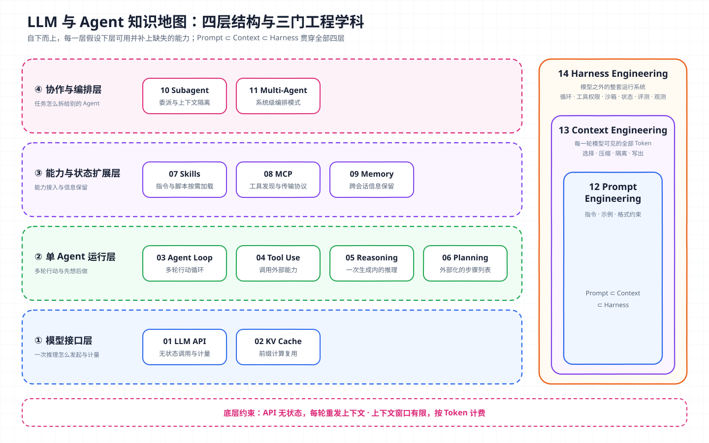

# 核心概念 00 - LLM 与 Agent 知识地图：从一次模型调用到可靠的 Agent 系统

> *本合集是一套面向 Agent 架构与工程实践的系统学习笔记，帮助读者建立从原理、Runtime、工具与权限到评测和多 Agent 编排的完整知识框架。*
>
> *本篇是核心概念系列的索引，用一条从模型调用到 Harness 的主线，把 14 个概念放进同一张地图，说明它们各自解决什么问题、彼此如何依赖，以及建议的阅读顺序。*

## 一条主线串起 14 个概念

Agent 系统可以从下往上拆成四层。每一层都假设下面一层已经可用，并补上它缺少的能力。

| 层级 | 这一层回答的问题 | 概念 | 篇目 |
| --- | --- | --- | --- |
| 模型接口层 | 一次推理怎么发起、怎么计量、为什么这样计费 | LLM API、KV Cache | [01](01-llm-api.md)、[02](02-kv-cache.md) |
| 单 Agent 运行层 | 模型如何多轮行动、调用外部能力、先想后做 | Agent Loop、Tool Use、Reasoning、Planning | [03](03-agent-loop.md)、[04](04-tool-use.md)、[05](05-reasoning.md)、[06](06-planning.md) |
| 能力与状态扩展层 | 能力怎么打包接入，信息怎么跨轮次、跨会话保留 | Skills、MCP、Memory | [07](07-skills.md)、[08](08-mcp.md)、[09](09-memory.md) |
| 协作与编排层 | 任务什么时候拆给别的 Agent，多个 Agent 怎么协作 | Subagent、Multi-Agent | [10](10-subagent.md)、[11](11-multi-agent.md) |

另有三门工程学科贯穿各层。它们本身不增加组件，讨论的是怎么把已有组件用好。

| 工程学科 | 优化的对象 | 篇目 |
| --- | --- | --- |
| Prompt Engineering | 写给模型的指令、示例和格式约束 | [12](12-prompt-engineering.md) |
| Context Engineering | 每一轮推理时模型能看到的全部 Token 的选择、压缩和隔离 | [13](13-context-engineering.md) |
| Harness Engineering | 模型之外让 Agent 可靠工作的整套运行系统 | [14](14-harness-engineering.md) |

三者逐层包含。Prompt 是 Context 的一部分，Context 的装配又是 Harness 的一项职责。

## 概念之间的依赖

下面这些依赖决定了阅读顺序。读后面某篇卡住时，通常是依赖的那篇还没吃透。

- **LLM API → Agent Loop**：API 是无状态的，每次调用都要重新发送完整上下文。Agent Loop 就是 Harness 在这个约束下反复“组装请求、调用模型、执行工具、回填结果”的循环。
- **KV Cache → Context Engineering**：推理服务会缓存前缀的计算结果，API 层的 Prompt Caching 就建立在这个机制上。上下文保持稳定前缀、只在尾部追加，缓存才能命中。压缩和改写历史会让缓存失效，这是上下文策略里的一项隐性成本。
- **Tool Use → MCP、Skills、Subagent**：MCP 解决工具怎么被发现、怎么传输；Skills 解决指令和脚本怎么按需加载；子 Agent 在主 Agent 看来通常也只是一个工具调用。三者都要落到模型能理解的工具定义或上下文内容上。
- **Reasoning → Planning**：推理发生在一次生成内部；规划把推理结果变成外部可见、可检查、可恢复的步骤列表。
- **Memory ↔ Context Engineering**：记忆决定哪些信息能在窗口之外保存下来，上下文工程决定这些信息什么时候、以什么形式回到窗口里。
- **Subagent → Multi-Agent**：子 Agent 是一种委派机制；多 Agent 是系统级的编排模式，子 Agent 是它最常见的实现手段之一。

## 阅读路线

| 目标 | 建议顺序 |
| --- | --- |
| 从零建立完整框架 | 01 → 02 → 03 → 04 → 05 → 06 → 12 → 13 → 09 → 07 → 08 → 10 → 11 → 14 |
| 已会调 API，想搞懂 Agent 运行机制 | 03 → 04 → 13 → 10 → 14 |
| 关注推理成本与性能 | 01 → 02 → 05 → 13 |
| 关注能力扩展与生态接入 | 04 → 07 → 08 → 11 |
| 关注生产可靠性 | 03 → 04 → 09 → 13 → 14 |

## 每篇的统一结构

各篇按同一顺序展开，方便横向对照。

1. 定义与边界：这个概念是什么，不是什么，和相邻概念怎么区分。
2. 架构与流程：它在系统里处于什么位置，数据怎么流动。
3. 核心机制：原理讲到能推导的程度，给出公式、协议消息或源码骨架。
4. 设计取舍：不同厂商或框架的实现差异，以及各自的代价。
5. 生产约束与失败模式：上线后会在哪里出问题。
6. 架构推演：用一个真实场景，把边界、组件、数据流、失败处理和安全控制完整推一遍。
7. 复习结论：几条可以独立记忆的结论。
8. 参考：官方文档、论文、规范和带提交号的源码链接。

## 复习结论

- 14 个概念可以按“模型接口 → 单 Agent 运行 → 能力与状态扩展 → 协作编排”四层组织，Prompt、Context、Harness 三门工程学科贯穿各层。
- 大多数 Agent 设计问题都能追溯到两条底层约束：API 无状态，以及上下文窗口有限、按 Token 计费。
- Tool Use 是扩展能力的统一接口。MCP、Skills、子 Agent 最终都以工具定义或上下文内容的形式进入模型。
- Prompt、Context、Harness 逐层包含。越往外，优化的对象越大，可控的变量也越多。

## 参考

| 主题 | 来源 |
| --- | --- |
| Agent 与 workflow 的划分 | [Building effective agents](https://www.anthropic.com/engineering/building-effective-agents) · [A practical guide to building agents](https://openai.com/business/guides-and-resources/a-practical-guide-to-building-ai-agents/) |
| 上下文工程 | [Effective context engineering for AI agents](https://www.anthropic.com/engineering/effective-context-engineering-for-ai-agents) |
| 各篇详细来源 | 见各篇文末“参考” |
